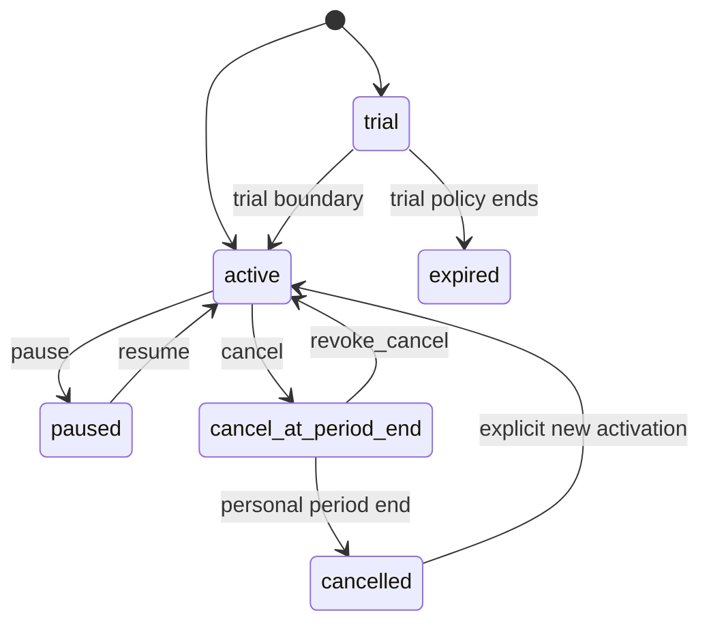

# 模块 PRD：Token-only 月度订阅、套餐版本与权益

## 2026-08-09 默认三套餐与Free自动资格增量

- 正式Plan identity code固定为`free`、`dream`、`is-dreaming`；Plan保存`eyebrow/note/details`正式展示字段，Dream不得复制静态数组。
- Free必须有published、monthly、Token-only Version和至少一个enabled、priced、支持`messages:create`的Entitlement；缺少合格模型时migration/startup明确失败。
- Dream与is Dreaming缺商业参数时创建Plan identity + draft Version，Product API仍返回`available=false`和“暂不可开通”，不得虚构价格或支付。
- canonical用户创建时自动建立platform projection、Billing Account和默认Free Subscription/Allowance/Event；历史backfill幂等，只补没有需要保留有效订阅的用户，不覆盖paid、Allowance、Usage、Ledger或Event。
- published Plan Version及Entitlement不可覆盖更新；变更只能创建新Version。

> 返回：[平台 PRD 总纲](../ink-memory-admin-prd-v3.md) · 交互：[订阅中心](../../design/modules/03-subscriptions.md)

> 业务纠偏：订阅套餐面向单个用户、按其订阅周期提供 **Token 与非货币权益**，并可定义整数 micro-USD 月费。套餐月费不是 Token 金额额度或现金余额，不定义现金超额扣费，也不使用平台统一生效日期。

## 0. Current / Target / Migration / Release Gate

| 分层 | 范围 |
|---|---|
| Legacy baseline | `0014` 及历史数据仍物理保留 `currency`、`base_price_microusd`、`allowance_microusd`、`cash_balance` overage、`effective_from` 和 annual 值，历史 Ledger 继续只读保留；这些字段不再是产品合同。 |
| Implemented / Release candidate | `0017–0024`、strict contracts、Service/Repository/worker、Gateway、Token Ledger、Product/Payment API、PaymentAdapter/Fake/Webhook 与 Dream 付费开通/续费已实现。Admin 66 files/313 tests、tsc/lint/build；本机 `ink-memory` 为 Admin migrations=25。 |
| Target | Plan 只定义名称/code/状态；不可覆盖 Plan Version 固定为月度，定义 `allowance_tokens`、整数 `base_price_microusd` 与 model/scope/RPM/Storage Entitlement。每个 Subscription 使用自己的周期。 |
| Migration | 保留历史 Ledger 记录，不做破坏性删除；`0022–0024` 允许 Token-only 版本带非负月费并增加续费绑定/past_due 边界，同时继续拒绝金额 allowance、cash overage 与 annual。 |
| Release Gate | 无全局生效时间；月费整数传输；付费首次开通/到期续费等待签名 Webhook；锚点周期、Token 守恒和 402 Token 合同通过；1440×1000 与 390×844 无假支付成功。 |

## 1. 产品目标与边界

所有 canonical `users` 都可直接成为 Subscription 的主体，不存在独立“计费用户”名册或开户步骤。订阅回答三件事：用户当前处于哪个个人月度周期、该周期获得多少 Token、该版本允许哪些模型与 Gateway 能力。

订阅不负责以下事实：

- 保存 USD 月费与整数 micro-USD 传输真值，但不发放 micro-USD、不向 Billing Account 充值。
- 不以 `effective_from/effective_to` 规定一批用户的统一生效日；发布时间只记录版本何时发布。
- 不以 `cash_balance` 作为 Token 用尽后的 overage，也不因开通、续期或换版产生金额 Ledger。
- PaymentAdapter/Webhook 是订阅激活的协调边界，不是 Token 权益；Stripe、支付宝、微信等真实渠道仍 Deferred。
- 不改变 Provider Pricing 的版本化金额快照、Provider 成本、既有现金账户和历史 Ledger；这些是独立的 Gateway 成本/按量计费事实。

## 2. 产品对象与权威字段

| 对象 | Target 权威字段 | 核心规则 |
|---|---|---|
| Plan | `id/code/name/description/status` | code 创建后稳定；停用不删除历史；无 currency/price/effective date。 |
| Plan Version | `id/plan_id/version/status/trial_days/grace_period_days/allowance_tokens/base_price_microusd/currency/published_at` | 周期固定 monthly；金额为整数 micro-USD；发布后不可修改或删除。 |
| Entitlement | `plan_version_id/model_id/gateway_scopes/rpm_limit/storage_limit_bytes` 等非货币权益 | 与已发布 Version 一起不可覆盖；不得出现 overage money rule。 |
| Subscription | `user_id/plan_version_id/status/cycle_anchor_at/current_period_number/current_period_start/current_period_end/cancel_at_period_end/pending_plan_version_id/version` | 一个平台用户最多一个当前订阅上下文；周期按该用户的锚点与周期序号计算。 |
| Usage Allowance | `subscription_id/period_start/period_end/granted_tokens/bonus_granted_tokens/reserved_tokens/consumed_tokens` | 每个订阅周期一条 Token 额度；Plan grant 不可变，Bonus 只可通过审计命令单调增加；满足 `granted_tokens + bonus_granted_tokens >= reserved_tokens + consumed_tokens`；无金额列参与新流程。 |
| Subscription Token Grant | `allowance_id/amount_tokens/bonus_before_tokens/bonus_after_tokens/available_before_tokens/available_after_tokens/reason/idempotency_key/actor` | 管理员只可向当前可调用周期补发一次性免费 Token；记录 append-only，不继承到下周期，不修改套餐或限流。 |
| Subscription Token Ledger | `gateway_request_id/request_sequence/entry_type/amount_tokens/*_before_tokens/*_after_tokens` | reserve/capture/release 与 Allowance 同事务，只追加、Token 单位、来源一致且请求内顺序唯一；不是 Payment 或金额账本。 |
| Subscription Event | action、前后状态、目标版本、reason、idempotency key/digest、actor、时间 | append-only；同 key 同 digest 返回原结果，同 key 异 digest 返回 409。 |

数据库现有 `currency`、`base_price_microusd`、`allowance_microusd`、Allowance 金额列、`overage_policy`、`billing_period`、`effective_from` 和历史 `subscription_charge/allowance_capture` 只作为迁移期兼容证据。Repository 不得将其重新投影为 Target 产品字段。

## 3. 页面、Resource 与权限

| 页面 | 路由 | Resource | 权限 |
|---|---|---|---|
| 套餐 | `/admin/subscriptions/plans` | `subscription-plans` | `subscriptions.read/write` |
| 版本 | `/admin/subscriptions/versions` | `subscription-plan-versions` | `subscriptions.read/write` |
| 权益 | `/admin/subscriptions/entitlements` | `subscription-entitlements` | `subscriptions.read/write` |
| 用户订阅 | `/admin/subscriptions/users` | `subscriptions`、`subscription-allowances/events` | `subscriptions.read/write`；补发需独立 `subscriptions.grant` |
| Token 流水 | `/admin/subscriptions/token-ledger` | `subscription-token-grants`、`token-ledger` | `subscriptions.read` |

Route Handler 只做 Session、RBAC、Origin、解析、严格 Zod 与 service 调用；月度周期、状态机、幂等、事务和 PostgreSQL 约束位于 `app/lib/subscriptions/**`。所有用户选择器查询 canonical `users`，支持服务端搜索、分页、稳定 total 和跨页已选项 hydration。

## 4. 用户级月度周期

周期使用半开区间 `[start, end)`；`start` 包含、`end` 不包含。激活时写入用户自己的 `cycle_anchor_at`，而不是读取平台统一生效日。

月度边界必须保留原始锚点的 UTC 日与时间，并在短月份取该月最后一日；之后月份仍回到原始锚点日。例如 `2026-01-31T08:00Z → 2026-02-28T08:00Z → 2026-03-31T08:00Z`，不能漂移到 3 月 28 日。

- 开通：从明确的用户起始时刻建立首个周期并发放一次 Token Allowance。
- 续期：只在 `current_period_end` 到达后推进。正常执行建立紧邻下周期；若 worker/运营重试已延迟跨过多个边界，则从原锚点直接推进到包含当前时刻的周期，只发放该当前周期的一条 Allowance，并在事件记录跳过数量，不追溯补发已过期月份。提前重复命令返回 409，不能让未来额度提前可用。
- 升级/降级：都只写 `pending_plan_version_id`，在下一个周期边界原子生效；当前周期不重开、不按比例折算、不再次发放 Token。
- 补发 Token：仅 `subscriptions.grant` 可向当前可调用周期追加一次性 `bonus_granted_tokens`。命令必须包含正整数数量、原因、幂等键和 Allowance optimistic version；不修改 Plan Version、用户安全限流或现金余额，下周期不会自动复制。
- 暂停/恢复：只改变 Gateway 资格，不移动周期边界、不补发 Token。
- 期末取消：当前周期内仍按原权益使用，到边界进入 cancelled；撤销取消只清除取消标志，不续期、不发额度。
- `trial` 可按非支付策略进入 `active/expired`。付费 published version 到期且仍启用续费时由受控 period worker 进入 `past_due`，保持原周期且不发新 Token；只有绑定当前 Subscription version/period end 的成功续费 Webhook 才推进周期并恢复 `active`。免费版本仍可直接 renew。



## 5. Gateway 资格与 Token 消耗

```text
Canonical User → Subscription → Plan Version → Entitlement → Model Permission
→ Current-period Plan + Bonus Token Allowance → Gateway Request → Token Usage → Subscription Token Ledger
```

Gateway 在调用 Provider 前锁定当前周期 Allowance，并只以 Token reserve/capture/release 维护守恒；每次变更与 `subscription_token_ledger_entries` 同事务，重放不重复记账。Token 不足返回 402 `SUBSCRIPTION_TOKEN_ALLOWANCE_EXHAUSTED`；Gateway `/v1/**` 响应使用 `metric="tokens"`、`unit="tokens"`、`available_tokens`、`required_tokens` 和 `period_end`，Dream BFF 只映射为 camelCase `availableTokens`、`requiredTokens` 和 `periodEnd`；禁止写入或显示 `availableMicrousd/requiredMicrousd`。

“每日/每月 Token 安全上限（429）”不是订阅 Token 发放。运营处理 402 时进入“订阅 → 用户订阅 → 管理 → 补发本周期 Token”；限流页的每个用户行同时提供“处理 402／补发 Token”直达入口，携带邮箱筛选和 `intent=grant`，但不得在限流资源上直接写额度。目标页先展示该用户的套餐 Token、补发 Token、预留、消耗和剩余，再由独立 `subscriptions.grant` 权限提交。补发与 `subscription_token_grants`、`subscription_events`、Admin Audit 同事务；同幂等键同请求返回原结果，不同请求返回 409。Gateway、Product subscription context 和 model catalog 都以 `granted_tokens + bonus_granted_tokens` 作为周期总额。

订阅用户 Token 用尽后不得由套餐隐式降级为现金超额。若未来保留独立的按量现金 Gateway 产品模式，它必须使用显式产品资格与独立合同，不能由 Plan Version 的 overage 字段开启，也不能把 Billing Account 余额描述为订阅额度。

## 6. Dream 产品投影（Implemented / Release candidate）

Admin Product/Payment API 与 Dream 同源 BFF 已实现；Dream 服务端用最小权限服务身份调用 Admin，并从 session 绑定 canonical user，不信任浏览器提交的 user ID。生产 Session/service identity 冒烟仍是 Release Gate。

| API | Token-only 投影 |
|---|---|
| `GET /api/product/v1/plans` | 已发布版本名称、monthly 标识、`allowanceTokens`、`monthlyPriceMicrousd/currency` 与 Entitlement。 |
| `GET /api/product/v1/me/subscription-context` | 状态、个人周期、当前/待生效版本、Token granted/reserved/consumed/remaining、合法 actions；无现金余额。 |
| `GET /api/product/v1/me/usage` | 当前周期 Token 聚合、分页请求与 Token 消耗趋势；预计耗尽按 Token/时间计算，不是金额超额。 |
| `GET /api/product/v1/me/model-catalog` | 当前订阅与用户例外共同允许的 stable alias/capability/limit。 |
| `POST /api/product/v1/me/subscription-commands` | `create/renew/upgrade/downgrade/pause/resume/cancel/revoke_cancel` 的 preview/execute；返回个人周期与 Token 影响，无金额或 Payment 状态。 |
| `POST /api/product/v1/me/payment-intents` | 为当前 canonical 用户和付费版本创建幂等 Intent；不直接激活订阅。 |
| `GET /api/product/v1/me/payment-intents/{id}` | 只读当前用户 Intent 状态；不返回 Adapter Secret 或外部凭据。 |

`phase=preview` 不写入状态，返回 `previewId/digest/expiresAt/expectedVersion`、当前→目标版本、下一周期生效时刻和 Token 差异。`phase=execute` 必须带未过期 receipt、相同 digest/expectedVersion 与 `Idempotency-Key`。预览过期或版本变化返回 409 并要求重新预览。

## 7. 迁移与回滚

1. 先在隔离 PostgreSQL 审计受影响行，统计货币版 Version、金额 Allowance、`cash_balance` overage、未来 `effective_from`、annual 版本和历史订阅收费；禁止修改共享 `ink-memory`。
2. 增量迁移新增/回填 `cycle_anchor_at/current_period_number`；将未发布草稿归一为 monthly、金额字段 0、overage deny、`effective_from=NULL`，并增加新写入约束。已发布历史行不覆盖。
3. Contracts/Service/Repository 停止接受、扣费和返回所有订阅货币字段；Allowance 新写只允许 Token；Gateway 不再创建新的 money-allowance coverage 或订阅收费 Ledger。
4. Admin 与 Dream 投影先移除金额/全局生效字段，再启用严格写入约束；历史详情如必须展示，只能放在明确的“Legacy migration evidence”只读审计区，不能作为可操作套餐配置。
5. 回滚只撤回新代码/约束并保留新增列和审计数据；不得删除历史 Ledger、Allowance、Event 或覆盖已发布 Version。稳定运行并完成保留期评估后，才可单独提案物理删列。

## 8. 状态与错误合同

- loading 保持页头/表头骨架；empty 区分无 Plan、无已发布 Version、无用户订阅与筛选无结果。
- 401/403 不渲染受保护数据；404 返回对应列表；409 保留表单并显示最新 version/period；429 显示 RPM/Token 窗口；503 显示 PostgreSQL/依赖不可用且不回退假套餐。
- 402 只用于当前周期 Token 不足；订阅支付失败使用 Payment Intent 状态，不混用 Gateway 402。
- 任何错误响应包含安全 request ID，不返回 Secret、SQL、stack 或其他用户数据。

## 9. 可自动测试的验收标准

- SUB-01：Plan/Version create/update/publish API 拒绝 currency、price、money allowance、cash overage、annual cycle 和 effective date；发布后的 Version/Entitlement 在 service 与数据库层拒绝 UPDATE/DELETE。
- SUB-02：激活只产生一个当前周期 Token Allowance，不写 `subscription_charge`、`allowance_capture` 或 Billing Account 变动。
- SUB-03：Jan-31 等月末锚点连续续期不漂移；周期严格 `[start,end)`，未来 Allowance 在 `start` 前不可使用；延迟多个周期时一次推进到当前周期且不补发漏期 Token。
- SUB-04：提前续期、重复续期和并发续期只有一个结果；同幂等 key 异 action/target/reason/payload 返回 409，不重复发 Token，也不重复写 Audit。
- SUB-05：升级、降级都在下一周期边界生效，当前周期版本/结束时间/Token 不变；暂停、恢复、取消与撤销取消不补发 Token。
- SUB-06：Allowance 始终满足 Token 守恒；Token 用尽在 Provider 前返回带正确 token 字段的 402，绝不回落到套餐现金超额。
- SUB-07：Dream/API/Admin 的月费只使用整数 micro-USD 真值并格式化展示；不返回金额额度、现金余额、Secret 或平台生效日期。
- SUB-08：历史 Ledger 可审计且不可改写；Payment Event/adjustment 只追加，重复 Webhook 不重复激活或调整。
- SUB-09：生产禁止 Fake Adapter；未接真实渠道时页面停在 `requires_action`，不得伪造支付成功。
- SUB-09（Implemented / release candidate）：成功请求按顺序产生 reserve/capture/release Token Ledger；重复幂等键不重复记账，usage unknown 由 worker 保守终结，来源不一致、重复顺序、UPDATE/DELETE 均由数据库拒绝。
- SUB-09：canonical 用户 selector 以至少 205 用户验证服务端搜索、跨页选择、稳定 total；不存在“计费用户”筛选或手工开户。
- SUB-10：1440×1000 与 390×844 focused E2E 覆盖 loading/empty/402/403/404/409/503、键盘、焦点、label、读屏播报和无横向页面溢出。

交互验收映射：SUB-01/07 → UI-SUB-01/02；SUB-02/03/04/05 → UI-SUB-04/05；SUB-06 → UI-SUB-03；SUB-09/10 → UI-SUB-06/07。
