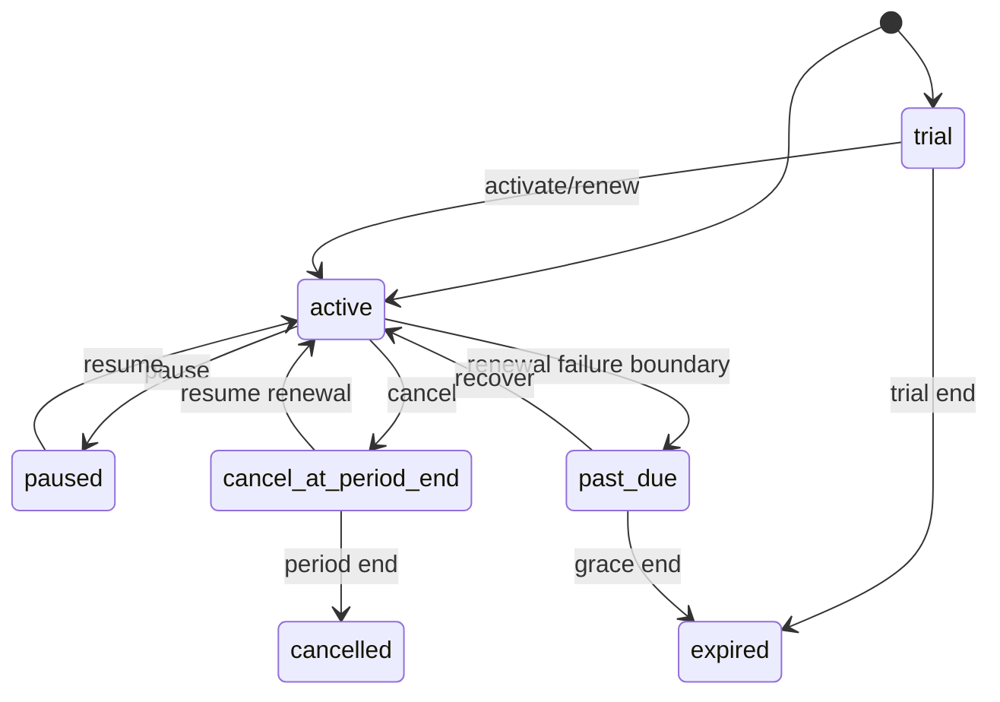

# 模块 PRD：订阅、套餐版本与权益

> 返回：[平台 PRD 总纲](../ink-memory-admin-prd-v3.md) · 交互：[订阅中心](../../design/modules/03-subscriptions.md)

## 1. 目标

为所有平台用户提供可版本化、可审计、可驱动 Gateway 资格判断的订阅体系。当前由运营 Admin 执行生命周期命令；第三方支付未接入，只保留 PaymentAdapter/Webhook 幂等边界。

## 2. 产品对象

| 对象 | 核心规则 |
|---|---|
| Plan | code/name/status/currency；code 稳定，停用不删除历史 |
| Plan Version | 周期、基础价、trial、allowance、overage 的不可覆盖快照；发布后不可修改/删除 |
| Entitlement | 版本允许的 model/scope、RPM、Token/Storage 配额；发布后不可变 |
| Subscription | 用户、当前版本、状态、周期、续费与 pending change；事务状态机 |
| Allowance | 周期 granted/reserved/consumed 金额或 Token 守恒 |
| Event | 生命周期命令的 append-only 幂等事实 |

## 3. 页面与权限

| 页面 | 路由 | 权限 |
|---|---|---|
| 套餐 | `/admin/subscriptions/plans` | `subscriptions.read`、`subscriptions.write` |
| 版本 | `/admin/subscriptions/versions` | `subscriptions.read`、`subscriptions.write` |
| 权益 | `/admin/subscriptions/entitlements` | `subscriptions.read`、`subscriptions.write` |
| 用户订阅 | `/admin/subscriptions/users` | `subscriptions.read`、`subscriptions.write` |

对应 Resources 为 `subscription-plans`、`subscription-plan-versions`、`subscription-entitlements`、`subscriptions`、`subscription-allowances`、`subscription-events`；领域逻辑位于 `app/lib/subscriptions/**`。

## 4. 生命周期

升级默认立即生效并冻结新版本快照；降级默认期末生效；续费创建新周期 Allowance；暂停阻止 Gateway；取消期末生效可在生效前恢复。所有命令要求 reason、idempotency key 和 expected version；并发冲突返回 409。

## 5. Gateway 资格

`User → active/trial Subscription → published Version → Entitlement → User Model Override → Allowance/Overage → Gateway Request`。无订阅的迁移兼容只能由明确 feature policy 控制；已有无资格订阅不得静默放行。

## 6. 验收

- SUB-01：发布后的 Version/Entitlement 在 service 和数据库层拒绝 UPDATE/DELETE。
- SUB-02：开通、续费、升级、降级、暂停、恢复、期末取消、过期均有成功与冲突测试。
- SUB-03：重复 idempotency key 返回原结果，不重复扣费或发放 Allowance。
- SUB-04：Allowance 满足 `granted >= reserved + consumed`；Token 与金额额度不混写。
- SUB-05：暂停/过期/模型不允许/额度耗尽在调用 Provider 前返回明确 402/403/409。
