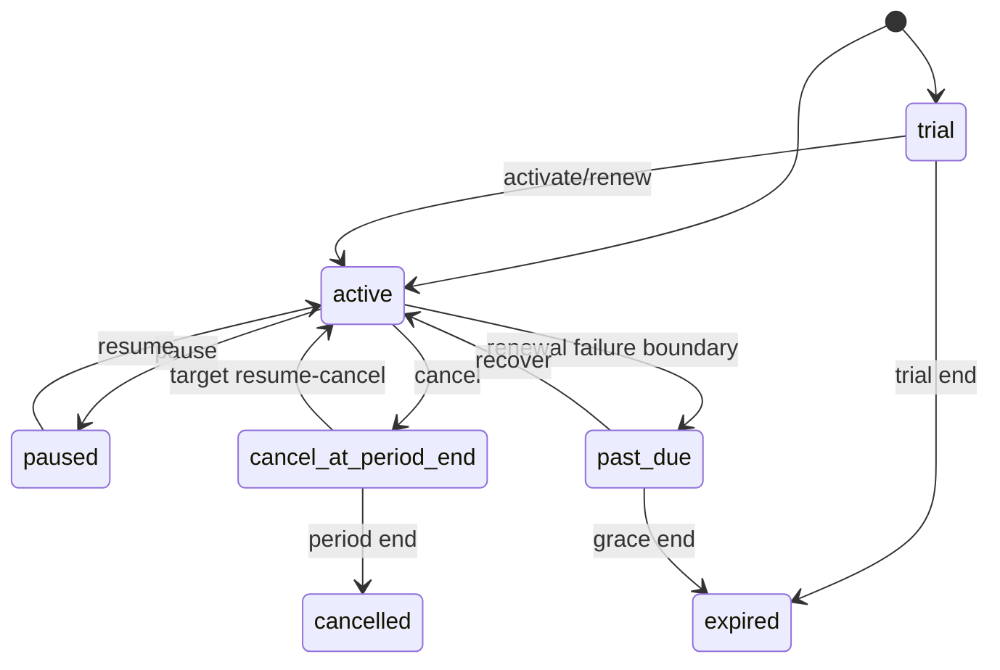

# 模块 PRD：订阅、套餐版本与权益

> 返回：[平台 PRD 总纲](../ink-memory-admin-prd-v3.md) · 交互：[订阅中心](../../design/modules/03-subscriptions.md)

> 实现状态：Schema、API、基础运营 UI、开通/续费/升级/降级/暂停/有限恢复/期末取消、Allowance 与 Gateway 资格/结算已实现；自动周期推进、真正撤销期末取消、聚合详情、账务影响预览和外部支付未实现。

## 1. 目标

为所有平台用户提供可版本化、可审计、可驱动 Gateway 资格判断的订阅体系。当前由运营 Admin 执行生命周期命令；第三方支付未接入，只保留 PaymentAdapter/Webhook 幂等边界。

## 2. 产品对象

| 对象 | 核心规则 |
|---|---|
| Plan | code/name/status/currency；code 稳定，停用不删除历史 |
| Plan Version | 周期、基础价、trial、allowance、overage 的不可覆盖快照；发布后不可修改/删除 |
| Entitlement | 版本允许的 model/scope、RPM、Token/Storage 配额；发布后不可变 |
| Subscription | 用户、当前版本、状态、周期、续费与 pending change；事务状态机 |
| Allowance | 周期 granted/reserved/consumed 金额或 Token 守恒 |
| Event | 生命周期命令的 append-only 幂等事实 |

## 3. 页面与权限

| 页面 | 路由 | 权限 |
|---|---|---|
| 套餐 | `/admin/subscriptions/plans` | `subscriptions.read`、`subscriptions.write` |
| 版本 | `/admin/subscriptions/versions` | `subscriptions.read`、`subscriptions.write` |
| 权益 | `/admin/subscriptions/entitlements` | `subscriptions.read`、`subscriptions.write` |
| 用户订阅 | `/admin/subscriptions/users` | `subscriptions.read`、`subscriptions.write` |

对应 Resources 为 `subscription-plans`、`subscription-plan-versions`、`subscription-entitlements`、`subscriptions`、`subscription-allowances`、`subscription-events`；领域逻辑位于 `app/lib/subscriptions/**`。

## 4. 生命周期

上图是完整目标状态机。当前实现不会自动产生 `past_due`，也没有调度任务推进 `cancel_at_period_end → cancelled`、`trial/past_due → expired`。当前 `resume` 只接受 `paused/past_due`；`cancel_at_period_end` 只能通过 `renew/upgrade` 回到 active，并会按规则收费/重开周期，因此不是“无账务影响的撤销取消”。

升级立即以目标版本全额基础价扣费，不按剩余周期 prorate、不退旧周期费用；升级时从当前时间建立新的目标周期并发放目标版本完整 Allowance。降级仅写入 pending version，在下一次续费时生效；续费从当前周期末（尚未结束）或当前时间（已结束）建立新周期并全额扣费/发放 Allowance。暂停阻止 Gateway；真正的期末取消恢复和自动状态推进属于待实现能力。

所有生命周期命令要求 reason 与 idempotency key。当前并发语义为数据库事务 + `FOR UPDATE` 悲观行锁 + 状态再次校验；请求合同没有 `expectedVersion` 字段。相同幂等键返回原事件结果，合法但已变化的状态返回 409。

## 5. Gateway 资格

`User → active/trial/cancel_at_period_end Subscription → published Version → Entitlement → User Model Override → Allowance/Overage → Gateway Request`。

当前实现保留一项迁移兼容：若用户**从未拥有任何订阅记录**，Gateway 返回空订阅资格并继续使用既有 cash balance-only 策略；一旦存在任意订阅记录，`paused/cancelled/expired`、宽限期外的 `past_due` 或其他无资格状态均不得静默放行。宽限期内的 `past_due` 按当前实现仍可调用。当前没有 feature flag、配置项或自动结束日期；移除此例外需要单独的代码变更、默认订阅/迁移策略和灰度验证。

## 6. 验收

- SUB-01：发布后的 Version/Entitlement 在 service 和数据库层拒绝 UPDATE/DELETE。
- SUB-02（当前 release gate）：开通、续费、升级、降级、暂停、从 paused/past_due 恢复、设置期末取消均有成功与冲突测试；UI 不得把 cancel_at_period_end 的 renew/upgrade 表述成免费撤销。
- SUB-02B（目标）：调度器幂等推进 period-end cancellation、trial expiry、past-due grace expiry，并提供真正撤销期末取消命令及并发测试。
- SUB-03：重复 idempotency key 返回原结果，不重复扣费或发放 Allowance。
- SUB-04：Allowance 满足 `granted >= reserved + consumed`；Token 与金额额度不混写。
- SUB-05：暂停/过期/模型不允许/额度耗尽在调用 Provider 前按 [Gateway 拒绝与错误契约](05-gateway.md#6-gateway-拒绝与错误契约) 返回唯一 HTTP/code 映射并留下规定证据。
- SUB-06：从未订阅用户走 cash-only 兼容路径；已有任意订阅记录的用户不能以兼容名义绕过状态或权益。移除兼容前必须有迁移与灰度测试。

交互验收映射：SUB-01 → UI-SUB-02；SUB-02/03 → UI-SUB-01/04 + API/数据库断言；SUB-04/05 → UI-SUB-03 + Gateway 集成测试。SUB-02B 与标记为“后续目标”的聚合详情不进入当前 release gate。
