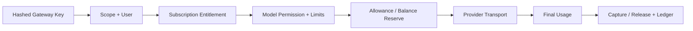

# 模块 PRD：Gateway、Key、Request、Payload 与限流

> 返回：[平台 PRD 总纲](../ink-memory-admin-prd-v3.md) · 交互：[Gateway](../../design/modules/05-gateway.md)

## 1. 目标与协议

向 Dream 和授权客户端提供 Anthropic/OpenAI 兼容代理，并完整记录可计费、可审计的请求生命周期。支持 `/v1/messages`、`/v1/messages/count_tokens`、`/v1/chat/completions`、`/v1/models`；同协议安全透传，跨协议使用显式 Adapter。

## 2. 页面

| 页面 | 路由 | 能力 |
|---|---|---|
| Request | `/admin/gateway/requests` | 只读查询、摘要、错误、完整 Payload 权限门 |
| Gateway Key | `/admin/gateway/keys` | 创建一次性回执、scope、到期、revoke |
| 限流 | `/admin/gateway/rate-limits` | 用户默认 Token、模型 override、实时窗口只读 |

权限：读取 `gateway.read`；完整报文 `gateway.payloads.read`；Key 写入 `gateway.keys.write`。

## 3. 调用链

资格拒绝发生在上游调用前。请求创建时冻结 Subscription/Entitlement/Pricing/limit snapshot。流式响应必须支持真实增量、backpressure、client cancel 和协议正确的 SSE error；Usage 未知时不得按 0 成功结算。

## 4. Key 与 Secret

- Key 明文只在创建成功显示一次；数据库仅存 hash、prefix、scopes、状态和到期。
- 每个平台用户可有多个最小 Scope Key；revoke 保留历史 Request。
- Anthropic/OpenAI 接入回执显示 Gateway URL、Header、alias 示例，不显示 Provider Secret/upstream model。

## 5. Request 与完整报文

`gateway_requests` 保存热摘要；`gateway_request_payloads`、`gateway_response_payloads`、`gateway_response_events` 保存脱敏完整报文/流事件。默认不加载 Payload；二次确认请求需要明确 header 并写 append-only Audit。认证、Cookie、Key、Provider Secret 固定脱敏。

429 摘要必须记录 limit/current/reserve/remaining/exceeded，并链接到可实际调整的用户默认 Token 或模型权限；实时 `gateway_rate_limits` 只读，不能改计数解除限流。

## 6. 验收

- GTW-01：无/错/revoked Key 分别返回协议正确 401，且 Secret 不进日志/DOM。
- GTW-02：Scope、订阅、模型、额度、余额、RPM/Token limit 在 Provider 前拒绝并记录 Request。
- GTW-03：Anthropic/OpenAI 非流与流式 contract、任意 chunk 边界、cancel、错误映射通过。
- GTW-04：Payload 默认不加载；无 `gateway.payloads.read` 返回 403；查看产生 Audit。
- GTW-05：Usage settle 产生唯一 Usage/Ledger 链；未知 Usage 标记 `settlement_failed`，不自动按 0。
