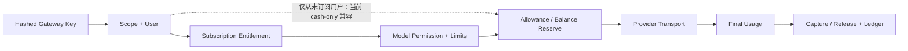

# 模块 PRD：Gateway、Key、Request、Payload 与限流

> 返回：[平台 PRD 总纲](../ink-memory-admin-prd-v3.md) · 交互：[Gateway](../../design/modules/05-gateway.md)

> 实现状态：协议代理、Key、Request/Payload、订阅资格、账务预授权与限流已实现；Request Drawer 已有价格/Token/Ledger，但 Subscription/Entitlement/Allowance 富分区仍为规划能力。

## 1. 目标与协议

向 Dream 和授权客户端提供 Anthropic/OpenAI 兼容代理，并完整记录可计费、可审计的请求生命周期。支持 `/v1/messages`、`/v1/messages/count_tokens`、`/v1/chat/completions`、`/v1/models`；同协议安全透传，跨协议使用显式 Adapter。

## 2. 页面

| 页面 | 路由 | 能力 |
|---|---|---|
| Request | `/admin/gateway/requests` | 只读查询、摘要、错误、完整 Payload 权限门 |
| Gateway Key | `/admin/gateway/keys` | 创建一次性回执、scope、到期、revoke |
| 限流 | `/admin/gateway/rate-limits` | 用户默认 Token、模型 override、实时窗口只读 |

权限：读取 Request/Key/限流事实使用 `gateway.read`；完整报文使用 `gateway.payloads.read`；Key 写入使用 `gateway.keys.write`；`/admin/gateway/rate-limits` 中用户默认 Token limit 与模型 override 的编辑还要求 `users.write`，实时计数始终只读。

## 3. 调用链

资格拒绝发生在上游调用前。请求创建时冻结 Subscription/Entitlement/Pricing/limit snapshot。流式响应必须支持真实增量、backpressure、client cancel 和协议正确的 SSE error；Usage 未知时不得按 0 成功结算。

## 4. Key 与 Secret

- Key 明文只在创建成功显示一次；数据库仅存 hash、prefix、scopes、状态和到期。
- 每个平台用户可有多个最小 Scope Key；revoke 保留历史 Request。
- Anthropic/OpenAI 接入回执显示 Gateway URL、Header、alias 示例，不显示 Provider Secret/upstream model。

## 5. Request 与完整报文

`gateway_requests` 保存热摘要；`gateway_request_payloads`、`gateway_response_payloads`、`gateway_response_events` 保存脱敏完整报文/流事件。默认不加载 Payload；二次确认请求需要明确 header 并写 append-only Audit。认证、Cookie、Key、Provider Secret 固定脱敏。

429 摘要必须记录 limit/current/reserve/remaining/exceeded。Token 限额链接到可实际调整的用户默认/模型覆盖/套餐权益；RPM 仅展示策略来源和“当前 Admin 未开放编辑”，不能伪造修复入口。实时 `gateway_rate_limits` 只读，不能改计数解除限流。

## 6. Gateway 拒绝与错误契约

本表是 Gateway 资格/计费错误的唯一产品映射；订阅和 Dream 接入文档引用本表，不另行发明状态码。

| 阶段 | HTTP / code | 是否落 Request | 客户端/运营恢复 |
|---|---|---|---|
| Key 认证 | 401 `GATEWAY_API_KEY_REQUIRED` / `GATEWAY_API_KEY_INVALID` | 否；尚不能识别安全主体 | 停止自动重试；检查 Secret 注入、到期/revoke；不得要求终端用户粘贴 Key |
| Key scope | 403 `GATEWAY_SCOPE_REQUIRED` | 否 | 更换具备最小必要 scope 的 Key；写部署告警 |
| 平台访问策略 | 401 `GATEWAY_API_KEY_INVALID`（用户非 active 时统一处理） | 否 | 在平台用户计费设置检查访问状态；不泄露用户存在性 |
| 从未订阅兼容 | 无订阅错误；继续既有 cash-only 预授权 | 是 | 当前迁移兼容，不代表独立计费用户；余额不足仍返回 402。该路径无配置开关，移除需代码变更与灰度迁移 |
| Subscription 状态 | 403 `SUBSCRIPTION_PAUSED` / `SUBSCRIPTION_INACTIVE` / `SUBSCRIPTION_PERIOD_EXPIRED` | 是，`rejected` | 恢复、续费或重新订阅；同请求不循环重试 |
| Entitlement | 403 `SUBSCRIPTION_MODEL_NOT_ALLOWED` / `SUBSCRIPTION_SCOPE_NOT_ALLOWED` | 是，`rejected` | 选择允许 alias/scope 或调整下一版权益 |
| Allowance 未就绪/并发 | 409 `SUBSCRIPTION_ALLOWANCE_NOT_READY` / `SUBSCRIPTION_ALLOWANCE_CONFLICT` | 是，`rejected` | 刷新订阅/Allowance；并发冲突可按幂等边界重试 |
| 额度/余额 | 402 `SUBSCRIPTION_ALLOWANCE_EXHAUSTED` / `INSUFFICIENT_BALANCE` | 是，`rejected` | 展示重置时间、升级或账户处理入口；合同必须携带明确 `metric/unit`。Token 使用 `available_tokens/required_tokens`，金额使用 `available_microusd/required_microusd`，禁止混写 |
| 预授权限流 | 429 `REQUEST_RATE_LIMIT_EXCEEDED` / `DAILY_TOKEN_LIMIT_EXCEEDED` / `MONTHLY_TOKEN_LIMIT_EXCEEDED` | 是，`rejected`，保存 limit summary/Payload | 返回 `Retry-After: 60`；Token 限额导航可编辑策略；RPM 当前仅说明未开放编辑 |
| Idempotency | 409 `REQUEST_IN_PROGRESS` / `REQUEST_ALREADY_COMPLETED` / `STREAM_REPLAY_NOT_SUPPORTED` | 关联原 Request | 展示原 Request 状态；不得创建第二次扣费请求 |
| Gateway 配置 | 503 `GATEWAY_AUTH_NOT_CONFIGURED` / `INVALID_ACCOUNT_LIMIT` / `GATEWAY_MIN_RESERVE_INVALID` 等 | 取决于发生在 Request 创建前/后 | 服务告警、复制 request ID；不切换未计费 Provider，不泄露配置值 |
| 上游限流/失败 | 429 `UPSTREAM_RATE_LIMITED` 或 502 `UPSTREAM_*` | 是，保留 Provider/Request 状态 | 仅 retryable 错误遵循 `Retry-After`/退避；未知 Usage 不按 0 结算 |

所有已创建 Request 的资格拒绝必须保存协议正确、已脱敏的 JSON 响应；认证阶段未创建 Request 时仍返回安全 `x-request-id`。429 `Retry-After` 的当前固定值是实现事实，未来若改为动态窗口必须同步更新测试和本文。

当前缺口：Token allowance 不足时实现仍可能把 Token 数写入 `available_microusd/required_microusd`，且 Gateway Key auth 未反向 JOIN canonical `users`。两项均为发布阻断风险；修复前客户端只能按 `code` 展示通用额度不足，不能把错误字段格式化为 USD。

## 7. 验收

- GTW-01：无/错/revoked Key 分别返回协议正确 401，且 Secret 不进日志/DOM。
- GTW-02：Scope、订阅、模型、额度、余额、RPM/Token limit 在 Provider 前拒绝并记录 Request。
- GTW-03：Anthropic/OpenAI 非流与流式 contract、任意 chunk 边界、cancel、错误映射通过。
- GTW-04：Payload 默认不加载；无 `gateway.payloads.read` 返回 403；查看产生 Audit。
- GTW-05：Usage settle 产生唯一 Usage/Ledger 链；未知 Usage 标记 `settlement_failed`，不自动按 0。
- GTW-06：仅从未有订阅记录的用户可进入 cash-only 兼容路径；已有任何订阅记录时必须执行 Subscription/Entitlement 校验。
- GTW-07：Gateway Key 认证必须证明内部兼容行存在对应 canonical 用户；402 的字段名、metric 与 unit 一致，Token 值永不进入 micro-USD 字段。

交互验收映射：GTW-01 → UI-GTW-01；GTW-02/05 → UI-GTW-03 + API/数据库断言；GTW-03 由协议 contract E2E；GTW-04 → UI-GTW-02/04。
