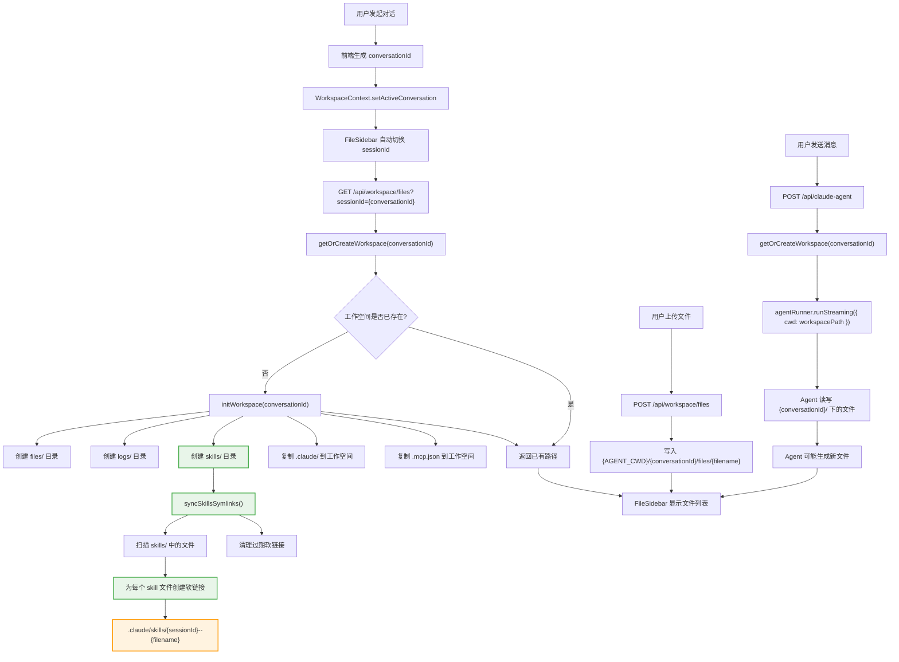
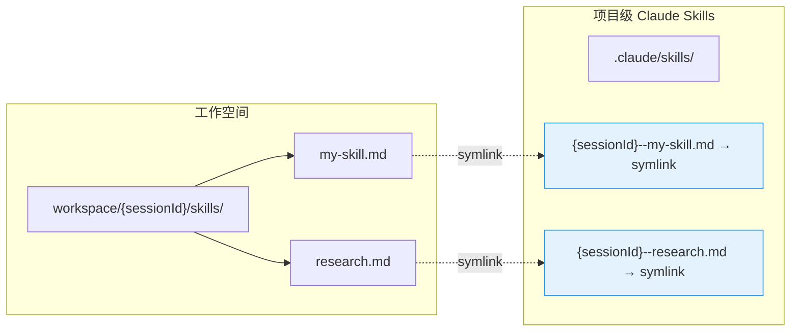
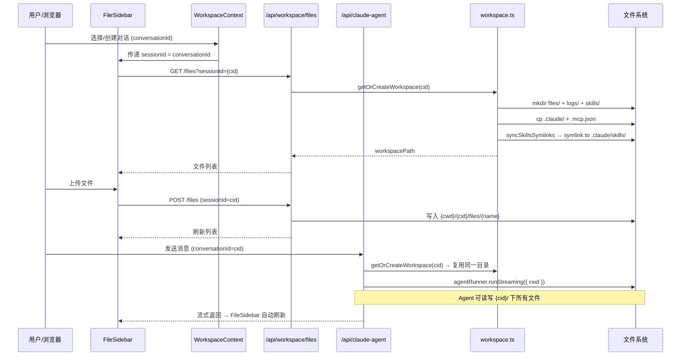

# 工作空间与 Skills 同步 — 全流程图

## 概述

本文档描述了对话工作空间初始化、文件管理、Agent 执行以及 Skills 自动同步的完整数据流。

---

## 核心流程图



---

## Skills 同步机制详情



### 为什么用软链接？

Claude Code 官方只认两个固定位置的 skills：
- **项目级**：`{project}/.claude/skills/`
- **用户级**：`~/.claude/skills/`

官方 **没有** 提供修改 skills 根目录的配置开关。因此我们采用软链接策略：

1. 每个对话工作空间自带 `skills/` 目录，用户/Agent 可自由写入
2. `syncSkillsSymlinks()` 自动将这些文件软链接到项目级 `.claude/skills/`
3. 链接命名为 `{sessionId}--{filename}`，避免多对话间冲突
4. 每次同步时清理已失效的过期链接

### 同步触发时机

| 时机 | 触发函数 | 说明 |
|------|----------|------|
| 工作空间初始化 | `initWorkspace()` → `syncSkillsSymlinks()` | 首次创建时自动同步 |
| 手动调用 | `syncSkillsSymlinks(workspacePath)` | 可在文件上传后主动触发 |

---

## 数据通道总览



---

## 环境变量

| 变量 | 默认值 | 说明 |
|------|--------|------|
| `AGENT_CWD` | `/tmp/claude-agent-workspaces` | 工作空间根目录；生产环境建议设为持久化路径 |

```
AGENT_CWD=/data/workspaces (生产环境)
  └── {conversationId}/
      ├── .claude/          ← 从项目根复制
      ├── .mcp.json         ← 从项目根复制
      ├── files/            ← 用户上传 + Agent 生成
      ├── logs/             ← Agent 日志
      └── skills/           ← 对话级 skills
            └── *.md        → symlink 到 .claude/skills/{sessionId}--*.md
```
