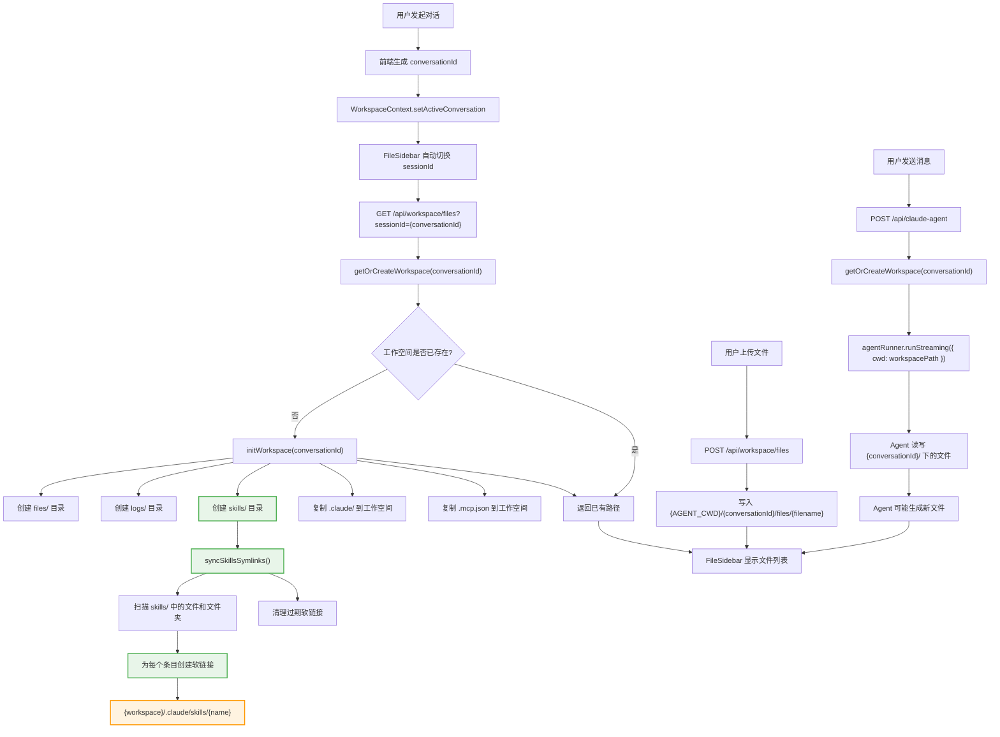
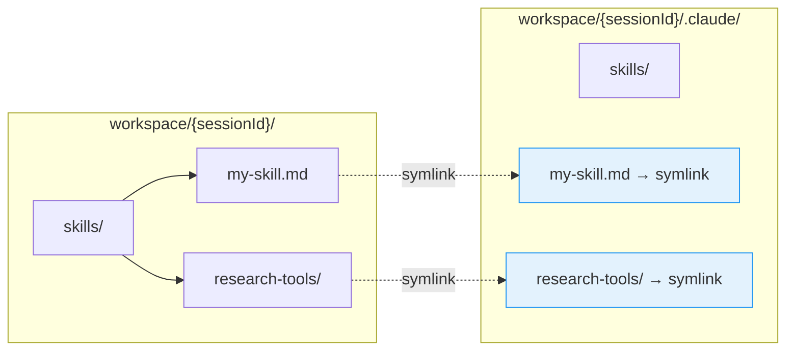
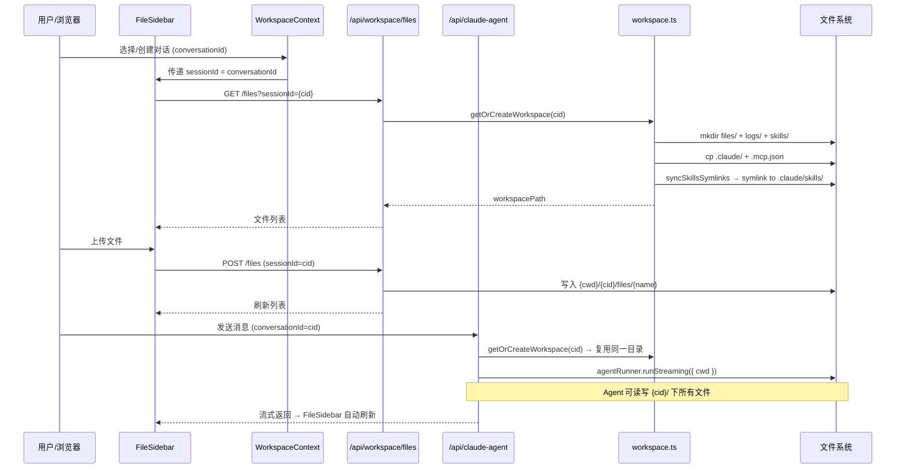

# 工作空间与 Skills 同步 — 全流程图

## 概述

本文档描述了对话工作空间初始化、文件管理、Agent 执行以及 Skills 自动同步的完整数据流。

---

## 核心流程图



---

## Skills 同步机制详情



### 为什么用软链接？

Claude SDK 被调用时设置 `cwd = workspacePath` 且 `settingSources: ["project"]`，
因此 Claude 从 `{workspacePath}/.claude/skills/` 读取 skills。

我们让用户/Agent 在更直观的 `{workspace}/skills/` 目录操作，然后自动软链接到
`{workspace}/.claude/skills/` 供 Claude 发现。

**关键优势**：
1. 每个对话工作空间完全隔离，无命名冲突
2. 同时支持**文件和文件夹**软链接
3. 无需 sessionId 前缀 — 工作空间本身就是隔离边界
4. 每次同步自动清理失效的链接

### 同步触发时机

| 时机 | 触发函数 | 说明 |
|------|----------|------|
| 工作空间初始化 | `initWorkspace()` → `syncSkillsSymlinks()` | 首次创建时自动同步 |
| 访问已有工作空间 | `getOrCreateWorkspace()` → `syncSkillsSymlinks()` | 每次访问重新同步 |
| 写入 skills/ | `writeWorkspaceFile()` → `syncSkillsSymlinks()` | 上传 skill 文件后自动同步 |
| 删除 skills/ | `deleteWorkspaceFile()` → `syncSkillsSymlinks()` | 删除后清理链接 |
| 移动涉及 skills/ | `moveWorkspaceFile()` → `syncSkillsSymlinks()` | 移动后更新链接 |

---

## 数据通道总览



---

## 环境变量

| 变量 | 默认值 | 说明 |
|------|--------|------|
| `AGENT_CWD` | `/tmp/claude-agent-workspaces` | 工作空间根目录；生产环境建议设为持久化路径 |

```
AGENT_CWD=/data/workspaces (生产环境)
  └── {conversationId}/            ← Claude SDK cwd
      ├── .claude/                 ← 从项目根复制
      │   └── skills/              ← 软链接目标目录
      │       ├── my-skill.md      → symlink → skills/my-skill.md
      │       └── research-tools/  → symlink → skills/research-tools/
      ├── .mcp.json                ← 从项目根复制
      ├── files/                   ← 用户上传 + Agent 生成
      ├── logs/                    ← Agent 日志
      └── skills/                  ← 对话级 skills（用户操作此目录）
            ├── my-skill.md
            └── research-tools/    ← 支持文件夹
                └── web-search.md
```
