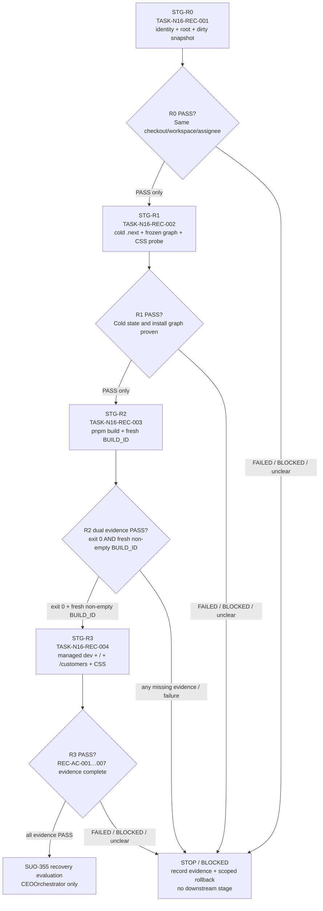
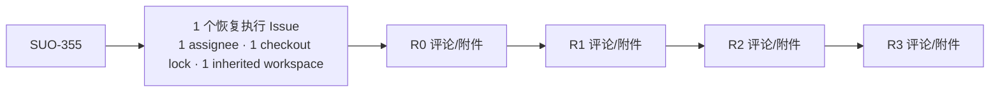

# Next 16 + Tailwind/PostCSS 基线恢复 Stage 计划

> Stage Plan ID: `STAGE-N16-RECOVERY-001`  
> 状态: 已规划，尚未执行  
> 关联设计: [`design_002_next16_tailwind_postcss_baseline_recovery.md`](../design/design_002_next16_tailwind_postcss_baseline_recovery.md)  
> 任务输入: [`task_009_shared_next16_execution_identity.md`](../task/task_009_shared_next16_execution_identity.md) 至 [`task_012_shared_next16_dev_smoke.md`](../task/task_012_shared_next16_dev_smoke.md)，及四份配套 `TASK-REQUIREMENT-*`  
> 上游链路: [SUO-355](/SUO/issues/SUO-355) → [SUO-356](/SUO/issues/SUO-356) → [SUO-357](/SUO/issues/SUO-357) → [SUO-358](/SUO/issues/SUO-358)  
> Stage 责任: `StagePlanner` 仅编排；不得据此执行命令、派发 execute 或改写上游文档。

## 编排结论

本计划是一个没有并行分支的四段关键路径：`R0 → R1 → R2 → R3`。每一段只能在前一段于**同一 checkout、同一 Paperclip execution workspace、同一唯一执行受理人**下产出明确 `PASS` 后启动；任何 `FAILED`、`[BLOCKED]`、澄清或证据缺失都会关闭当前及全部后续 Stage。

计划文档完成不代表 R0–R3 中任一 gate 已执行或通过。执行准入、执行者的唯一指派，以及 single-assignee checkout 锁的实际确认均由 [@CEOOrchestrator](agent://1e68c2e7-57cc-4e9e-88c8-3b4432fd6249) 的 execute-readiness check 处理；本计划不创建 execute 任务。

## 阶段任务表

| 阶段 | 任务 | 产出 | 依赖 | 风险 |
| --- | --- | --- | --- | --- |
| `STG-R0` | `TASK-N16-REC-001` — 固化执行身份、版本与工作区快照 | R0 根目录/版本/模块解析/dirty snapshot 证据包；唯一 `PASS` 或 `[BLOCKED]` | 无；恢复链唯一入口 | cwd、pnpm root 或模块从父目录/sibling 解析；并发 dirty state 不可区分 |
| `STG-R1` | `TASK-N16-REC-002` — 冷生成态、冻结安装图与 CSS probe | 旧 `.next` 污染摘要和隔离证据、安装图证据、条件 frozen install 结果、独立 CSS probe、唯一 `PASS` 或 `[BLOCKED]` | `STG-R0` 的完整 `PASS` 证据 | 缓存污染、冻结安装要求改锁/版本、安装图越界、未被证据支持的配置猜测 |
| `STG-R2` | `TASK-N16-REC-003` — 冷生产构建与新鲜 `BUILD_ID` | `pnpm build` 全日志/exit code、Next 版本、当前 run 新鲜非空 `.next/BUILD_ID`、diagnostics/污染扫描/scoped diff、唯一 `PASS` 或 `[BLOCKED]` | `STG-R1` 的完整 `PASS` 证据，且 `.next` 为冷态 | build 非零/超时、部分生成物、旧 checkout/Refine 引用、无新鲜 `BUILD_ID` |
| `STG-R3` | `TASK-N16-REC-004` — 受管 dev 与现有 PWA smoke | dev 生命周期、`/` 与 `/customers` 非 5xx、实际 CSS 可获取、无 resolver error、进程回收、`REC-AC-001`–`007` 汇总、唯一 `PASS` 或 `[BLOCKED]` | `STG-R2` 的**双证据 PASS**：`pnpm build` exit `0` + 本 run 新鲜非空 `.next/BUILD_ID` | ready 后退出、页面 5xx/CSS 404、端口或 sandbox 环境误归因、orphan 进程 |

## 当前进度

| 阶段 | 任务 | 状态 |
| --- | --- | --- |
| `STG-R0` | `TASK-N16-REC-001` | `PLANNED — 未执行；等待 execute-readiness 指派与 checkout 锁确认` |
| `STG-R1` | `TASK-N16-REC-002` | `LOCKED — 仅 R0 PASS 后可进入` |
| `STG-R2` | `TASK-N16-REC-003` | `LOCKED — 仅 R1 PASS 后可进入` |
| `STG-R3` | `TASK-N16-REC-004` | `LOCKED — 仅 R2 双证据 PASS 后可进入` |

## 执行连续性与锁定合同

- **唯一受理人**：execute-readiness check 必须指定一名实际执行者；该人以 Paperclip checkout 获得 lock 后，连续完成 R0–R3。不得在 gate 之间更换 assignee、转移 checkout 或交接到新 workspace。
- **同一执行环境**：R0 记录并确认 `$PROJECT_ROOT=/Users/dmeck/project/ink-admin-memory`、Paperclip execution workspace cwd、Git toplevel 与 `pnpm root` 同源。R1–R3 的 run/checkout/workspace 标识必须与 R0 证据包逐项一致。
- **锁的失效处理**：若 checkout 失效、workspace/cwd 变化、run 无法关联前序证据，立即将当前 Stage 记为 `[BLOCKED]`，由 `CEOOrchestrator` / runtime owner 恢复同一执行环境后，从 `STG-R0` 重新建立完整链；不得从中段续跑。
- **串行语义**：每道 gate 完成后先写入对应执行 Issue 评论及证据附件，确认结论为 `PASS` 才能进入下一道。没有并行、预热 build/dev、跳关或“先运行后补证据”的例外。
- **执行边界**：StagePlanner、TaskDesignAgent 不作为 R0–R3 的并行执行者。本计划不创建 `/admin`，不安排任何 Refine 验证或 execute 派发。

## Stage 准入与产出 checklist

### `STG-R0` — 执行身份与保护快照

**准入条件**

- execute-readiness 已指定唯一执行受理人，并确认其 checkout lock 生效。
- 当前 workspace cwd、shell cwd、Git toplevel 和计划中的 `$PROJECT_ROOT` 均可记录；不允许以父目录或 sibling checkout 启动。
- 未开展 `.next` 隔离、安装、build 或 dev；已有 dirty files 被视为只读保护对象。

**允许范围**

- 只读 `package.json`、`pnpm-lock.yaml`、`pnpm-workspace.yaml`、`node_modules/**` 和工作树状态。
- 在当前 execution run 的证据位置记录命令、cwd、退出码、版本、解析路径、hash/scoped diff 基线。

**禁止范围**

- 不删除/生成 `.next/**`，不运行安装、`pnpm build`、`pnpm dev`，不修改任何 tracked file。
- 不使用 npm/yarn/bun，不向父目录安装依赖，不变更版本，不引入 `@refinedev/*`、React Router 或任何 Admin 路由/测试。

**验收与验证**

- `pwd -P`、Git toplevel、Paperclip workspace cwd 与 `pnpm root` 指向同一项目根。
- Node `>=20.9.0`、pnpm `9.15.0`；Next `16.1.6`、Tailwind `4.1.18`、`@tailwindcss/postcss` `4.1.18`、PostCSS `8.4.39` 的声明和四个 `require.resolve` 路径均在本 checkout `node_modules/**`。
- 保存初始 `git status --short`，以及条件候选配置的 hash/scoped diff；保护已有 `docs/stage/**`、`docs/exec/**` 等并发改动。

**产出 checklist**

- [ ] R0 证据包含 run/Issue、命令、cwd/root、版本、解析路径、时间和 exit code。
- [ ] dirty-file 保护清单及候选配置基线已记录。
- [ ] 给出唯一 `R0 PASS` 或首个 `[BLOCKED]`，没有触碰生成态或 tracked files。

**阻塞、回滚与后继**

- 阻塞 owner/action：`CEOOrchestrator` / runtime owner 修复 execution workspace 或启动 cwd；版本不符由 runtime owner 提供符合合同的镜像。修复后从 R0 重跑。
- 回滚：R0 不产生仓库修改；仅确认未改变文件，保留原始工作树。
- 后继：仅清晰的 `R0 PASS` 解锁 `STG-R1`。

### `STG-R1` — 冷生成态、安装图与 CSS 工具链

**准入条件**

- 消费同一 checkout、workspace、assignee 连续链上的完整 `R0 PASS`，包括 dirty snapshot；证据字段或环境不一致即回到 R0。
- 仅本恢复 Issue 启动的 dev 进程均已停止；R1 开始前不运行 R2 build 或 R3 dev。

**允许范围**

- `.next/**` 仅可在摘要后隔离到本 run scratch 或删除；`node_modules/**` 仅在解析缺失/越界/状态不一致时用 `pnpm install --frozen-lockfile` 恢复。
- run scratch 可保存日志、probe 输出、HTTP/工具链证据；`app/globals.css` 仅作为现有 PostCSS probe 输入。
- 只有“未修改失败 + 精确命中诊断 + 单变量 scoped diff”齐全时，才可最小改动一个候选：`next.config.js`、`postcss.config.js`、`pnpm-workspace.yaml`、`package.json`、`pnpm-lock.yaml` 或 `playwright.config.ts`。

**禁止范围**

- 不使用非冻结安装；不改版本/新增依赖/删除或重生 `package-lock.json`。
- 不改 `app/**`（包括 `app/globals.css`）、`app/api/**`、`app/lib/**`、schema/migration、`drizzle/**`、下游文档、Refine/Admin 或父目录/sibling 项目。

**验收与验证**

- 记录旧 `.next` 的 `BUILD_ID`、旧 checkout 和 `@refinedev/*` 污染摘要；隔离后 R2 输入必须为空 `.next`。
- 重复四模块解析；冻结安装若未触发，要明确写明原因；若触发，必须 exit `0` 且不改写 `pnpm-lock.yaml`/当前版本。
- 以现有配置对 `app/globals.css` 做独立 PostCSS/Tailwind probe：输出非空、无 warning；它只证明插件链，不代表 build PASS。

**产出 checklist**

- [ ] 旧缓存摘要和可判定的冷态证据已保存，生成态不提交。
- [ ] 安装图在项目 pnpm 链内；frozen install（如触发）的命令、exit code 与 lock diff 已保存。
- [ ] CSS probe 的 cwd、配置、输入、输出大小、warning/error chain 已保存。
- [ ] 唯一 `R1 PASS` 或首个 `[BLOCKED]` 已回写；条件配置变更（如有）附三件因果证据。

**阻塞、回滚与后继**

- 阻塞 owner/action：需要版本变更时由 `DesignArchitect` + `CEOOrchestrator` 评审；包管理治理由仓库 owner / `CEOOrchestrator` 决定；安装图越界由 runtime owner 修复。默认保持现版本、pnpm 权威并停止下游。
- 回滚：仅撤销本 run 确实写入的候选配置；隔离本 run `.next`/probe，绝不 reset、checkout 或清理全工作树。
- 后继：仅 `R1 PASS` 解锁 `STG-R2`；CSS probe PASS 不可直接解锁 R3。

### `STG-R2` — 冷生产 build 与 `BUILD_ID` 双证据

**准入条件**

- 同一执行连续链的完整 `R1 PASS` 已证明：冷 `.next`、项目内安装图及 CSS probe 完成。
- build 前 `.next` 为空或不存在；若 R1 存在获准单变量配置 diff，必须一并消费其“修改前失败 + 精确诊断 + scoped diff”。

**允许范围**

- 从 `$PROJECT_ROOT` 执行唯一权威 `pnpm build`，检查 `.next/**`、diagnostics、trace/sourcemap，并在 run scratch 保存日志、hash 与 diff 摘要。
- 条件 tracked 修改仍只限 R1 列出的候选，且仅在本次 cold build 的直接诊断支持时以单变量执行；若 R1 已修改一个候选，R2 不得叠加第二个猜测。

**禁止范围**

- 不启动 dev、不访问页面；不把构建启动、部分 `.next`、超时或旧缓存当作成功。
- 不改 `app/**`、`app/api/**`、`app/lib/**`、schema/migration、`package-lock.json`、版本、新依赖、Refine/Admin、下游文档或外部项目。

**验收与验证**

- `pnpm build` exit code 必须为 `0`，日志可审计地显示 Next `16.1.6`，且无 Tailwind/PostCSS/module-resolution error。
- `.next/BUILD_ID` 必须是本次 build 后生成的**非空普通文件**；以 build 开始时间、mtime 与 hash/值摘要证明新鲜性。
- `build-diagnostics.json` 不得停留在失败 `compile`；日志、trace、sourcemap 不含父目录依赖、旧 checkout 或 `@refinedev/*` 引用。
- 前后 scoped diff 只允许已证据化的候选配置；所有既有并发 dirty state 和 `.next` 忽略生成态均维持边界。

**产出 checklist**

- [ ] build 的 cwd、开始/结束时间、完整 exit code 和关键日志已保存。
- [ ] `BUILD_ID` 的文件类型、非空、新鲜 mtime 和 hash/值摘要已保存。
- [ ] diagnostics、污染扫描、scoped diff 均通过；或记录首个失败的完整反证。
- [ ] 唯一 `R2 PASS` / `[BLOCKED] R2` 已回写。

**阻塞、回滚与后继**

- 阻塞 owner/action：外部 cwd 由 `CEOOrchestrator` / runtime owner 修复后从 R0 重启；版本或应用 CSS 需求由 `DesignArchitect` + `CEOOrchestrator` 澄清；并发 diff 不可区分时由当前执行者协调作用域。
- 回滚：只撤销本 run 真实写入的一项受控配置，并隔离本 run `.next`；保留其他人的变更。
- **R3 准入硬条件**：R2 只有在 `pnpm build` **exit `0`** 与**本次新鲜、非空 `.next/BUILD_ID`**同时成立，且 diagnostics/污染/scope 验证通过时，才能产生 `R2 PASS` 并解锁 `STG-R3`。任一缺失即停止，不得启动 dev。

### `STG-R3` — 受管 dev、现有 PWA smoke 与收口

**准入条件**

- 消费同一 checkout、workspace、assignee 连续链中的 `R2 PASS`，并重新核验 R2 的 build exit `0` 与新鲜非空 `BUILD_ID` 两项原始证据；单独的 build 日志或单独的 `BUILD_ID` 均不准入。
- 已记录端口占用、遗留进程与工作树状态；不得复用来源不明的运行中服务器。

**允许范围**

- 在 Paperclip execution workspace 的受管 runtime 或可回收前台进程中从 `$PROJECT_ROOT` 启动 `pnpm dev`；管理仅本 Stage 启动的进程。
- 将启动/ready/HTTP/CSS/停止日志写入 run scratch；读取既有 `/`、`/customers` 页面、实际 Next CSS 输出和 `tests/e2e/customers-flow.spec.ts`。
- `playwright.config.ts` 仅在直接 dev 已通过、但既有 Playwright webServer 的错误 cwd 被同 run 证据精确锁定时，允许一个最小 cwd 修复；不得叠加第二个配置猜测。

**禁止范围**

- 不请求、创建或断言 `/admin`、`/admin/login`，不安装/恢复 `@refinedev/*`，不切换 React Router。
- 不改 `app/**`、API/lib/schema/migration、版本、`package-lock.json`、下游文档或外部项目；不得留下 orphan dev 进程。

**验收与验证**

- `pnpm dev` 明确 ready，记录 PID/服务 ID、地址、ready 时间，并在首次请求后证明进程仍存活。
- 从同一运行环境请求 `/`、`/customers`：两者均为非 5xx 且主文档可读；从主文档提取实际静态 CSS URL 并证明可获取，日志不含 Tailwind/PostCSS resolver error。
- dev 必须优雅停止，监听释放且无 orphan；端口占用/sandbox `EPERM` 与应用构建链错误分开记录。
- 若整个恢复链修改过 tracked 配置，追加受影响配置 lint/加载检查和既有 customers Playwright smoke；无配置变化时不扩大为全量 Vitest/E2E。

**产出 checklist**

- [ ] R2 双证据已在 R3 开始时重新核验。
- [ ] dev 生命周期（启动、ready、请求后存活、停止、最终无 orphan）完整可审计。
- [ ] `/`、`/customers`、实际 CSS 的状态与可读性证据齐全，且无 resolver error。
- [ ] `REC-AC-001`–`REC-AC-007` 逐项映射到 R0–R3 证据；未访问 `/admin`。
- [ ] 唯一 `R3 PASS / BASELINE RECOVERED` 或 `[BLOCKED]` 已回写，并给出 scoped-cleanliness / rollback 结论。

**阻塞、回滚与完成信号**

- 阻塞 owner/action：端口或权限由 runtime owner 提供获准环境（仅可重试一次）；外部 workspace/cwd 由 `CEOOrchestrator` / runtime owner 修复并从 R0 重启；版本或应用 CSS 需求须由 `DesignArchitect` + `CEOOrchestrator` 澄清。
- 回滚：停止并回收本 Stage 启动的进程，隔离本 run `.next`/日志；只撤销本 run 获准的配置，保留其他 dirty state。
- 完成信号：仅 R3 的全量 `REC-AC-001`–`REC-AC-007` 证据和 scope-cleanliness 才能回流 [SUO-355](/SUO/issues/SUO-355) 进行恢复评估。它不恢复旧 [SUO-351](/SUO/issues/SUO-351)，不授权新的 S0、Refine 或 Admin 工作。

## 关键路径

`STG-R0 → STG-R1 → STG-R2 → STG-R3` 是唯一关键路径，且每条边均为 `PASS-only`。最长链即完整交付链，不能通过并行缩短：

1. R0 的根目录/版本/dirty snapshot 是 R1 的可信前提；环境身份断裂时，后续所有工具链证据都无效。
2. R1 的冷态和安装图排除缓存与临时安装污染；独立 CSS probe 只解除 R2 的插件链不确定性。
3. R2 的 exit `0` 与新鲜非空 `BUILD_ID` 是不可替代的双门；这也是 R3 的唯一准入来源。
4. R3 将构建证据扩展为真实 dev 生命周期、两页与 CSS 的最小回归，并关闭执行进程后才可收口。

## 风险与缓冲策略

| 风险 | 预防与证据 | 停止点 / 缓冲策略 |
| --- | --- | --- |
| 错误 cwd、workspace 或 assignee 交接 | R0 固化 cwd/root/run/workspace/assignee；每 Stage 重核验连续性 | 任一不一致立即阻断，从 R0 重新建立证据链；不以父目录依赖掩盖 |
| `.next` 与旧 checkout/Refine 污染 | R1 仅留摘要后隔离；R2 扫描 trace/sourcemap | 旧引用不能作为成功证据；隔离本 run 生成态后停止当前 gate |
| frozen install 或锁文件不一致 | 仅证据触发 `pnpm install --frozen-lockfile`，保留前后 hash/diff | 需要改 lock/version 时保持 blocked，交由设计/编排澄清；不改用非冻结安装 |
| 猜测性配置修复扩大范围 | 每次只允许一个获准候选，必须保存三件因果证据 | 不可归因或需第二变量时回滚该项并澄清；从空 `.next` 重跑 R2/R3 |
| build 伪成功 | R2 记录 exit code、`BUILD_ID` 文件类型/mtime/hash、diagnostics | 缺少任一双证据即不准入 R3，缓冲为明确失败记录而非 dev 尝试 |
| 端口、权限、DB/外部服务误归因 | R3 分栏记录 runtime 环境、HTTP/CSS、resolver 与业务依赖错误 | runtime owner 仅提供一次获准环境重试；页面 5xx 不得记为 smoke PASS |
| 并发 dirty files 被覆盖 | R0 基线、各 Stage scoped diff、禁止全局 reset/checkout | 无法归属即停止；只回滚可证明属于当前 run 的更改 |

## 全局禁止项与回退纪律

- 不重加 Refine，不创建/验证 `/admin`，不安装 `@refinedev/*`，不引入 React Router、第二个 QueryClient、Ant Design 或 MUI。
- 不改 Next、React、Tailwind 或 PostCSS 版本；不删除/重生 `package-lock.json`；不修改 `app/**`、`app/api/**`、`app/lib/**`、schema/migration、`drizzle/**` 或下游 `docs/design/**`、`docs/issue/**`、`docs/task/**`、`docs/stage/**`、`docs/exec/**`。
- 不对父目录、sibling checkout 或外部项目安装依赖、写入或运行恢复命令。
- 每次失败只回退当前 run 实际改动的一个受控配置，隔离/删除当前 run 的 ignored `.next` 与临时输出；不得 `git reset`、全局 `checkout`、stash 或清理他人改动。
- 每一失败/阻塞记录必须包含最后一个 `PASS` gate、首个失败 gate、命令、cwd、exit code、完整 error chain、scoped diff、证据位置和回滚结果；用对应 Issue 评论与 `@mention` 唤醒拥有 unblock action 的 Agent。

### SUO-360 增量澄清：唯一执行 Issue 与正式报告例外

本小节仅澄清执行 Issue 拓扑和正式报告写入边界；它优先解释本节中 `docs/exec/**` 的笼统禁止表述。R0→R1→R2→R3、`PASS-only`、同一 workspace/assignee、R2 双证据，以及既有九项 execute-readiness 的其余输入、验收、测试、回滚和所有 Refine/Admin/版本排除项均**不变**。

**唯一 Paperclip Issue 拓扑与 lock 语义**

- execute-readiness 通过后，[@CEOOrchestrator](agent://1e68c2e7-57cc-4e9e-88c8-3b4432fd6249) 仅创建 **1 个**恢复执行 Issue，作为 [SUO-355](/SUO/issues/SUO-355) 的直接 child；不得为 R0、R1、R2、R3 分别创建四个执行 Issue。
- 该 Issue 在创建时只指定 **1 名**实际执行受理人。受理人对这一唯一 Issue checkout **1 次**并持有唯一 checkout lock，随后依次执行 R0、R1、R2、R3；所有 gate 的评论、附件、`PASS` / `[BLOCKED]` 结论都写入这个**同一个**执行 Issue。“对应执行 Issue”在四个 gate 中均指该共享 Issue，不产生 gate 专属 Issue 或额外 lock。
- 该执行 Issue 作为 [SUO-355](/SUO/issues/SUO-355) 的 direct child，继承其 execution workspace；如创建 API 需要显式字段，`inheritExecutionWorkspaceFromIssueId` 必须指向 [SUO-355](/SUO/issues/SUO-355)。R0 记录 workspace id/cwd 与 lock/assignee；R1–R3 只能继承该 workspace，并在同一未释放 lock 下继续，不能新建 workspace、转移 assignee、release/re-checkout 或以另一 Issue 的 workspace 续跑。
- 多个 heartbeat/run 可以为同一执行 Issue 追加证据，但必须由同一 assignee、同一仍有效 checkout lock、同一 inherited workspace 承接；任一连续性字段失效即将共享执行 Issue 标记 `[BLOCKED]`，并从 R0 重建整条链，不能以新 Issue 或新 lock 续接中段。

**`docs/exec/**` 的受限正式报告例外**

- 仅上述唯一恢复执行 Issue 的 assignee 可新建 **1 份**正式报告：`docs/exec/exec_{task_id}_next16_tailwind_postcss_baseline_recovery.md`，其中 `{task_id}` 必须是该唯一执行 Issue 的 task identifier。该文件是 R0–R3 的共用持续报告，不为每个 gate 另建报告；创建后只能由同一 assignee 追加本链 gate 证据和最终结论。
- 除这一个此前不存在的路径外，`docs/exec/**` 继续完全禁止写入：不得覆盖、改名、删除、回滚、格式化或补写任何既有/无关报告（包括现存 `exec_TASK-REFINE-ADM-*`）；不得创建其他 `exec_{task_id}_{slug}.md`，也不得把报告写到 `docs/exec/` 以外的下游文档目录。
- 如果目标路径在首次写入前已经存在、其 task identifier 与唯一执行 Issue 不一致，或执行者/checkout/workspace 连续性无法证明，视为 `[BLOCKED]`；保留已有文件并回到 [SUO-355](/SUO/issues/SUO-355) 的 `CEOOrchestrator` 重新完成 readiness，不得覆盖以“修复”冲突。

## 完成信号与交接

本 Stage 计划的完成信号是：四个 task 均被编排为可审阅、可执行的严格串行链，且每个 task 的输入/输出证据、修改边界、验收、验证、阻塞 owner/action 和回滚规则均可判定。本计划不等同于基线恢复通过。

在 execute-readiness check 后，实际执行只有同时满足以下条件才可向 [SUO-355](/SUO/issues/SUO-355) 回流 `BASELINE RECOVERED`：

1. R0、R1、R2、R3 全部在同一 checkout / execution workspace / 唯一 assignee checkout lock 下连续 `PASS`；
2. R2 有 `pnpm build` exit `0` 和新鲜非空 `.next/BUILD_ID` 双证据；
3. R3 有受管 dev 生命周期、`/` 与 `/customers` 非 5xx、实际 CSS 可获取、无 resolver error、进程回收和 `REC-AC-001`–`REC-AC-007` 全量映射；
4. scoped diff 与回滚记录证明没有越过本恢复范围。

此信号只供 [@CEOOrchestrator](agent://1e68c2e7-57cc-4e9e-88c8-3b4432fd6249) 做 execute readiness / recovery evaluation；不得自动重开 [SUO-351](/SUO/issues/SUO-351) 或任何 Refine/Admin 执行链。
