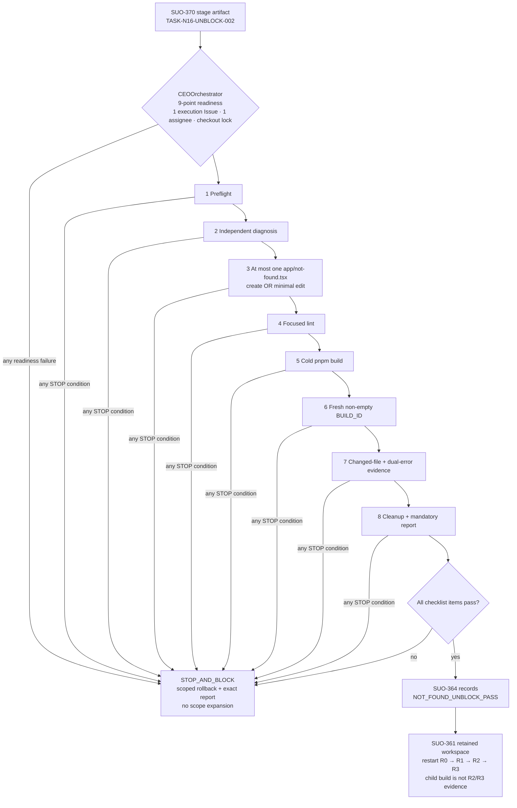

# `/_not-found` prerender unblock 阶段执行闸门

> Stage plan: `STG-N16-UNBLOCK-002`
>
> 关联 Stage Issue: [SUO-370](/SUO/issues/SUO-370)
>
> 任务合同: `TASK-N16-UNBLOCK-002`
>
> 状态: `PLANNED` — 本文档是唯一阶段产物；它不授权源码、lint、build 或执行 Issue 的创建。

## 关联设计稿

- 恢复设计（只读）：`docs/design/design_002_next16_tailwind_postcss_baseline_recovery.md`
- 上游 application unblock（只读）：[SUO-364](/SUO/issues/SUO-364)
- 被阻塞恢复链（只读）：[SUO-361](/SUO/issues/SUO-361)
- 先例（只读）：`docs/stage/stage_global_error_prerender_unblock.md`、`docs/exec/exec_TASK-N16-UNBLOCK-001_global_error_prerender_unblock.md`

## 任务输入来源说明

- 主任务合同（只读）：`docs/task/task_014_shared_not_found_prerender_unblock.md`
- 已填充 requirement（只读）：`docs/task/TASK-REQUIREMENT-task_014_shared_not_found_prerender_unblock.md`
- requirement 模板（只读）：`docs/task/TASK-REQUIREMENT-FORMAT.md`

输入合同定义的错误序列是：旧 `/_global-error` / null `useContext` 首失败已由已回滚的临时变化排除；后续 child build 的首失败是 `/_not-found` / null `useState`。旧 child build、日志和 `.next/BUILD_ID` 均只能作为失败来源，绝不可作为本 gate 或 [SUO-361](/SUO/issues/SUO-361) 的成功证据。

## 阶段任务表

| 阶段 | 任务 | 产出 | 依赖 | 风险 |
| -- | -- | -- | -- | -- |
| `STG-N16-UNBLOCK-002`（唯一严格串行 gate） | `TASK-N16-UNBLOCK-002`：独立诊断并仅在单文件范围足够时解除 `/_not-found` null `useState` prerender 阻塞 | 单一 execution Issue 中完整的 preflight、诊断、lint、cold build、fresh `BUILD_ID`、错误/changed-file、清理/回滚与 handback 证据；强制正式报告 `docs/exec/exec_TASK-N16-UNBLOCK-002_not_found_prerender_unblock.md` | task + requirement + recovery design 已完成；[SUO-364](/SUO/issues/SUO-364) 的 retained workspace/checkout；CEOOrchestrator execute-readiness | 目标/dirty/`.next` 归因不明、第二源码路径、build 伪成功、旧 global-error 回归、报告越界或 child build 被误用为恢复证据 |

## 当前进度

| 阶段 | 任务 | 状态 |
| -- | -- | -- |
| `STG-N16-UNBLOCK-002` | `TASK-N16-UNBLOCK-002` | `PLANNED` — 仅阶段编排完成；执行锁定，等待 CEOOrchestrator 完成九点 execute-readiness。 |

## 执行模型与范围锁

此计划只定义**一个** execution gate。它没有并行分支、没有第二候选修复、没有预热 build，也不得与 [SUO-361](/SUO/issues/SUO-361) 的 R0–R3、旧 global-error 任务或其他候选修复并行。所有步骤必须在同一 execution Issue、同一 assignee、同一 checkout lock 和 retained workspace 连续完成；不得中途换人、换 workspace、release/re-checkout 或派发第二执行者。

### 应用源码 allowlist

唯一允许的应用源码净变化是 `app/not-found.tsx`。

- 仅在 preflight 证明目标**缺失**时可创建，或证明目标是**既有 clean tracked 文件**时可最小修改；两种情形二选一。
- target 已存在但 ownership 不明、dirty、untracked，或其 pre/post 状态不能归因时，立即 `STOP_AND_BLOCK`；不得覆盖、删除或尝试替代文件。
- 结果必须是自包含、静态可 prerender 的 not-found fallback；不得使用 hook/context/Provider/业务依赖或敏感错误信息。Client directive 不是默认方案；若其必要性不能由独立诊断证明且不引入 hook，同样 `STOP_AND_BLOCK`。

### 正式报告 allowlist

`docs/exec/exec_TASK-N16-UNBLOCK-002_not_found_prerender_unblock.md` 是唯一允许创建或幂等更新的正式报告，且在 PASS 与 BLOCKED 两条路径都必须保留。它是强制的非应用源码证据，**不计入**应用源码 changed-file。

除上述精确路径外，所有 `docs/exec/**` 均只读，包括 `docs/exec/exec_TASK-N16-UNBLOCK-001_global_error_prerender_unblock.md`。报告缺失、Task ID/ownership 不符，或任何另一 `docs/exec/**` 路径被本 run 触碰，均为 `STOP_AND_BLOCK`。

### 冻结范围

除两个 allowlist 外，一律冻结：

- `app/global-error.tsx`、所有其他 `app/**`（特别是 layout、Provider、Context、page、CSS、components、hooks、API 和 `app/lib/**`）；
- Next/React/Tailwind/PostCSS、全部依赖和 package-management；`package.json`、全部 lock/workspace/config/typecheck/build 文件、`node_modules/**`；
- Refine/Admin、React Router、`/admin`、UI 套件和第二 Query Client；
- DB、schema/migration、API、领域逻辑与 `app/lib/**`；
- 所有 `docs/design/**`、`docs/issue/**`、`docs/task/**`、已有 `docs/stage/**`、旧执行报告及其他 recovery-chain documents；
- 所有 pre-existing dirty/untracked state，以及父目录、sibling checkout 和外部项目。

不得运行 install、dev、页面 smoke、R3、全量 unit/E2E；不得 global reset/checkout/stash/clean、批量格式化或提交 `.next/**`。`next-env.d.ts` 是兼容性保护项，非修改目标：若 Next 自动写入，必须以 preflight 的逐字节快照恢复并证明最终 hash 相同。

## CEOOrchestrator 九点 execute-readiness

CEOOrchestrator 只有在以下九项全为真时，才可为本计划建立**一个** execution Issue；本计划不创建或派发该 Issue。

1. `TASK-N16-UNBLOCK-002`、其 filled requirement、模板、恢复设计和本阶段文档均存在，且 Task ID / issue chain 一致。
2. 已建立恰好一个 execution Issue；该 Issue 只指定一名执行 assignee，未存在并行执行、复用旧 global-error gate 或第二候选修复。
3. assignee 已 checkout 并持续持有唯一 checkout lock；Issue/run/assignee 不会在 gate 内变更。
4. execution workspace 是 [SUO-364](/SUO/issues/SUO-364) 保留的同一 workspace/checkout；`pwd -P`、Git toplevel、Paperclip workspace cwd 和 project root 可以同源证明。
5. pre-existing dirty/untracked snapshot 已作为保护清单登记，特别是旧 global-error report；执行器承诺不以 clean worktree 为前提，也不覆盖其状态。
6. `app/not-found.tsx` 的 existence、tracked/dirty/untracked 状态、content/hash 和 ownership 可在 preflight 判定；任何歧义即不启动修改。
7. `.next` 与旧 `BUILD_ID` 的来源可判定并且 cold build 前不存在；未知生成态不会被覆盖、清理或借用。
8. 正式报告责任被绑定到精确路径 `docs/exec/exec_TASK-N16-UNBLOCK-002_not_found_prerender_unblock.md`，并理解它是 mandatory、非源码 allowlist；其他 `docs/exec/**` 已明确只读。
9. 执行者和控制面确认 PASS 只能是 diagnostic-only handback：先由 [SUO-364](/SUO/issues/SUO-364) 记录 `NOT_FOUND_UNBLOCK_PASS`，再由 [SUO-361](/SUO/issues/SUO-361) 在 retained workspace/checkout 从 R0 重启 R0 → R1 → R2 → R3；child build 不得充当 R2/R3 或 baseline-recovered 证据。

任一项未满足，不创建执行工作或在运行时立即 `STOP_AND_BLOCK`，并在唯一 execution Issue 中记录首个失败条件、证据位置与拥有下一动作的 owner。

## Gate 内部严格串行清单

以下九个检查点是同一个 gate 的不可跳过顺序。每个检查点都必须保存 command（如有）、cwd、开始/结束时间、完整输出、exit code、hash/status/diff 及证据位置；任一失败关闭所有后续检查点。

### 1. Preflight

- 记录 execution Issue/run、assignee、checkout continuity、`pwd -P`、Git toplevel、Paperclip workspace cwd、完整 `git status --porcelain=v1 -uall` 与 pre-existing dirty/untracked 清单。
- 记录 `.next` 与 `.next/BUILD_ID` 的存在性/归属；`next-env.d.ts` 的字节/hash；`app/not-found.tsx` 的缺失或 clean-tracked 状态、content/hash/ownership；`app/global-error.tsx`、旧报告与新报告路径的状态/hash。
- 发现 target / workspace / checkout / dirty state / `.next` 的任何归因或所有权歧义，立即 `STOP_AND_BLOCK`；不得先清理再判断。

### 2. Independent diagnosis（只读）

- 只读检查新 `/_not-found` / null `useState` 错误链、旧 global-error 合同/报告、root layout/Provider 锚点和本地 Next `16.1.6` not-found 约定。
- 明确记录：旧 `/_global-error` / null `useContext` 已不应作为当前首失败，且旧 child build/`BUILD_ID` 不可复用。
- 独立诊断若要求第二个应用文件、`app/global-error.tsx`、layout/provider/context、配置、版本、依赖、安装或 recovery 文档变化，立即 `STOP_AND_BLOCK`，不试第二方案。

### 3. At most one `app/not-found.tsx` create/minimal edit

- 仅在检查点 1 与 2 通过时，创建缺失的 target 或最小修改既有 clean tracked target；绝不同时采用两种方式，绝不触碰第二个源码文件。
- 复核该 fallback 无 hook/context/Provider、RootLayout、业务页面/组件、TanStack Query、Workspace Context、`app/lib/**`、全局 CSS 或新依赖 import，并且不输出 error/stack/digest/环境变量。

### 4. Focused lint

```bash
pnpm exec eslint app/not-found.tsx
```

命令必须 exit `0`。非零或需要改 ESLint、TypeScript、依赖或配置才能通过时，立即 `STOP_AND_BLOCK`。

### 5. Cold build

- 在调用前再次证明 `.next` 不存在、未借用任何旧 child 生成态或 `BUILD_ID`。
- 从 project root 运行唯一权威构建：

```bash
pnpm build
```

必须 exit `0`，日志须表明 Next `16.1.6`；非零、超时或任何试图安装/改配置绕过均立即 `STOP_AND_BLOCK`。

### 6. Fresh `BUILD_ID` verification

- `.next/BUILD_ID` 必须是检查点 5 开始后本 run 新建的非空普通文件，记录 file type、mtime、size 与 hash/值摘要；`test -s .next/BUILD_ID` 只是最低验证，不能替代 fresh 证明。
- diagnostics 不得处于失败状态。即使 `BUILD_ID` 存在，只要 build 非零、文件空/陈旧/非普通文件或 diagnostics 失败，仍为 `STOP_AND_BLOCK`。

### 7. Changed-file / error evidence

- 保存 pre/post `git status --porcelain=v1 -uall`、全仓 changed-name 对照和 `app/not-found.tsx` 的完整新增内容或最小 diff；新增 untracked 文件不得因普通 `git diff` 默认遗漏。
- 日志必须不含 `/_not-found` / null `useState` prerender failure，并证明未回归 `/_global-error` / null `useContext`；同时不得出现新的 prerender、Tailwind/PostCSS 或 module-resolution failure。
- 证明 `app/global-error.tsx`、所有冻结路径、旧报告、`next-env.d.ts` 与每项 pre-existing dirty state 仍与 preflight 一致。任何第二 application/source 文件或不可解释路径即 `STOP_AND_BLOCK`。

### 8. Cleanup / report

- 取证后只隔离或删除本 run 可证明生成的 `.next/**`；不触碰未知/前序生成态，也不保留其给恢复链使用。
- 若 Next 改写 `next-env.d.ts`，从 preflight 字节快照恢复，并证明 hash 相等。
- 仅在精确 allowlist 创建或幂等更新强制报告 `docs/exec/exec_TASK-N16-UNBLOCK-002_not_found_prerender_unblock.md`；报告必须记录 PASS 或 `[BLOCKED]`、诊断、lint/build、fresh `BUILD_ID`、双错误反证、完整 changed-file、保护项、cleanup/rollback 和 handback。随后证明不存在其他本 run `docs/exec/**` 变化。
- 失败时仅回滚本 run 对 target 的可归因创建/最小修改；报告仍保留 `[BLOCKED]` 及最后成功步骤、首失败步骤、command/cwd/exit code、完整 error chain、证据位置、rollback 与 owner/action。

### 9. Handback

- 仅当全部下方验收项通过，execution Issue 才能记录 `NOT_FOUND_UNBLOCK_PASS`；否则只记录 `[BLOCKED]`，不得扩大 allowlist。
- PASS 的顺序固定为： [SUO-364](/SUO/issues/SUO-364) 记录 `NOT_FOUND_UNBLOCK_PASS` → [SUO-361](/SUO/issues/SUO-361) 在 retained workspace/checkout 从 R0 重新串行运行 R0 → R1 → R2 → R3。
- 本 gate 的 build 是诊断验证，永远不是 [SUO-361](/SUO/issues/SUO-361) 的 R2 PASS、R3 PASS 或 `BASELINE RECOVERED` 证据。

## 阶段产出 checklist

- [ ] 同一 execution Issue / assignee / checkout lock / retained workspace 的连续性证据完整。
- [ ] 仅 `app/not-found.tsx` 作为本 run 应用源码净变化；创建与既有文件最小修改二选一。
- [ ] 独立诊断确认单文件静态 fallback 足够，未要求任何冻结范围变更。
- [ ] `pnpm exec eslint app/not-found.tsx` exit `0`，并有完整记录。
- [ ] 冷 `pnpm build` exit `0`，并有完整记录。
- [ ] 本 run 生成 fresh、非空、普通文件 `.next/BUILD_ID`，diagnostics 未失败。
- [ ] `/_not-found` / null `useState` 消失，`/_global-error` / null `useContext` 不回归，且没有新 prerender/resolver failure。
- [ ] exact changed-file 证明、`next-env.d.ts` 恢复、旧 global-error/recovery 文档与 pre-existing dirty state 保护、run-owned `.next` 清理均完成。
- [ ] 唯一正式报告位于精确 allowlist；PASS 仅按 diagnostic-only 顺序 hand back，或 BLOCKED 保留完整反证与 owner/action。

## 关键路径与拓扑

关键路径没有可并行任务：execute-readiness → 一个严格串行 gate → diagnostic-only PASS handback，或 scoped BLOCKED/rollback。任何停止条件都回到 [SUO-364](/SUO/issues/SUO-364) 的独立证据路由，不允许在本 gate 扩域。



## 风险与缓冲策略

| 风险 | 预防/缓冲 | 明确停止点 |
| -- | -- | -- |
| target 不是可安全修改的唯一文件 | preflight 将 missing、clean tracked、dirty/untracked/ownership unknown 分开取证 | 任何模糊状态、第二 source 路径或 second solution 即 `STOP_AND_BLOCK` |
| 旧 `.next` 或 child `BUILD_ID` 造成伪成功 | build 前要求可归因的冷态；对本 run 生成物记录 fresh 属性后回收 | 未知生成态、旧 BUILD_ID、非零 build 或失败 diagnostics |
| global-error 回归被忽略 | 把 `/_global-error` / null `useContext` 作为与新错误并列的必检反证 | 原错误残留、旧错误回归或新增 prerender/resolver failure |
| 自动文件或并发 dirty state 被覆盖 | preflight byte/hash/status 快照；只回滚 run-owned target 与 `.next` | `next-env.d.ts` hash 不同、旧报告/dirty state 被触碰或 diff 无法归因 |
| 报告范围被误当作源码范围 | 报告精确 allowlist、mandatory、单独计数；所有其他 `docs/exec/**` 冻结 | 报告缺失/错路径/ownership 不符或另一个 exec 路径改变 |
| child build 误解锁恢复链 | handback 的固定双层顺序与独立 R0 restart | 声称 R2/R3 PASS、跳 R0 或 `BASELINE RECOVERED` |

## 完成信号说明

本阶段的唯一完成信号是本文件已存在并完整定义：一个严格串行 gate、九点 execute-readiness、allowlist/冻结范围、准入、验收、STOP_AND_BLOCK、风险缓冲和 diagnostic-only handback。它不表示执行已开始、源码已修改或 build 已通过。

只有未来唯一 execution Issue 的全部 checklist 通过，才允许产生 `NOT_FOUND_UNBLOCK_PASS`；否则必须保留 `[BLOCKED]` 正式报告和 scoped rollback 证据。执行结果不改变本阶段完成信号，也不授权把 child build 作为 [SUO-361](/SUO/issues/SUO-361) 的恢复阶段证据。
