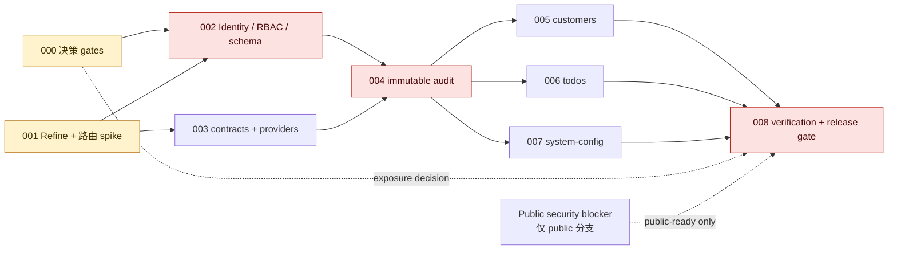

# Refine 管理后台 MVP 执行 Stages

> Stage Plan ID：`STAGE-REFINE-ADMIN-001`
> 关联设计：`DESIGN-REFINE-ADMIN-001`（[设计稿](../design/refine-admin-validated-architecture.md)）
> Task 输入：`TASK-REFINE-ADM-000` 至 `TASK-REFINE-ADM-008`，及其 9 份 requirement
> 编排范围：当前 `ink-admin-memory` checkout；仅规划，不创建 execute Issue、不实现代码
> 交付姿态：默认 `internal-only`；`public-ready` 不是本计划可自动达成的结果

## 编排结论

- 9 个 task 均被映射且仅映射一次；DAG 无环。
- `TASK-REFINE-ADM-000` 与 `001` 是入口并行任务。`003` 可在 `001` 完成后、`002` 仍在进行时做 mock/合同工作；真实受保护 API 验收必须等待 `002`。
- `002` 独占 admin schema/migration，`003` 独占 provider/contract 基座，`004` 独占 audit 基座；这三项是后续资源任务不可绕过的串行门。
- `005`、`006`、`007` 的 route/page/component 写入面互斥，因此在 `004` 稳定后可并行；它们不得回写共享基础。`007` 的配置 mutation 启用必须在 customers/todos canary 成功后最后进行。
- `008` 是唯一验证与交付收口 task。任何 public 断言均另受全服务安全 blocker 约束。

## 输入来源与边界

| 类型 | 权威输入 | 使用方式 |
| --- | --- | --- |
| 设计 | [refine-admin-validated-architecture.md](../design/refine-admin-validated-architecture.md) | 范围、`AC-001`–`AC-016`、`DEC-001`–`DEC-015`、风险与发布约束。 |
| Task package | `docs/task/task_000_*.md` 至 `task_008_*.md` | 每个 task 的目标、DAG、允许/禁止路径、完成信号及测试策略。 |
| Requirement package | `docs/task/TASK-REQUIREMENT-task_000_*.md` 至 `task_008_*.md` | 核验 task 设计时必须保留的 gate、范围与失败路径。 |
| 模板 | [TASK-REQUIREMENT-FORMAT.md](../task/TASK-REQUIREMENT-FORMAT.md) | 核验任务输入字段与标准章节。 |

不可改变的边界：不得修改 `ink-admin-memory-output.xml`、`ink-dream-memory`、`story-workspace`；不得把用户中心、Story、模型注册、密钥轮换、计费、额度、网关或 conversations 纳入 MVP。API Route Handler 只解析、zod 校验、server session/RBAC、`app/lib` 调用、审计编排与统一响应；不得在 route 堆叠 DB 逻辑。

## 阶段任务表

| 阶段 | 任务 | 产出 | 依赖 | 风险 |
| --- | --- | --- | --- | --- |
| `S0` 决策与兼容性证据 | `TASK-REFINE-ADM-000`（与 001 并行） | IdP/session、stable subject、callback allowlist、暴露模式与 fail-closed 的可引用决定 | 无 | IdP/公网模式未决会阻止 production auth 与 public-ready。 |
| `S0` 决策与兼容性证据 | `TASK-REFINE-ADM-001`（与 000 并行） | 锁定 Refine/Router、显式 `/admin` 壳、Next 16 build/SSR/navigation/dynamic-route 证据 | 无 | `next: "*"` 不是运行时兼容承诺；失败必须回流设计。 |
| `S1` 安全与协议基座 | `TASK-REFINE-ADM-002`（与 003 受控并行） | server-only identity、RBAC/guard/protected layout、`admin_members` + `admin_audit_logs` 的唯一 additive migration | 000、001 | IdP 未配置时只允许 fail-closed 基础；schema/migration 只能由本 task 写入。 |
| `S1` 安全与协议基座 | `TASK-REFINE-ADM-003`（可先于 002 以 mock 验证） | resource allowlist、zod contracts、统一错误、Data/Auth/Access providers | 001；真实受保护 API 验收等 002 | `AdminProviders` 与 QueryClient 生命周期冲突，或错误映射泄密。 |
| `S2` 审计与事务基座 | `TASK-REFINE-ADM-004`（串行） | 脱敏 audit writer/transaction seam、只读 audit API 与 UI | 002、003 | audit 失败若仍提交 mutation，会失去安全与取证保证。 |
| `S3` 资源交付 | `TASK-REFINE-ADM-005`（与 006/007 并行） | customers admin CRUD/API/UI、RBAC 与审计闭环 | 002、003、004 | PII 最小披露；不得修改旧 customers 路径或共享基础。 |
| `S3` 资源交付 | `TASK-REFINE-ADM-006`（与 005/007 并行） | todos admin CRUD/API/UI、RBAC 与审计闭环 | 002、003、004 | 枚举/排序/过滤必须在领域查询前 fail-closed。 |
| `S3` 资源交付 | `TASK-REFINE-ADM-007`（与 005/006 并行；最后启用 mutation） | system-config 单例 GET/PUT、show/edit、确认与审计闭环 | 002、003、004 | `extras`/secret 泄露或错误配置影响 AI 行为。 |
| `S4` 集成与发布收口 | `TASK-REFINE-ADM-008`（唯一串行收口） | `AC-001`–`AC-016` 证据矩阵、unit/integration/E2E/PWA 回归、internal-only 结论 | 000 作为决策输入；001–007 均完成 | 环境/IdP 测试身份不足；public 仍受独立安全 blocker 阻止。 |

## 当前进度

| 阶段 | 任务 | 状态 |
| --- | --- | --- |
| `S0` | `TASK-REFINE-ADM-000` | 未执行；可创建 decision execute Issue，但完成前必须形成五项决策证据。 |
| `S0` | `TASK-REFINE-ADM-001` | 未执行；具备兼容性 spike 的 task 输入。 |
| `S1` | `TASK-REFINE-ADM-002` | 未准入；等待 000 的决定记录与 001 的路由/Provider seam。 |
| `S1` | `TASK-REFINE-ADM-003` | 未准入；等待 001，之后仅可 mock/合同验证，受保护 API 验收等待 002。 |
| `S2` | `TASK-REFINE-ADM-004` | 未准入；等待 002 与 003 的稳定接口和 migration review。 |
| `S3` | `TASK-REFINE-ADM-005` | 未准入；等待 002/003/004 完成。 |
| `S3` | `TASK-REFINE-ADM-006` | 未准入；等待 002/003/004 完成。 |
| `S3` | `TASK-REFINE-ADM-007` | 未准入；等待 002/003/004 完成；即使代码完成也最后打开 mutation。 |
| `S4` | `TASK-REFINE-ADM-008` | 未准入；等待 001–007 的实现与 000 的决定记录。 |

状态仅描述此计划生成时的 execute readiness，不代表已经创建或派发任何 execute Issue。

## DAG、并行边与关键路径

**结构性关键路径**：`000 + 001 → 002 + 003 → 004 → (005 | 006 | 007 全部完成) → 008`。没有容量或工期证据，本计划不虚构日期；三个资源支路以最后完成者决定收口时间。若有 public 目标，独立“全服务认证 + ownership/行级授权 + 旧 API 加固”变成 `008` 的额外一等 blocker，而不改变 internal-only 路径。

### 文件冲突与合并控制

| 写入面 | 唯一/主 owner | 并行约束 |
| --- | --- | --- |
| Paperclip 决策记录 | 000 | 无仓库代码写入；其结论为 002/008 的输入。 |
| `package.json`、lockfile、`app/(admin)/admin/login/**`、最小壳、`AdminProviders` seam | 001 | 002 只能在 001 结束后接入 login/protected layout；003 只在 001 交付 seam 后扩展 provider。 |
| `app/lib/db/schema.ts`、`drizzle/**` | 002 独占 | 004–007 只读；不得出现第二个 migration owner 或 runtime DDL。 |
| `app/lib/admin/contracts.ts`、response/route helpers、provider 实现 | 003 | 002 消费 policy seam 但不写 provider；005–007 不得改写/分叉。 |
| `app/lib/admin/audit.ts`、audit API/UI | 004 | 005–007 只能调用稳定 transaction/audit seam；接口不足必须回流 004。 |
| customers/todos/settings 的 admin route/page/component 子树 | 005 / 006 / 007 各自独占 | 三者可并行；各自不写共享基座、schema、旧 PWA/API 或其他 resource 目录。 |
| 测试、fixture、E2E 汇总 | 008 | 只补验证/fixture 明确缺口；不得借验证修改资源功能或上游合同。 |

## Stage 准入、执行规则与产出 checklist

### `S0` 决策与兼容性证据

**准入**：已存在设计与 task package；无需代码前置。000 和 001 可并行。

**执行规则**：000 只记录真实部署/安全决定；001 只进行锁版本与最小路由 spike。001 的 peer 无冲突不得被升级表述为 Next 16 已兼容。

**退出 checklist**：

- [ ] 000 记录 IdP/server-session、stable `identity_subject`、callback allowlist、exposure mode、production fail-closed 行为及 owner/evidence。
- [ ] 未选择 public 时明确 `internal-only`；选择 public 时已有独立安全 blocker，不能只写风险说明。
- [ ] 001 锁定 Core 5.x、Next.js Router 7.x、Node `>=20`，并证明无 React Router/Ant Design/MUI/第二个 QueryClient。
- [ ] 001 留存 build、SSR、client navigation、动态 `[id]` 和既有 `/`、`/customers` 路由回归结果。
- [ ] 兼容性失败时停止下游实现、留下可复现证据并回流设计，而不是更换路由方案。

**失败/回退**：IdP 选择不足时，000 仍应记录“未配置 → production fail-closed”而不能假造身份；001 spike 失败时撤销未发布的依赖/壳变更，回流 DesignArchitect。

### `S1` 安全与协议基座

**准入**：003 在 001 完成后可开始 mock/合同工作；002 必须同时消费 000 决定记录与 001 seam。002 的 IdP 缺失分支仅允许 policy/schema/明确 fail-closed，不得通过 production auth 完成信号。

**并行/串行规则**：002 与 003 可并行；003 的真实受保护 API 验收、以及 S1 退出，均等待 002 guard/policy 稳定。003 拥有 `AdminProviders`；002 不改该组件，只消费其 children seam。

**退出 checklist**：

- [ ] 002 的 `AdminIdentity`、active member mapping、401/403 guard、默认拒绝 `can()`、protected server layout 均有证据。
- [ ] 002 的 migration 仅新增 `admin_members`、`admin_audit_logs`，由 `pnpm db:generate` 产生；无 DROP/rename、无 `ensureInitialized()` admin DDL。
- [ ] 003 的 allowlist、strict zod、分页/排序/过滤上限、错误结构、`{data,meta.total} → {data,total}` 映射完成。
- [ ] 003 对 401/403/404/409/422/429/5xx 有不泄密的映射；403 不登出，401 才进登录流。
- [ ] 现有 QueryClient 只有一个受控生命周期；没有把 provider 当授权权威。

**失败/回退**：schema 或 IdP 合同冲突时停止迁移/认证发布并回流设计；provider 类型冲突时保留 Admin API 合同、回到 001/设计评估，不改旧 API 迎合 Refine。

### `S2` 审计与事务基座

**准入**：002/003 完成，迁移 SQL 已审查，guard/policy、contract/provider 接口可被消费。

**执行规则**：004 是唯一 audit owner；所有成功敏感 mutation 必须与审计在同一事务或有等价证明。审计 record 只能保存字段名、稳定 reason code 与 requestId，不保存 body、PII、prompt、secret、`extras`。

**退出 checklist**：

- [ ] sanitized writer/transaction seam、audit list/show API 与只读 UI 已交付。
- [ ] 三角色 list/show 均可读；没有 audit mutation API/UI。
- [ ] success、denied、failed、redaction 和 audit insert failure 均有测试；audit failure 会回滚敏感业务变更。
- [ ] 响应、测试日志和 audit payload 均通过 secret/PII/prompt/`extras` 反证。
- [ ] 给 005–007 的稳定 audit/transaction 调用接口和 failure 行为已登记。

**失败/回退**：不能证明原子性时 mutation 保持关闭；不得降级成“稍后补审计”。

### `S3` 资源交付与受控启用

**准入**：002/003/004 的完成信号、接口与 failure 测试均存在。每个资源 execute Issue 必须仅含所属 resource 的新增 route/page/component 与测试。

**并行规则**：005 customers、006 todos、007 system-config 可并行；在同一阶段内不得碰 schema、migration、provider、policy、audit 基础或旧 API/PWA。若共享 seam 缺失，停止该 resource，回流对应 owner（002/003/004），不在资源任务私自补写。

**退出 checklist**：

- [ ] 005：list/show/create/update/delete、角色矩阵、operator/auditor direct DELETE 403、PII 最小字段、mutation→audit 与旧 customers E2E 回归。
- [ ] 006：list/show/create/update/delete、非法 enum/sort/filter 的 query 前拒绝、direct DELETE 403、mutation→audit 与旧 todos E2E 回归。
- [ ] 007：固定 `id=default` 的 GET/PUT 与 show/edit；仅 admin 在确认后更新四个白名单字段；`theme`、`extras`、secret 全路径反证。
- [ ] 三个 resource 对 401/403/404/409/422/5xx、audit failure、请求 ID 到 audit 的证据均完整。
- [ ] rollout 先只读 canary；customers/todos mutation 成功后，才可最后启用 system-config mutation。任何 canary 失败先关闭该资源入口/mutation，保留 schema 与审计。

**失败/回退**：关闭受影响 admin resource 的 mutation/入口，保留 additive schema/audit；绝不回滚旧 PWA 数据路径、旧 API 或删除审计。

### `S4` 集成、安全与交付收口

**准入**：001–007 全部完成且 000 的决定记录可引用；受控 E2E 环境和所需 IdP 测试身份可用。若没有环境/身份，未执行项必须显式保留为阻塞，不得以 mock 取代发布证据。

**退出 checklist**：

- [ ] `AC-001`–`AC-016` 逐项映射为通过证据或具有 owner/action 的阻塞记录。
- [ ] admin login → resource mutation → audit 的 happy path 与未登录/operator direct-call failure path 均有可追踪证据。
- [ ] policy/guard/contracts/providers/audit unit、admin API integration、admin E2E、customers/todos PWA 回归与受影响 lint 结果完整。
- [ ] migration/schema 单一 owner、无 runtime DDL、secret/`extras`/敏感值反证、`git diff --check` 均完成。
- [ ] 发布说明明确为 `internal-only`；只有独立全服务安全 blocker 完成才允许额外声明 `public-ready`。

**失败/回退**：资源缺口回流拥有该资源的 execute Issue；设计边界冲突回流 DesignArchitect。008 不扩展产品功能或暗改上游合同。

## 逐 Task Execute Readiness Handoff（供 CEOOrchestrator）

| Task / 关联 Issue | 来源 task / requirement | execute 准入与必须输入 | 允许写入面 | 禁止写入面 | 验收与最小验证 | 当前 gate / CEO 后续动作 |
| --- | --- | --- | --- | --- | --- | --- |
| `TASK-REFINE-ADM-000` / `REFINE-ADM-000` | [task_000](../task/task_000_shared_delivery_gates.md)；[requirement_000](../task/TASK-REQUIREMENT-task_000_shared_delivery_gates.md) | **可执行（决策型）**；需要真实 IdP/session、stable subject、callback allowlist、exposure mode、fail-closed owner/evidence。 | 仅 Paperclip 决策评论/交互。 | `app/**`、`drizzle/**`、上游/Stage/exec、XML、外部仓库。 | 五项字段齐全；002/008 可引用；public 有一等安全 blocker。 | **未决**：CEOOrchestrator/部署与安全 owner 记录决定。未决时 002 只可做 fail-closed 基础，008 只可 internal-only 条件收口。 |
| `TASK-REFINE-ADM-001` / `REFINE-ADM-001` | [task_001](../task/task_001_frontend_refine_route_shell.md)；[requirement_001](../task/TASK-REQUIREMENT-task_001_frontend_refine_route_shell.md) | **可执行**；Node `>=20`、当前依赖树、现有 QueryClient/PWA 路由基线可读。 | `package.json`、lockfile、`app/(admin)/admin/**` 最小壳、`AdminProviders` seam、相关测试。 | React Router、Ant/MUI、catch-all、第二个 QueryClient、session/RBAC、CRUD、schema/migration、旧 PWA/API。 | 依赖树、lint、build、SSR/client navigation/dynamic route smoke、customers 路由回归。 | **Ready**：CEO 可为该 task 创建 execute Issue；失败必须提供证据并回流设计。 |
| `TASK-REFINE-ADM-002` / `REFINE-ADM-002` | [task_002](../task/task_002_shared_admin_auth_rbac.md)；[requirement_002](../task/TASK-REQUIREMENT-task_002_shared_admin_auth_rbac.md) | **条件准入**；000 决定记录 + 001 seam。IdP 未配置仅准 policy/schema/fail-closed，不准 production-auth 完成。 | `app/lib/admin/auth.ts`、`policy.ts`、`app/lib/db/schema.ts`、`drizzle/**`、protected layout/login 接入、认证/RBAC/迁移测试。 | 旧 API、具体 resource CRUD、contract/provider/audit、延期域 schema、chat/Claude/XML。 | policy/guard unit、route/layout smoke、`pnpm db:generate` + SQL/meta review、无 runtime DDL、`git diff --check`。 | **Blocked on input evidence**：先完成 000 和 001；execute Issue 必须标明它是 schema/migration 唯一 owner。 |
| `TASK-REFINE-ADM-003` / `REFINE-ADM-003` | [task_003](../task/task_003_shared_admin_contracts_providers.md)；[requirement_003](../task/TASK-REQUIREMENT-task_003_shared_admin_contracts_providers.md) | **条件准入**；001 已完成。可用 mock 验证；protected API 验收须等待 002 guard。 | `app/lib/admin/contracts.ts`、窄 helper、`AdminProviders`/provider、相关测试。 | resource routes/pages、route SQL、schema/migration、旧 API、secret、任意代理、第二个缓存。 | zod/provider mapping unit；mock 401/403/409/5xx；`{data,meta.total}` 映射。 | **Wait for 001**：CEO 可在 001 完成后创建 execute Issue，并把 protected-API 验收依赖 002 作为 blocker/exit gate。 |
| `TASK-REFINE-ADM-004` / `REFINE-ADM-004` | [task_004](../task/task_004_full-stack_admin_audit_resource.md)；[requirement_004](../task/TASK-REQUIREMENT-task_004_full-stack_admin_audit_resource.md) | **未准入**；002 schema/guard 与 003 contracts/providers 均稳定，migration 已审查。 | `app/lib/admin/audit.ts`、audit admin API/UI、audit tests/fixtures。 | schema/migration、现有业务表、resource mutation、旧 API、audit mutation、敏感内容持久化/日志。 | writer/route/UI tests；事务失败模拟；三角色只读；secret/PII 反证。 | **Wait for 002+003**：CEO 创建 execute Issue 前须核验两个基础 task 的完成信号与稳定导出。 |
| `TASK-REFINE-ADM-005` / `REFINE-ADM-005` | [task_005](../task/task_005_full-stack_customers_admin_resource.md)；[requirement_005](../task/TASK-REQUIREMENT-task_005_full-stack_customers_admin_resource.md) | **未准入**；002/003/004 已交付的 guard/contract/audit seam。 | `app/api/admin/customers/**`、admin customers pages/components、仅需的 customers 窄接口、资源测试。 | schema/migration、共享基础、旧 customers API/PWA、conversations、其他 resources。 | CRUD integration/E2E，direct DELETE 403，mutation→audit，PWA customers 回归。 | **Wait for 002+003+004**：资源 Issue 只包含 customers 文件面；缺共享接口时回流 owner。 |
| `TASK-REFINE-ADM-006` / `REFINE-ADM-006` | [task_006](../task/task_006_full-stack_todos_admin_resource.md)；[requirement_006](../task/TASK-REQUIREMENT-task_006_full-stack_todos_admin_resource.md) | **未准入**；002/003/004 已交付的 guard/contract/audit seam。 | `app/api/admin/todos/**`、admin todos pages/components、仅需的 todos 窄接口、资源测试。 | schema/migration、共享基础、旧 todos API/PWA、其他 resources、批量/实时/多租户。 | CRUD integration/E2E，非法 enum/sort/filter 拒绝，direct DELETE 403，PWA todos 回归。 | **Wait for 002+003+004**：可与 005/007 并行，文件面必须独立。 |
| `TASK-REFINE-ADM-007` / `REFINE-ADM-007` | [task_007](../task/task_007_full-stack_system_config_resource.md)；[requirement_007](../task/TASK-REQUIREMENT-task_007_full-stack_system_config_resource.md) | **未准入**；002/003/004 已交付；只准四个白名单字段、admin 确认和 audit transaction。 | `app/api/admin/system-config/route.ts`、admin settings pages/components、必要窄接口、资源测试。 | schema/migration、旧 system-config API、`theme`/`extras`/secret、Registry/计费/网关、共享基础。 | strict projection/policy/audit tests；GET/PUT integration；confirm→update→audit E2E；泄露反证。 | **Wait for 002+003+004**：代码可与 005/006 并行，但 enable/canary 必须最后执行。 |
| `TASK-REFINE-ADM-008` / `REFINE-ADM-008` | [task_008](../task/task_008_shared_admin_integration_verification.md)；[requirement_008](../task/TASK-REQUIREMENT-task_008_shared_admin_integration_verification.md) | **未准入**；001–007 完成、000 决定可引用、E2E 环境/测试身份可用；public 还须独立安全 blocker done。 | 被影响 tests/integration/E2E、fixtures、最小 Playwright config、既有发布说明。 | resource 功能、RBAC/协议决定、public 配置、旧 API 大重构、上游 docs、Stage/exec、延期域。 | `AC-001`–`AC-016` 矩阵，lint/unit/integration/E2E/PWA、secret/audit failure、`git diff --check`。 | **Wait for all predecessors**：CEO 仅在所有证据齐全后创建收口 execute Issue；结论必须明确 `internal-only` 或 `[BLOCKED] public-ready`。 |

## 未决 Gate、风险与缓冲策略

| Gate / 风险 | 阻塞范围 | Owner | 解锁动作 | 缓冲与回退 |
| --- | --- | --- | --- | --- |
| `G-01` IdP/session、stable subject、callback allowlist 未有真实记录 | 000 closure；002 production auth；008 release evidence | CEOOrchestrator / 产品部署责任人 | 在 000 的决策记录中填写五项字段、证据与 fail-closed 行为。 | 允许明确的 fail-closed policy/schema 基础；禁止 mock 身份成为 production 路径。 |
| `G-02` 暴露模式未显式确认 | 000 closure；008 发布表述 | CEOOrchestrator / 产品安全责任人 | 明确 internal-only；若选 public，创建并前置独立全服务安全 blocker。 | 默认 internal-only；不把 `/api/admin` 通过误称为全 PWA 公网安全。 |
| `G-03` Next 16 运行时兼容性 | 001、后续所有 Refine 依赖任务 | 001 execute owner | 真实 build/SSR/client navigation/dynamic-route 证据。 | spike 失败时撤销未发布依赖/壳并回流设计；不改 React Router/Next 作临时绕行。 |
| `G-04` schema 与 audit 的单一所有权 | 002–007 合并与发布 | 002/004 execute owner | 002 先交付 additive migration；004 先交付稳定 audit transaction seam。 | 资源任务无权补 migration/provider/audit；缺接口即回流，避免冲突分支。 |
| `G-05` E2E 环境、三角色身份和审计 failure fixture | 008 最终收口 | 008 execute owner / 部署责任人 | 提供受控测试身份、环境与 audit failure 注入方式。 | 未执行的 E2E 必须带 owner/action 记录为未完成，不能用 mock 替代发布证据。 |
| `G-06` system-config mutation 风险 | 007/008 rollout | 007 execute owner | 仅 admin、确认、白名单、审计成功与只读 canary 后启用。 | 先关闭 settings mutation/入口；保留 audit 和前向兼容 schema。 |

## 完成信号与交接

StagePlanner 的完成信号是本文件存在且满足以下验证：

- [x] 9/9 task 与 9/9 requirement 一一映射，且每个 task 仅出现一次。
- [x] DAG 只包含从前置到后继的边；无循环；000/001、002/003、005/006/007 的可并行条件已显式说明。
- [x] schema/migration、provider/contract、audit、三个 resource 的写入 ownership 已分离；共享文件冲突有回流规则。
- [x] 每个 task 均有来源、关联 Issue、执行准入、允许/禁止写入面、验收/测试与当前 gate。
- [x] 关键路径、internal-only/public 条件、风险、缓冲和回退均已记录。

后续由 CEOOrchestrator 执行逐 task execute readiness check：只对上表标为可执行或已满足条件的 task 创建 execute 子 Issue。StagePlanner 不自行派发 execute，不修改 `docs/task/`、上游设计、应用代码或 `docs/exec/`。
