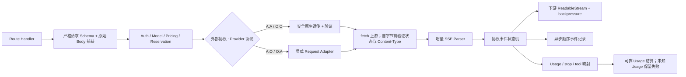

# Gateway 协议、流式与完整报文审计

> 审计日期：2026-08-08（Asia/Shanghai）  
> 写入范围：`ink-admin-memory`；只读参考：`ink-dream-memory`、`cc-switch`  
> 数据边界：未使用真实用户 Token，未迁移或清理共享 PostgreSQL。

## 1. 结论与真实根因

基线实现不是“完全没有流”，而是存在四个结构性缺口：

1. `resolveBillableModel()` 把外部入口协议与 Provider 协议强制相等。Anthropic→OpenAI 与 OpenAI→Anthropic 在 Adapter 之前即返回 `MODEL_PROTOCOL_MISMATCH`，所以协议矩阵实际只有对角线两格。
2. 基线 Handler 依赖 SDK 已解析对象再拼装下游 SSE；它没有独立、可测试的字节级 SSE parser 和转换状态机，也没有保存原始下游事件。网络 Chunk 与 SSE Event 的边界没有被显式建模。
3. 基线流在 `ReadableStream.start()` 内才建立 SDK 上游流，但 Route 已构造 200 Response。Provider 在首事件前返回 401/400/5xx 时只能退化成流内 error，不能返回正确的非 200 HTTP 响应。
4. `gateway_requests` 只保存计费、状态和 `response_summary`。请求 JSON、脱敏 Headers、非流式完整响应、流式事件序列均没有持久化目标，Admin 列表因此不可能还原报文。

没有发现基线在流式热路径直接调用 `response.json()`；问题是 SDK 对象级重编码、缺少跨协议状态机、响应启动时机和缺少报文数据模型。非流式路径完整读取 JSON 是预期行为；流式路径不得完整缓冲。

### 1.1 Claude Code 2.1.220 兼容性复核

后续真实调用暴露出第五个协议缺口：Claude Code 2.1.220 对 `/v1/messages?beta=true` 的请求会同时发送顶层 `system`，以及位于 `messages[]` 中的 `role: "system"` 运行时控制消息。旧 Zod Schema 把消息角色限定为 `user|assistant`，因此在 Provider 调用前返回 `messages.1.role` 400；同时旧传输层没有把安全的 `anthropic-beta`、`anthropic-version`、`x-app`、User-Agent 和受限 `beta=true|1` query 传播到 Anthropic Provider。

修复后，Anthropic 原生 Provider 保留 Claude Code 的 message-level system 形状；Anthropic→OpenAI Adapter 则把顶层和消息级 system 内容按原顺序合并为唯一的 OpenAI system 前缀，避免把 system 错误降级成 user。Gateway 认证 Header 仍不会传播到 Provider，Provider 认证始终由加密凭据重建。

### 1.2 Dream 实际环境与请求日志复核

对 Dream 正在运行的 Claude Code 2.1.220 子进程及 `.env` 做了只读、脱敏核对：进程实际收到 `ANTHROPIC_BASE_URL=http://localhost:3000`、`deepseek-v4-flash` 外部模型别名和 `gw_` 类型 `ANTHROPIC_AUTH_TOKEN`。因此本轮故障不是 Dream 没有加载环境变量，也不是重复拼接 `/v1` 或误用 Provider Key。

共享数据库的只读生命周期元数据显示，Gateway 已认证该 Key、解析到启用的原生 Anthropic Provider，但在调用 Provider 前返回 `429 DAILY_TOKEN_LIMIT_EXCEEDED`：当天可靠 Usage 计数为 64,045 tokens，平台用户日限额为 100,000，而 Claude Code 本次输入估算加最大输出预留为 45,242，合计 109,287，超过剩余额度。429 的 `Retry-After: 60` 使 CLI 约每分钟重试，这就是“配置了环境变量但不能正确发起”的当前直接原因；不得通过代码静默绕过日限额，需由 Admin 提高该用户限额、降低请求最大输出预算，或等待 UTC 日窗口重置。

日志缺报文有独立的真实根因：`beginGatewayRequest()` 已为限额拒绝创建 `gateway_requests` 行，但旧 `prepareGatewayRequest()` 仅在 `reserved` 分支调用 `recordGatewayRequestPayload()`，所以 429/402/409 预授权拒绝会停在 `payload_capture_status=pending`，响应体也没有写入 `gateway_response_payloads`；订阅暂停/失效等策略拒绝甚至发生在主行 INSERT 前。修复后，认证并解析成功的请求会先建立主行再执行订阅策略，除 idempotency replay 外，rejected 分支同样保存完整脱敏请求，并把外部协议正确的 JSON 错误响应保存为 complete；replay 不覆盖原始请求报文。实际 Dream 后续重试的只读元数据已显示 request/response 两侧均为 `complete`，未读取或输出 Prompt 内容。

429 的运营可见性随后补齐：限额判定将 `limit_window`、`limit_metric`、`current`、`requested`、`limit`、`remaining`、`exceeded_by` 固化到 `gateway_requests.response_summary`，并生成包含同一快照的 `error_message` 和协议错误体。Admin 列表直接显示错误码/具体原因，详情在完整报文权限门之前显示中文诊断卡，因此定位 `/v1/messages?beta=true 429` 不需要加载大型 payload 或查看 Prompt。诊断卡按计量类型提供真实恢复入口：Token 429 携带用户/模型定位到可编辑的用户默认 Token 上限，RPM 定位到模型授权矩阵，并补充模型覆盖与套餐权益检查链接。`gateway_rate_limits` 明确展示为自动累加的实时用量计数，保持只读。隔离 E2E 已证明将测试用户日上限从 1 提高到 1000 后，同一 Gateway Key 重试由 429 变为 200。

## 2. Route、Handler、Adapter、Transform 链路

### 2.1 修复前

| 外部入口 | Handler | Provider client | Transform | 结果 |
|---|---|---|---|---|
| `POST /v1/messages` | `anthropic-handler.ts` | Anthropic SDK | 模型名/输出上限覆盖；事件对象重新序列化 | 只支持 Anthropic Provider |
| `POST /v1/messages/count_tokens` | `anthropic-handler.ts` | Anthropic SDK | 模型名覆盖 | OpenAI Provider 会协议不匹配 |
| `POST /v1/chat/completions` | `openai-handler.ts` | OpenAI SDK | 模型名、输出上限、`include_usage` | 只支持 OpenAI Provider |
| `GET /v1/models` | `models.ts` | PostgreSQL | 对可用模型投影 | 非流式 |

共同前置链路是：Route → 协议 Zod → Gateway Key/Scope → 用户/模型/Provider/价格解析 → 预授权/限流 → Provider。共同后置链路是 Usage 解析 → 价格快照计费 → append-only Ledger → `gateway_requests` 终态。

### 2.2 修复后

Route 仍只编排。请求/响应转换位于 `protocol-adapters.ts`，SSE 状态机位于 `stream-adapters.ts`，Chunk parser 位于 `sse.ts`，传输与取消位于 `provider-transport.ts`，状态编排位于 `proxy-handler.ts`，持久化位于 `payloads.ts`。

## 3. SSE、Headers、错误与取消审计

### 3.1 Chunk 与 Event

新 parser 持有跨 Chunk buffer，支持：一个 Event 横跨多底层 Chunk、单 Chunk 多 Event、CRLF、多 `data:` 行和 EOF 缺少尾部空行。转换不做字符串替换；每个 `data` 先解析为 JSON，再交给协议状态机。

Anthropic 下游逐个输出 `event: <type>\ndata: <json>\n\n`。OpenAI 下游逐个输出 `data: <json>\n\n`，成功终态只输出一次 `data: [DONE]\n\n`，不会混入 Anthropic event 名称。

### 3.2 Response 启动时机

Gateway 先等待上游返回响应头：

- 首字节前 HTTP 错误：映射为 Anthropic/OpenAI 对应 JSON 错误与真实非 200 Gateway 状态；Provider 原始错误只进入受保护 payload，不直接回显。
- 200 但不是 `text/event-stream`：在下游流开始前返回 `UPSTREAM_STREAM_INVALID` 502。
- 流开始后解析、网络或 Provider 中断：保持已经发送的 200，输出协议内 error event，标记 `interrupted`，按已获得 Usage 决定结算或 `settlement_failed`。

### 3.3 Headers

流式响应设置：

- `Content-Type: text/event-stream; charset=utf-8`
- `Cache-Control: no-cache`
- `Connection: keep-alive`
- `X-Accel-Buffering: no`
- `X-Request-Id`

部署层仍需关闭对 `/v1/messages` 与 `/v1/chat/completions` 的响应缓冲/压缩；应用不声明 `Content-Encoding`，上游请求以 `Accept: text/event-stream` 发出。

### 3.4 Backpressure 与客户端中断

下游 `ReadableStream.pull()` 每次从增量 iterator 读取下一 SSE Event，避免整流读取；下游 `cancel()` 会 abort 联结的 Provider `AbortController`、结束 iterator、记录 `cancelled` 并执行未知 Usage 的失败终态。Request `AbortSignal` 同样联结上游和 Provider timeout。

## 4. 协议矩阵

| 外部 | Provider | 请求 | 非流式响应 | 流式 |
|---|---|---|---|---|
| Anthropic | Anthropic | 验证后覆盖模型/上限 | 安全透传 | 保留 Anthropic named events |
| OpenAI | OpenAI | 验证后覆盖模型/上限、补 `include_usage` | 安全透传 | 保留 OpenAI chunks + 单一 `[DONE]` |
| Anthropic | OpenAI | messages/system/tools/tool_choice 转 Chat | choices/tool_calls/usage/finish 转 Message | OpenAI delta → Anthropic text/thinking/input_json 状态机 |
| OpenAI | Anthropic | messages/tools/tool calls 转 Messages | content/tool_use/cache usage/stop 转 Chat | Anthropic events → OpenAI delta/tool_calls/usage 状态机 |

映射覆盖 text、thinking/reasoning、tool use/tool call、finish/stop reason、cache read/write Usage。无法无损表达的供应商扩展字段不会用字符串替换伪造；它们要么作为明确扩展字段传递，要么在 schema/contract test 中被拒绝。

## 5. 完整报文为何此前不可还原、现在如何还原

### 5.1 基线缺口

`gateway_requests` 只有摘要和 Usage；SDK 流事件发送后即丢弃。没有 body hash、字节数、响应 Content-Type、sequence 或 raw SSE，因此无法证明请求/响应完整性、事件顺序或首事件时间。最初实现完整报文表后仍遗漏了预授权拒绝分支：rejected 主行存在，但 payload recorder 被 `result.kind !== "reserved"` 提前返回跳过；该分支现已纳入捕获。

### 5.2 新表

- `gateway_request_payloads`：method/path/query、外部/Provider 协议、脱敏 Headers、原始 JSON 文本与 JSONB、长度、SHA-256、压缩和捕获状态。
- `gateway_response_payloads`：HTTP/Content-Type/白名单 Headers、非流式完整 JSON/文本、总流字节、Provider request ID、错误体、首事件/完成时间和状态。
- `gateway_response_events`：真实 FK、唯一 `(gateway_request_id, sequence)`、event type、raw data、完整下游 raw event、字节、相对时间与绝对时间。

列表查询不 join 这些表。Raw SSE 通过 `sequence ASC` 连接 `raw_event` 精确重建；完成时写入整条下游 SSE 的 SHA-256，Provider HTTP request ID 优先于消息对象 ID 单独保存。

## 6. 安全、隐私、保留与审计

持久化前只保留请求/响应 Header 白名单；`authorization`、`x-api-key`、Cookie、Set-Cookie 和认证别名固定写成 `[REDACTED]`。Provider secret 只在内存中解密并构造上游 Header，不进入 payload、Admin Audit、console 或 analytics。

完整报文 API 需要独立 `gateway.payloads.read`、`x-gateway-payload-confirmation: reveal` 和活跃 Admin Session。每次成功查看在同一 PostgreSQL 事务写 `view_full_payload` 审计；审计只保存 request id、可用性和事件数，不复制 Prompt/Response。UI 默认不加载，二次确认后才读取，复制按钮标记为不进入 analytics。

建议默认在线保留 30 天（`GATEWAY_PAYLOAD_RETENTION_DAYS`），随后将加密归档写入受控对象存储或按合规策略删除；`gateway_requests`、价格快照和 Ledger 不随 payload 清理。长期保存 Prompt 必须在隐私政策中说明用途、法定依据、用户删除请求与备份删除 SLA。清理只能针对 payload 三表，并按事件→响应→请求顺序或依赖 FK cascade 执行；不得删除主请求和账本。

## 7. cc-switch 对比

cc-switch 的关键差异不是 UI，而是把 SSE 当作字节流和状态机：`response_processor.rs` 直接把 `bytes_stream()` 包装为 `Body::from_stream`，流路径不整包读取；转换器维护跨 Chunk buffer、UTF-8 remainder、内容/tool/reasoning index、EOF sentinel 与终态。它还在转发层显式选择协议转换并重建 Anthropic headers。

本次实现采纳相同原则，但不复制其 SQLite、Tauri 或 Codex Responses 专用模型：Ink Gateway 保持单一 PostgreSQL、Next Web Streams、Anthropic Messages/OpenAI Chat Completions 两种公开协议。

## 8. ink-dream-memory 实际消费方式与后续清单

只读审计确认业务调用方不是直接用普通 Anthropic Messages SDK，而是通过 Python `claude-agent-sdk` 启动 Claude Code 子进程：

- `SimpleClaudeAgentSDKClient.query_stream()` 使用 `ClaudeSDKClient` 的 `query()` + `receive_response()`。
- Runner 默认 `include_partial_messages=True`，依赖合法 Anthropic 增量事件形成 SDK `StreamEvent`。
- 子进程显式接收 `ANTHROPIC_BASE_URL`、`ANTHROPIC_AUTH_TOKEN` 和模型环境变量；不读取 OpenAI endpoint。
- Claude Code 2.1.220 会发送 `/v1/messages?beta=true`、`anthropic-beta`，并在 `messages[]` 中加入 `role: system` 控制消息；Gateway 必须接受并按 Provider 协议保留或规范化。
- 纯取消会向外传播，非取消的 SDK/CLI failure 被转成业务 SSE error。

后续调用方调整清单：

1. `ANTHROPIC_BASE_URL` 指向 Gateway origin（不要重复拼 `/v1/messages`），`ANTHROPIC_AUTH_TOKEN` 使用 Gateway Key；不要同时放真实 Provider Key。
2. 模型环境变量使用 Admin 中启用的外部 alias，不使用 Provider upstream model。
3. 保持 `include_partial_messages=True`；不要把多个 `content_block_delta` 合并后才向前端发送。
4. 对 SDK 的 cancellation/BaseExceptionGroup 继续区分真实客户端取消与 Provider 失败。
5. 若 UI 需要显示成本/Usage，通过受权 Admin/业务 API 读取，不从 SSE 私自推断账单。
6. 遇到流中 `error` 时不得把先前部分文本当作成功完成；保留 request id 便于后台关联。

`ink-dream-memory` 与 `cc-switch` 在本任务中均未修改。

## 9. 自动化证据与未执行外部场景

最终验证结果：

| 验证 | 结果 | 覆盖证据 |
|---|---:|---|
| `pnpm env:check` | 通过 | 环境结构及单 PostgreSQL 约束 |
| `pnpm exec tsc --noEmit` | 通过 | Gateway、Admin、Schema 类型链路 |
| `pnpm lint` | 通过 | 全仓 ESLint |
| `pnpm test:run` | 41 files / 214 tests 通过 | 协议、SSE、Usage、拒绝报文捕获、计费、订阅、安全、Story/Storage/RBAC 回归 |
| `pnpm build` | 通过 | Next.js 生产构建及 `/v1/*`、payload API 路由 |
| Drizzle 迁移 | 0000–0014 通过 | 独立 Docker PostgreSQL：`127.0.0.1:55433/ink-memory` |
| Gateway focused Playwright | 1/1 通过 | Mock Provider、真实 PostgreSQL、真实 Claude CLI 2.1.220、日限额 429 双侧报文、官方 Anthropic/OpenAI SDK、原生 `fetch`、`curl -N`、RBAC/Audit |
| Subscription focused Playwright | 1/1 通过 | 暂停订阅 403 的主请求、完整请求/响应、RBAC 读取与 Audit；订阅生命周期和 allowance 结算回归 |
| 视觉验收 | 2/2 通过 | 1440×1000 Drawer；390×844 全屏；无页面级横向溢出 |

协议自动化覆盖原生 Anthropic/OpenAI 非流、原生流、双向交叉流、Claude Code message-level system、`beta=true` 与安全兼容 Header、分片 SSE、多 Event、CRLF、text/thinking/tool、Usage/cache、首事件立即输出、首字节前 Provider error、流开始后中断、客户端 cancel、无可靠 Usage、预授权 429 的请求/响应完整捕获、持久化失败不破坏客户端流、Header 脱敏、SHA-256、Provider request ID 与完整事件顺序。Playwright 对数据库执行了明文 Gateway Key 泄漏扫描，并验证完整报文查看审计不含 Prompt/Response。

隔离测试只重建专用容器中的 `ink-memory`；没有迁移、清空或修改共享 `127.0.0.1:5433` 数据。测试结束后专用容器和此前创建的命名临时数据库均按精确名称清理。

真实 Anthropic/OpenAI Provider 不在本地验收范围：没有使用真实用户 Token，也没有用外部 Provider 产生费用。该场景只能在专用 staging key、预算和数据处理协议到位后执行。
