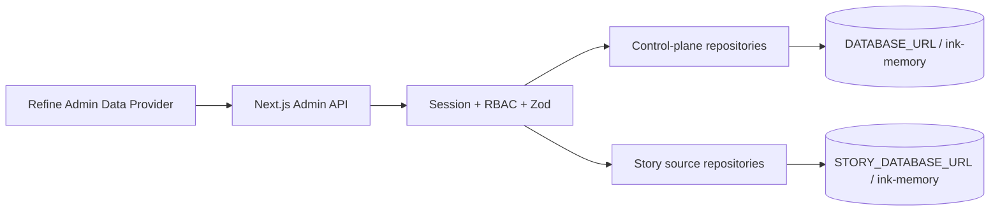

# Ink Dream Memory 业务数据接入审计

> 审计日期：2026-08-08  
> Admin 项目：`/Users/dmeck/project/ink-admin-memory`  
> 业务源项目（只读）：`/Users/dmeck/project/ink-dream-memory`

## 1. 执行结论

当前 Admin 看不到 `ink-dream-memory` 的业务表，不是 PostgreSQL schema search path 或数据库名拼写导致，而是两个项目根本没有使用同一种持久化实现：

- `ink-admin-memory` 通过 `app/lib/db.ts` 的 `pg.Pool` 读取 `DATABASE_URL`，Drizzle 配置也固定为 `dialect: "postgresql"`。
- `ink-dream-memory` 的实际运行代码 `backend/database.py:34-46, 121-132` 通过 Python 标准库 `sqlite3` 打开 `INK_DATABASE_PATH`，默认文件为 `backend/data/ink-and-memory.db`。其任务文档 `docs/task/task_201_backend_story-workspace-schema.md:20-27` 也明确写明“项目使用 SQLite（非 PostgreSQL）”。业务源环境模板不存在 `DATABASE_URL` 或 PostgreSQL 配置。
- Admin 迁移 `drizzle/0006_smart_hedge_knight.sql` 独立创建了 `story_workspaces`、`story_projects`、`story_characters`、`story_scenes`、`story_workflow_runs`，并把它们连接到 Admin 的 `platform_users`。这些表名、字段、主外键、枚举和业务规则均没有对齐业务源的真实表。

因此，现状同时包含两个问题：Admin 连接的是自己的 PostgreSQL 控制面数据库，且又在这个数据库里重新建立了一套语义重复、结构不兼容的 Story 表。即使两个项目使用同一个数据库名字符串，也不可能让 PostgreSQL 自动看见 SQLite 文件中的表。

用户要求“业务源不修改、Admin 不引入 SQLite、最终只用 PostgreSQL”与业务源当前“真实数据只在 SQLite”之间存在客观前提冲突。可实施且不伪造数据的目标架构是：

1. Admin 立即停止读取和写入错误的 `story_*` 平行表，但不删除旧表。
2. Admin 增加显式的 PostgreSQL 第二数据源 `STORY_DATABASE_URL`，只映射业务源的真实表名和字段；同实例部署时允许它等于 `DATABASE_URL`，不同实例时指向另一个数据库名仍为 `ink-memory` 的 PostgreSQL。
3. Admin 不迁移、不创建业务源表；这些表必须由业务源的正式 PostgreSQL 化部署或受控 DBA 迁移提供。当前业务源代码仍是 SQLite，因此真实线上接通需要业务源所有者完成独立迁移/兼容工作；本项目不得通过复制同步或 SQLite 驱动绕过这个边界。
4. 在第二 PostgreSQL 数据源具备之前，Story 资源显式返回“业务数据源不可用”，不得回退到 Admin 平行表或假数据。

## 2. 工作区与证据边界

### 2.1 Git 状态

- `ink-admin-memory`：`main...origin/main`，审计开始时工作区干净。
- `ink-dream-memory`：`story-workspace...origin/story-workspace`，存在未跟踪目录 `.claude/worktrees/`。本次审计未进入、修改或清理该目录，也未修改业务源任何文件。

### 2.2 数据安全

- 仅检查源码、迁移、文档和已配置环境变量的键名；没有输出环境变量值。
- 没有连接、迁移、清空、写入或删除 Admin/PostgreSQL、业务源 SQLite 或 Storage 中的任何真实数据。
- 没有执行 `db:migrate`、fixture seed 或破坏性 SQL。

## 3. 数据连接审计

| 项目 | 实际连接实现 | 配置入口 | 当前数据形态 | 判断 |
|---|---|---|---|---|
| ink-admin-memory | `pg.Pool` + Drizzle PostgreSQL | `DATABASE_URL`，`drizzle.config.ts` | PostgreSQL，目标库名规范为 `ink-memory` | Admin 控制面数据库 |
| ink-dream-memory | `sqlite3.connect(DB_PATH)` | `INK_DATABASE_PATH`，默认 `backend/data/ink-and-memory.db` | SQLite 文件 | 当前真实业务数据源 |
| Story 第二数据源 | 当前不存在 | 规划为 `STORY_DATABASE_URL` | 必须是 PostgreSQL，库名 `ink-memory` | 纠偏后的 Admin 业务读写入口 |

不能直接把 `STORY_DATABASE_URL` 指向 SQLite，也不能在 Admin 安装 `better-sqlite3`、SQLite fixture、JSON/内存回退。若未来源业务表与 Admin 控制面表同库，`STORY_DATABASE_URL` 可与 `DATABASE_URL` 相同；若分实例，则使用两个独立 `pg.Pool`，但不做表复制同步。

## 4. 实体与表映射

| 业务实体 | ink-dream-memory 真实表 | 当前 Admin 表/Resource | 是否重复 | 最终数据源 | 读写策略 | 需要修改的代码 |
|---|---|---|---|---|---|---|
| 业务用户 | `users`（`id INTEGER`、email、display_name、avatar_url、role、created/updated） | `platform_users` / `platform-users` | 部分重复。`platform_users` 可作为计费身份映射，但不能代替业务用户主数据 | Story PostgreSQL 的 `users`；控制面保留 `platform_users(source, external_user_id)` 交叉引用 | 业务字段只读；状态/套餐/Token 限额只写控制面；不得修改源 password_hash | 新建 source-user repository；用户页组合源用户与计费身份；禁止独立创建“业务用户” |
| 工作区 | `story_workspace_workspaces`（owner_id、name、settings） | `story_workspaces` / `story-workspaces` | 是 | Story PostgreSQL | 列表/详情；仅允许受控更新 name/settings；不允许任意创建或删除 | 停止 `resources.ts` 与 `mutations.ts` 对 `story_workspaces` 的 SQL；映射真实表 |
| 剧本/故事 | `story_workspace_stories`（identifier、title、description、type、content、author_id、workspace_id、review_status、agent_session_id 等） | `story_projects` / `story-projects` | 是，且字段语义错误 | Story PostgreSQL | Agent/业务流程负责创建；Admin 可编辑源 API 已允许字段，执行 confirm/reject/archive；禁止硬删除 | Resource 改名/兼容别名为 stories；实现真实 repository/service；移除 create/delete UI |
| 角色 | `story_workspace_characters`（全局 workspace 角色，经过关联表连接 Story） | `story_characters`（错误地直接 `project_id` FK） | 是，关系模型错误 | Story PostgreSQL | 编辑源契约字段、confirm/reject/archive；禁止创建/硬删除 | 映射真实表和 `story_workspace_story_characters`；修正列表、详情与层级导航 |
| 场景 | `story_workspace_scenes`（`story_id` 可空、author/workspace、order_index、review fields） | `story_scenes`（`project_id` 必填、content/word_count） | 是，字段和可空性错误 | Story PostgreSQL | 编辑 name/description/story_id/order_index 与审阅动作；禁止创建/硬删除；变更 story_id 前校验同 owner/workspace | 映射真实表和源外键；删除虚构 content/word_count CRUD |
| Story-角色关系 | `story_workspace_story_characters`，复合 PK `(story_id, character_id)` | 无；Admin 把角色错误建模为 project 子项 | 缺失且被错误替代 | Story PostgreSQL | 详情读取；关系调整必须事务校验同 workspace/owner 并维护计数 | 新增关系查询；角色页按关联表跳转 |
| 场景-角色关系 | `story_workspace_scene_characters`，复合 PK `(scene_id, character_id)` | 无 | 缺失 | Story PostgreSQL | 详情读取；关系调整必须校验 scene/character 同 workspace/owner | 新增关系查询与详情展示 |
| 工作流运行 | `workflow_runs` + `workflow_run_transitions` + `workflow_run_token_consumptions` | `story_workflow_runs` / `story-workflow-runs` | 是，Admin 发明了 `project_id`、`workflow_code`、`input/output` 等不存在关系 | Story PostgreSQL | 运行、转换、Token 消费只读；取消/重试使用明确命令流程，不做通用 PATCH/DELETE | 映射真实表；工作流 Resource 改为只读；详情展示 provenance 与 transition |
| Deck/创作配置 | `decks`、`voices` | 无对应业务 Resource | 否（当前遗漏） | Story PostgreSQL | 首阶段只读关联；不得与 AI Provider/Model 混为一类 | PRD 标记跨模块关系，后续按运营优先级接入 |
| Chat/Agent 会话 | `chat_thread`、`chat_message`、`agent_sessions` | 无对应业务 Resource | 否（当前遗漏） | Story PostgreSQL | 默认只读、内容按权限和隐私最小化展示 | 工作流详情仅显示必要 provenance，不回显敏感消息 |
| Storage | 源项目有 Storage API；Admin 自有 `app/api/storage` 与 `app/lib/file-storage` | Storage routes/lib | 不是数据库重复建模 | Admin 现有 Storage 服务 | 保持现有上传、签名 URL、代理读取与驱动配置，不删除不降级 | 增加管理视图但复用现有 API/lib |
| Provider | 无同义业务表 | `ai_providers` | 否 | Admin PostgreSQL 控制面 | 完整 CRUD/停用；凭据只写、加密、永不回显 | 保留现有实现并改善 UI |
| Model | 无同义业务表 | `ai_models` | 否 | Admin PostgreSQL 控制面 | CRUD/启停；删除受 Provider/Pricing FK 保护 | 保留 |
| Pricing | 无同义业务表 | `ai_pricing_rules` | 否 | Admin PostgreSQL 控制面 | 生效窗口规则；历史价格快照不可被覆写 | 保留并强化冲突 UI |
| Token usage | 业务源 `workflow_run_token_consumptions` 仅表示 workflow token/idempotency 消费，不是代理计费用量 | `gateway_requests` 的 Token 字段 | 否，语义不同 | Admin PostgreSQL 控制面；详情可关联 source run external ID | 只读、不可删除；micro-USD 价格快照 | 保留 |
| 计费账户/账本 | 无同义业务表 | `billing_accounts`、`billing_ledger_entries` | 否 | Admin PostgreSQL 控制面 | 账户仅通过受审计调整；账本 append-only | 保留 DB trigger 与 API 限制 |
| Gateway | 无同义业务表 | `gateway_api_keys`、`gateway_requests`、`gateway_rate_limits` | 否 | Admin PostgreSQL 控制面 | Key 一次明文、之后仅掩码；请求/限流只读；失败结算显式 reconcile | 保留 |
| Admin 身份/RBAC | 源 `users.role` 不是 Admin RBAC | `admin_users/roles/permissions/sessions` | 否 | Admin PostgreSQL 控制面 | Session/RBAC 服务端强制；内置角色保护 | 保留 |
| 系统设置/审计 | 无同义控制面表 | `system_settings`、`admin_audit_logs` | 否 | Admin PostgreSQL 控制面 | Secret 永不回显；审计 append-only | 保留 |

## 5. 关键结构差异

### 5.1 主键与身份

- 源业务用户 `users.id` 是自增整数；Admin `platform_users.id` 是文本 ID。所有跨库引用必须使用 `(source, external_user_id)`，不得伪造数据库外键。
- 源 Story/Workspace/Character/Scene/Workflow Run 主键是文本 ID。Admin 可以原样返回这些 ID，不生成替代 ID。
- 跨数据库实例无法声明 PostgreSQL 外键。完整性由 Story 数据库自身外键和 Admin repository 的同 workspace/owner 校验共同保证；控制面审计保存源 ID 快照。

### 5.2 Story 聚合关系

源模型不是 `Project -> Character/Scene` 的简单树：

1. Workspace 拥有 Stories、Characters、Scenes。
2. Story 与 Character 是多对多关系，通过 `story_workspace_story_characters` 连接并携带 `role_type`。
3. Scene 可选关联一个 Story，并通过 `story_workspace_scene_characters` 与 Character 多对多关联。
4. Admin 当前 `story_characters.project_id` 与 `story_scenes.project_id` 直接 FK 会丢失跨 Story 复用角色和场景角色关系。

### 5.3 Workflow Run

源 `workflow_runs` 保存 Deck/Plugin/runtime/preflight 不可变 provenance、幂等键、状态版本和创建者，状态枚举为 `preflight/queued/running/output_validating/pending_review/confirmed/rejected/continuing/completed/failed/cancelled`。Admin 的 `story_workflow_runs` 没有这些关键字段，却虚构了 `project_id`、`workflow_code/version`、`input/output`。该表不能继续作为运行记录来源。

## 6. API 与写操作安全边界

业务源 FastAPI `backend/routers/story_workspace.py` 提供的真实能力是：

- Workspace：`GET /api/story-workspace/workspace`、`PATCH /workspace/{id}`。
- Story：list/detail/PATCH，以及 confirm/reject/archive；没有通用 create/delete。
- Character：list/detail/PATCH，以及 confirm/reject；没有通用 create/delete。
- Scene：list/detail/PATCH，以及 confirm/reject；没有通用 create/delete。
- Workflow：list/detail、preflight/start/retry/cancel/guidance 等命令式接口；没有通用 CRUD。

Admin 写边界必须与此契约一致：

1. 禁止为 Story/Character/Scene/Workflow 暴露虚构的通用创建和硬删除。
2. 严格 Zod 校验只允许源契约中的字段与枚举，忽略字段不是可接受行为。
3. 更新 Story/Character/Scene 前在同一 Story 数据源事务中校验资源、author、workspace 及关联 FK；`story_id` 变更必须验证目标 Story 与 Scene 同 owner/workspace。
4. confirm/reject/archive 使用条件更新，旧状态不满足时返回 409；批量操作要么全部成功，要么回滚。
5. Workflow 运行与 transition、源 Token consumption 默认只读；retry/cancel 是显式命令而不是 PATCH status。
6. 每个 Admin 成功或失败写入控制面审计，保存 actor、action、source resource ID、request ID、before/after 的安全字段和冲突原因；不记录密码、Token、密钥或完整敏感内容。
7. 跨库操作不能做分布式事务。Story 源更新先提交，随后写 Admin 审计；若审计失败，操作返回明确的审计失败/需人工核对状态，不能假装整体回滚。
8. FK/unique/check 冲突映射为 409，业务数据源不可用映射为 503，未知异常为 500。

## 7. 单数据源还是双 Data Provider

代码应支持一个统一的 Refine Data Provider，但服务端使用两个明确的 PostgreSQL Pool：

- 同实例/同库：`STORY_DATABASE_URL` 等于 `DATABASE_URL`，两个 pool 可以在实现层复用；真实源表仍按其原名映射。
- 不同实例：两个 pool 严格分离，Admin 不复制业务表。Refine 不直接持有数据库连接，只调用统一 Admin API。
- 当前实际：业务源尚无 PostgreSQL，不能声称已接通真实数据。代码应 fail-closed，并把“业务源 PostgreSQL 化/受控迁移”列为部署前置条件。

## 8. 旧表处置与迁移兼容策略

不得直接删除 `story_workspaces`、`story_projects`、`story_characters`、`story_scenes`、`story_workflow_runs`：

1. **阶段 A - 停止使用**：Resource/repository 从旧表切走；旧表保留，添加代码级 deprecated 清单与运行时禁止新写。
2. **阶段 B - 只读核对**：由 DBA 在明确隔离/备份环境比较旧表与真实源表。不得自动合并，因为字段与关系并非一一对应。
3. **阶段 C - 归档**：如确有历史数据，导出到受控归档 schema，并记录映射决策；不把它写回源业务表。
4. **阶段 D - 可选删除**：只在业务负责人签字、备份验证、回滚演练完成后新增独立 destructive migration；本次不创建该迁移。

`drizzle/0006_smart_hedge_knight.sql` 已经发布过，不能重写历史迁移。后续迁移只应增加必要的控制面交叉引用/审计字段，不应创建真实 Story 业务表。

## 9. 需要修改的代码

### 数据与服务层

- 新增 `app/lib/story-source/**`：PostgreSQL pool、真实表类型/映射、list/detail/update/review repositories、错误归一化。
- 调整 `app/lib/admin/resources.ts`：Story 和 source-user 资源委托给 story-source service；控制面资源继续使用 `DATABASE_URL`。
- 调整 `app/lib/admin/mutations.ts`：移除旧 Story 通用 create/delete 绑定；只保留明确的 patch/review/archive 命令。
- `app/lib/db/schema.ts`：移除旧平行表导出，避免未来 `db:generate` 继续把错误模型当作目标 Schema；历史物理表由非破坏迁移保留并标记 deprecated。
- `scripts/setup-env.mjs`、`.env.local.example`：增加可选/显式 `STORY_DATABASE_URL`，校验 URL 协议为 PostgreSQL、库名为 `ink-memory`；容器同库模式沿用 `DATABASE_URL` 回退，无需复制配置。

### 本轮非破坏迁移决策

- `drizzle/0007_curvy_sabretooth.sql` 只为五张平行表写入 `COMMENT ON TABLE ... DEPRECATED`，不执行 DROP、RENAME、TRUNCATE、数据搬运或同步。
- `drizzle/meta/0007_snapshot.json` 与当前 Drizzle Schema 不再包含平行表，确保以后生成控制面迁移时不会继续扩展这些错误模型。
- 最终删除仍保留为需要数据核对、备份和负责人批准的独立未来阶段，本轮不执行。

### API 与 Refine

- 保持 `app/api/admin/[resource]/**` 仅编排；Story 自定义动作增加轻量 Route Handler。
- 调整 `app/components/admin/providers.ts` 的 Resource 注册、错误语义与只读/命令式能力。
- 把 `/admin/story` 拆为工作区、剧本、角色、场景、工作流运行等清晰路由和真实字段表格。
- 用户模块区分“源业务用户”和“计费身份”，不再把 `platform_users` 当作源用户表。

### 测试

- 单元测试：真实字段白名单、分页排序筛选、冲突映射、禁止 create/delete、无配置 fail-closed。
- PostgreSQL 集成：使用两个明确 disposable 数据库/两个 schema；Story fixture 使用真实表名和关系，但不使用 SQLite。
- Playwright：无 Session、RBAC、源数据查询/受控更新、FK/状态冲突、数据库不可用、移动/桌面视觉。

## 10. 验收判断

- [x] 已检查两个项目的连接方式、Schema/迁移、Story 查询/API、字段关系、Admin Resources/API/页面绑定。
- [x] 已证明“看不到源表”的根因是 PostgreSQL 与 SQLite 的数据源分离，而非 schema 名猜测。
- [x] 已识别 Admin `0006` 的平行 Story 建模与字段/关系差异。
- [x] 已划分真实业务域和 Admin 控制面边界。
- [x] 已确定未来 PostgreSQL 单/双数据源模式及 fail-closed 行为。
- [x] 已定义 Story 写边界、审计、FK/unique/state 冲突和无破坏旧表退役策略。
- [x] 未修改业务源代码、未操作真实数据库、未删除旧表。
- [ ] 真实数据接通仍依赖业务源提供 PostgreSQL 版真实表；在该外部条件完成前，Admin 只能交付正确映射代码与隔离 PostgreSQL 验收，不能宣称读取了现有 SQLite 真实数据。
