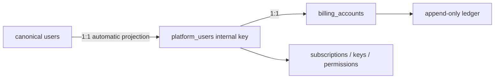

# Ink Dream Memory PostgreSQL、订阅计费与 Gateway 处理判断

> 状态：Task 1 证据化审计结论（Current decision）  
> 审计日期：2026-08-09  
> Dream：`/Users/dmeck/project/ink-dream-memory`  
> Admin：`/Users/dmeck/project/ink-admin-memory`  
> 安全边界：本轮只读取代码、迁移、页面、测试与 SQLite schema 元数据；没有连接、迁移、清空或写入任何 PostgreSQL，没有输出业务行、密码哈希、Token 或 Secret。

## 1. 执行结论

本轮是明确的范围重启，不延续 Round 24–28 的全面延期结论：

1. Dream 主库 43 表、Notion Connector 5 表的 PostgreSQL 全量迁移进入 **Planned → Implemented** 主线；三表导入器只能作为首波安全模式参考。
2. Admin 已有 Subscription/Billing/Gateway 是可复用基线，但不是目标闭环的完整实现。Dream 产品用户 API、严格 canonical 用户校验、完整生命周期、Payment Adapter/Webhook、Dream 订阅页面和新推理链路仍需实现。
3. 真实 Stripe、支付宝、微信支付、银行等第三方支付渠道保持 **Deferred**；标准 PaymentAdapter、签名验证边界、Webhook event store、幂等重放和测试环境 Fake Adapter 为 **Planned**。
4. canonical PostgreSQL `users` 是唯一平台用户全集；`platform_users` 只保留为既有文本外键的内部一对一映射。任何独立“计费用户”名册、创建入口或只显示 QA seed 的结果均是缺陷。
5. Dream 是 43+5 canonical 业务 Schema、Repository、业务写入和 Alembic 的所有者；Admin/Gateway 是控制面、订阅、计费、Provider/Model/Pricing、Usage/Ledger、Payment Adapter 和系统设置的所有者。
6. 发布顺序不可倒置：本审计 → PRD/架构/交互与 Reader Testing → 隔离 PG DDL/Repository/迁移演练 → Admin 产品 API与支付边界 → Dream 页面与 Gateway 链路 → canary/cutover。未经前一门禁不得宣称后一阶段已完成。

当前至少存在六类 P0/P1 级发布阻断：

- Dream 运行时仍由 SQLite 驱动，且 42 个运行时文件含 SQLite SQL 字面量；没有 PostgreSQL driver、pool、Alembic 或 43+5 全量迁移器。
- Dream `/story-workspace/subscription` 实际仍渲染静态三档数组；旧文档声称已重定向，文档与代码不一致。
- Admin Gateway Key 鉴权只 JOIN `platform_users`，未反向证明 canonical `users` 存在；无订阅用户还会走无开关的 cash-only 兼容路径。
- 多个用户选择器固定加载第一页 100 条；PaymentAdapter、支付 Webhook event store 和 Dream 产品用户 API 均不存在。
- 受版本控制的运行时代码含硬编码 Provider credential；必须由密钥所有者确认吊销/轮换、移除代码值并通过 secret scan。
- `/ws/speech-recognition` 未做 canonical 鉴权即可直连 ASR Provider；必须在发布前禁用或补齐鉴权、Origin、限流和审计。

## 2. 证据边界与复核方法

### 2.1 Git 与数据安全

- Admin 审计开始时 `git status --short` 为空。
- Dream 仅有用户既有未跟踪 `.claude/worktrees/`；本轮没有进入、修改或清理。
- 权威主库 `backend/data/ink-and-memory.db` 使用 SQLite URI `mode=ro&immutable=1`、`PRAGMA query_only=ON` 读取 schema；普通 `-readonly` 因 WAL 头部只读限制失败后，没有改权限或切换写模式。
- Notion 库 `backend/data/notion-connectors.db` 使用 `sqlite3 -readonly` 和 `PRAGMA query_only=ON`。
- 两个文件读取前后 size、mtime、inode 均相同。主库为 43 表/25 trigger，Notion 为 5 表/0 trigger。
- Secret 扫描发现 `backend/speech_recognition.py:9` 在受版本控制的运行时代码中硬编码了形似有效的 Provider credential，且 `git log -S'dashscope.api_key'` 显示它至少从提交 `2deb4b1` 起进入历史。本文不记录该值，也不以网络请求验证它；立即吊销/轮换、代码移除和历史处置是当前 P0 发布阻断。
- PostgreSQL owner、ACL、role membership 与生产行数本轮未读取；它们是迁移前独立只读门禁，本文的逻辑所有权不是执行 `ALTER OWNER`、GRANT 或 REVOKE 的授权。

### 2.2 可复核命令

```bash
rg -n "sqlite3\\.Connection|database\\.get_db\\(|PRAGMA|BEGIN IMMEDIATE|CREATE TRIGGER" backend -g '*.py' -g '!backend/.venv/**' -g '!backend/tests/**'
/usr/bin/sqlite3 'file:/Users/dmeck/project/ink-dream-memory/backend/data/ink-and-memory.db?mode=ro&immutable=1' "PRAGMA query_only=ON; SELECT name, sql FROM sqlite_master WHERE type IN ('table','index','trigger');"
/usr/bin/sqlite3 -readonly backend/data/notion-connectors.db "PRAGMA query_only=ON; SELECT name, sql FROM sqlite_master WHERE type IN ('table','index','trigger');"
rg -n "platform-users|pageSize: 100|platform_users|billing_accounts" app tests drizzle
rg -n "PaymentAdapter|webhook_event|payment_intent|refund|reversal" app drizzle tests
```

## 3. Dream 43+5 真实 Schema 清单

说明：以下来自真实 SQLite `sqlite_master`、`pragma_table_info`、`pragma_foreign_key_list` 和 index/trigger 元数据，不依据旧文档猜测。SQLite 的所谓 enum 是 `TEXT + CHECK`；目标 PostgreSQL 首版保留可演进的 `text + CHECK` 语义，不在迁移时擅自改为不可扩展的 native enum。`JSON` 列是当前由代码读写 JSON 的 TEXT 语义列；目标为 `jsonb`，导入前必须 parse/canonicalize 并以语义 digest 校验。SQLite `DATETIME`/ISO TEXT 目标为 `timestamptz`，无 offset 的历史值按经批准的 UTC 规则转换。

### 3.1 主库 43 表

| 表 | PK | FK / 删除语义 | Unique / enum / check 摘要 | JSON / 时间语义 | Trigger / 不可变语义 |
|---|---|---|---|---|---|
| `users` | `id` INTEGER | — | email unique | created/updated | canonical 用户；PG identity sequence 需校准 |
| `auth_sessions` | `token` | user→users CASCADE | — | expires/created | Session Secret 不进日志 |
| `oauth_accounts` | `id` | user→users CASCADE | provider+provider_sub unique | token ciphertext；expires/created/updated | OAuth 密文按现合同保留 |
| `refresh_tokens` | `id` | user→users CASCADE | token_hash unique | expires/revoked/created | 只迁 hash，不输出 token |
| `device_authorizations` | `id` | user→users CASCADE | device_code_hash、user_code_hash unique | poll/expires/approved/consumed/created/updated | 状态迁移需合同测试 |
| `user_sessions` | `id` | user→users CASCADE | — | `editor_state_json`; created/updated | 会话内容隐私最小披露 |
| `user_preferences` | `user_id` | user→users CASCADE | — | voice/state/system config JSON；updated | 一用户一行 |
| `analysis_reports` | `id` | user→users CASCADE | — | report JSON；created | 报告正文不进 receipt |
| `daily_pictures` | `id` | user→users CASCADE | — | date/created；base64 内容 | 大对象迁移需尺寸校验 |
| `friendships` | `id` | user/friend→users CASCADE | user+friend unique；status pending/accepted/rejected | created/updated | 双向关系业务语义保留 |
| `friend_invites` | `code` | user CASCADE；used_by SET NULL | — | expires/used/created | 邀请码不输出 |
| `decks` | `id` | parent→decks；owner→users CASCADE | — | created/updated | boolean/int 归一化 |
| `voices` | `id` | deck/owner CASCADE；parent self FK | — | created/updated | memory config 演进列需 baseline 对照 |
| `chat_thread` | `id` | user→users CASCADE | — | created/updated | 含后加 claude/deck/voice 列 |
| `chat_message` | `id` | thread→chat_thread CASCADE | role user/assistant | parts、metadata JSON；created | 顺序必须显式稳定 |
| `story_workspace_workspaces` | `id` | owner→users | — | settings JSON；created/updated | canonical；Admin 仅白名单更新 |
| `story_workspace_stories` | `id` | author→users；workspace→workspace | status draft/published/archived；review pending/confirmed/rejected；type short/long/script/outline；agent 0/1 | created/updated/confirmed/published | canonical；无通用硬删 |
| `story_workspace_characters` | `id` | author→users；workspace→workspace | review 三态；status active/archived；agent 0/1；review_notes≤2000 | tags JSON；created/updated/confirmed/archived | 关系由 join 表维护 |
| `story_workspace_scenes` | `id` | story nullable；author→users；workspace→workspace | review 三态；status active/archived；agent 0/1；review_notes≤2000 | created/updated/confirmed/archived | story 可空不可误改必填 |
| `story_workspace_story_characters` | story+character | 两端 FK | 复合 PK | created | 关系事实，无独立 CRUD |
| `story_workspace_scene_characters` | scene+character | 两端 FK | 复合 PK | created | 关系事实，无独立 CRUD |
| `workflow_preflights` | `workflow_preflight_id` | — | token hash unique；active request partial unique；revision≥0；status checking/passed/failed/expired；失败字段一致性 | expires/consumed/created/updated | request fingerprint 幂等 |
| `workflow_runs` | `id` | retry self；binding/lock/preflight FK | workspace+creator+idempotency unique；11 态；revision/version≥1 | source time、created/started/completed | provenance、voice source、status_version、receipt/session 绑定 6 个 guard trigger |
| `workflow_run_token_consumptions` | `token_digest` | run/preflight RESTRICT | — | consumed | UPDATE/DELETE trigger 禁止，只追加 |
| `workflow_run_transitions` | `id` | run RESTRICT | run+sequence unique；sequence≥1 | occurred | UPDATE/DELETE trigger 禁止，只追加 |
| `deck_plugin_releases` | `id` | — | plugin+version unique；draft/validating/published/deprecated/revoked | manifest/capability/compat/runtime/dependency JSON；created/updated/published | 发布事实不可覆盖策略由 service 保证 |
| `deck_runtime_plugin_locks` | `id` | composite release FK RESTRICT | plugin+version unique | lock JSON；created | 运行锁内容需 digest |
| `deck_plugin_installations` | `id` | — | scope+scope_id+plugin unique；scope instance/workspace；6 状态 | installed/approved/pending JSON；created/updated | revision 并发语义 |
| `deck_plugin_bindings` | `deck_plugin_binding_id` | deck、composite release RESTRICT | deck+revision unique；`status=active` 时 deck partial unique；revision≥1；active/stale；applied_to=next_run | created/updated | 绑定替换事务化 |
| `deck_runtime_snapshots` | `deck_runtime_snapshot_id` | deck/binding RESTRICT | deck+revision+profile+hash unique；revision≥1 | config JSON；created | UPDATE/DELETE trigger 禁止，只追加 |
| `runtime_plugin_materializations` | `runtime_materialization_id` | — | materialization_key unique；declaration/materialization/activation/verification checks；attempt≥1；pool=environment | created/updated | identity columns immutable trigger |
| `runtime_plugin_reconcile_attempts` | `attempt_id` | run RESTRICT | path headless/cli；result succeeded/failed | argv JSON；created | UPDATE/DELETE trigger 禁止，只追加 |
| `runtime_load_receipts` | `receipt_id` | run/lock RESTRICT | local_persistent；development/test；scope=session；state=session_loaded；pool=environment | created | UPDATE/DELETE trigger 禁止，只追加 |
| `runtime_load_receipt_entries` | receipt+plugin | receipt RESTRICT | verification/load/required checks | loaded capabilities JSON；loaded | UPDATE/DELETE trigger 禁止，只追加 |
| `agent_sessions` | `agent_session_id` | run/receipt/lock RESTRICT | run+attempt、request key unique；仅 creating/active 的 workflow_run partial unique；local_persistent；development/test；attempt≥1；4 状态；pool=environment | settings JSON；created/started/terminated/lease | immutable binding + insert/lifecycle/status 4 triggers |
| `claude_plugin_installations` | `id` | — | package+market+version+digest unique；source/status checks | manifest/component/compat JSON；created/updated/installed | artifact digest 是迁移校验事实 |
| `claude_plugin_operations` | `id` | — | operation/status checks | argv JSON；created/updated/finished | 操作记录保留 |
| `deck_claude_plugin_refs` | deck+installation | deck/installation RESTRICT | 复合 PK | created/updated | 关联事实 |
| `reflections_section_configs` | `id` | user CASCADE | user+section unique；echoes/traits/patterns | prompt_files JSON；updated | — |
| `reflection_task` | `id` | user CASCADE | — | sections/input snapshot JSON；created/started/completed/updated | 状态原样迁移 |
| `reflection_result` | `id` | task/user CASCADE | section 三类；confidence high/medium/low | related sessions JSON；created | — |
| `reflection_task_event` | `id` | task CASCADE | — | payload JSON；created | 当前 writer 使用 `INSERT OR REPLACE`；目标改为同 ID+同 digest 幂等接受、异内容 409，增加 append-only guard |
| `events` | `event_id` | — | aggregate+version unique；versions≥1 | payload JSON；occurred | UPDATE/DELETE trigger 禁止，只追加 |

真实主库共有 25 个 trigger：events、runtime snapshots/receipts/entries/reconcile、workflow token/transition 的 UPDATE/DELETE guard，workflow run 的 provenance/status/source/receipt/session guard，agent session 生命周期 guard，以及 runtime materialization identity guard。目标 PostgreSQL 必须逐个以 PL/pgSQL trigger/constraint 或等价不可变权限重建；不能只搬行。

### 3.2 Notion Connector 5 表

| 表 | PK | FK / 删除语义 | Unique / check | JSON / 时间语义 | 不可变语义 |
|---|---|---|---|---|---|
| `resource_connectors` | `id` | `user_id` 当前没有跨文件 FK | — | config JSON；last_synced/created/updated | 迁入同库后补 `user_id→users.id` 前必须先查 orphan |
| `connector_resources` | `id` | connector CASCADE | connector+resource_type+external_id unique | metadata JSON；created/updated | 选择集由 connector 领域写 |
| `connector_resource_pages` | `id` | resource CASCADE | resource+page unique | properties/page JSON；last_edited/created/updated | snapshot 页面事实 |
| `connector_snapshots` | `id` | connector CASCADE | connector+snapshot_version unique | snapshot JSON；fetched/created/updated | 当前 writer 对同 version `DO UPDATE`；目标改为同 key+同 digest 幂等接受、异内容冲突拒绝，只追加不覆盖 |
| `connector_chat_threads` | `id` | connector CASCADE | connector+thread unique | created/updated | 关联事实 |

## 4. SQLite 直接耦合位置

### 4.1 机械统计

排除 `.venv` 与 `backend/tests/**` 后：

| 耦合 | 运行时证据 |
|---|---:|
| 声明 `sqlite3.Connection` | 34 个文件 / 115 次类型命中 |
| `database.get_db()`（含 `_database.get_db()`） | 16 个文件 / 52 个调用 |
| PRAGMA | 3 个文件 / 7 处 |
| `BEGIN IMMEDIATE` | 11 个文件 / 22 处（其中 1 处 docstring） |
| SQLite `CREATE TRIGGER` | `backend/database.py` 15 个生成/显式位置；真实库最终 25 trigger |
| `INSERT OR REPLACE/IGNORE` | 4 个文件 / 10 处 |
| 含 SQL 关键字与 `?` 的 Python string literal | 42 个文件、436 个 SQL literal、1,425 个占位符；不含动态拼装和测试 |

这组下界已经证明迁移不是驱动替换。PostgreSQL 需要 `%s`/named parameter、显式事务/UoW、`FOR UPDATE`/advisory lock、`ON CONFLICT` 的逐语义选择、dict row 和 PG error mapping；禁止运行时 SQL 翻译器。

### 4.2 精确特殊语法位置

- 连接与 PRAGMA：`backend/database.py:121-128,184,195,1199`；`backend/notion/store.py:35-42,77-85`；`backend/services/deck_plugin/rollback_manager.py:248`。
- `BEGIN IMMEDIATE`：`services/runtime_plugin/reconcile_service.py:845`、`events/event_emitter.py:98`、`deck_plugin/binding_service.py:151`、`workflow/preflight_service.py:335`、`workflow/run_service.py:258,417`、`story_workspace/dream_agent_message_service.py:1877,2015,2056`、`dream_confirmation_service.py:335,641,741,1424`、`dream_launch_gateway.py:201,762,881`、`claude_agent/session_manager.py:645`、`story_workspace_tool.py:491`、`routers/story_workspace.py:543,642,692`。
- SQLite trigger 建模：`backend/database.py:263,1011,1264,1273,1307,1321,1333,1471,1480,1498,1566,1591,1603,1616,1635`。
- `database.get_db()` 的运行时调用集中在 `database.py` 调用者、Claude/Deck/Story/Workflow/Plugin routers/services、`picture_service.py`、`server.py`、`script/import_diaries.py` 和工具；完整文件集合见下一节。

### 4.3 需要 Repository/UoW 接管的运行时文件集合

`?` SQL literal 的 42 文件下界：

```text
backend/database.py
backend/notion/store.py
backend/server.py
backend/picture_service.py
backend/claude_agent/service.py
backend/routers/{claude_plugins,deck_plugins,story_workspace}.py
backend/libs/claude_agent_kit/server/{editor_tool,story_workspace_tool}.py
backend/services/claude_agent/{remote_interaction_guard,session_manager}.py
backend/services/claude_plugin/{deck_refs_service,install_service,workspace_packer}.py
backend/services/deck/{admin_gateway,builtin_plugin,chat_context,runtime_context,story_workflow_gateway}.py
backend/services/deck_plugin/{binding_service,compatibility_service,installation_service,manifest_validator,release_service,revocation_service,rollback_manager,selection_validation_service}.py
backend/services/events/event_emitter.py
backend/services/runtime_plugin/{materialization_manager,reconcile_service}.py
backend/services/story_workspace/{agent_integration,dream_agent_message_service,dream_confirmation_service,dream_launch_gateway,dream_reentry_service,episode_action_service,guidance_service}.py
backend/services/workflow/{preflight_service,run_service}.py
backend/script/import_diaries.py
backend/tools/session_inspector.py
```

另有 `routers/deck_plugin_binding.py` 等文件直接声明 `sqlite3.Connection`，即使 AST 没检测到内嵌 SQL，也必须改为 Repository/UoW 注入。测试中的 SQLite fixture 只能在迁移开发期作旧合同参照；cutover release gate 要求持久化合同测试全部指向隔离 PostgreSQL。

### 4.4 JSON、文件与内存边界

- `.ink/*.json`、plugin manifest/receipt、workspace 文件是显式领域 artifact，不是数据库 fallback；可继续存在，但其索引/状态真值必须在 PostgreSQL。
- `tool_confirmation_store`、SSE/EventBus 内存结构是进程内短生命周期协调，不得承载切换后需要恢复的业务事实；已有持久化 event/task 为真值时可作为 cache。
- `models.json.example` 是示例配置，不得成为 Provider/Model/Pricing 或 Subscription 真值。
- cutover 后 `INK_DATABASE_PATH` 与 `INK_AGENT_NOTION_DB_PATH` 只允许迁移 CLI 使用；FastAPI 启动路径出现这两个变量即 fail-fast，不回退 SQLite/JSON/内存库。

## 5. Admin 三表导入器能力上限

证据：`scripts/lib/story-source-import.mjs:3-7` 把 `SOURCE_TABLES` 固定为 `users`、`story_workspace_workspaces`、`story_workspace_stories`；`scripts/import-ink-dream-story-source.mjs:68-119` 只 SELECT/INSERT 这三表。

已有优点可以复用：

- `/usr/bin/sqlite3` 只读快照，源 fingerprint 前后相等；临时 snapshot 单独处理 WAL。
- 强制 `TEST_DATABASE_URL`、数据库名 `ink-memory`、拒绝 5433、拒绝与 runtime `DATABASE_URL` 相同。
- 默认 dry-run，`--apply` 才写；目标三表任一非空即阻断；serializable 单事务；无 merge/upsert/truncate/delete。
- 验证三表 row count、PK digest、三类 FK orphan、workspace settings JSON 与 Story enum/agent flag；执行 `setval` 校准 users sequence，但未读取 `last_value/is_called` 或以事务内受控 `nextval` 复核校准结果。

能力上限与缺口：

- 只覆盖 3/48 表，没有 Character/Scene/关系、Auth/Chat/Deck/Workflow/Plugin/Reflection/Event 或 Notion。
- SQLite JSON 子进程 stdout 每表硬限 64 MiB，三表用 `Promise.all` 全量并发载入内存，目标写入逐行 `await INSERT`，没有分页、batch 或 `COPY`；`COUNT(*)::int` 还把大表计数限制在 32-bit。即使只迁三表，也不是大数据量全量迁移实现。
- 没有 25 个 trigger、不变性、复合 FK、partial unique、所有 JSON/time、sequence/identity 的全量 DDL/验证。
- `fingerprintIds` 只 digest PK 集，不校验行内容；也没有表级 manifest、列/约束 digest、导入隔离区和冲突 receipt。
- importer 额外检查 Story `identifier` 值唯一，但真实 SQLite DDL 与 Admin `0010` 都没有该 unique constraint；它是导入前数据假设，不得未经产品/数据审计就伪装成现有数据库约束。
- 由 Admin Node/Drizzle 持有三表 DDL，不符合最终 Dream-owned Alembic；只能作为 baseline adopt 证据与安全模式参考。

处理：保留脚本为历史首波 importer，重命名/文档标识为 `3-table-story-baseline`；新建 Dream-owned 48 表 manifest、Alembic baseline、snapshot→staging→validate→import CLI。不得扩写旧脚本后声称全量完成。

## 6. canonical User、内部映射与“QA-only”根因

### 6.1 当前关系



- `drizzle/0015_platform_users_are_billable.sql:5-29` 回填 canonical 用户映射和零余额账户；`:31-75` 用 trigger 同步新增用户与展示字段。
- `app/lib/admin/resources.ts:48-72,151-171` 已让平台用户/账户列表从 `users` 驱动并 JOIN 内部映射与账户。
- `POST /api/admin/platform-users` 已由 mutation contract 拒绝；产品不允许手工开户。

### 6.2 根因分层

历史已确认根因：订阅、Gateway Key、模型权限和调账选择器曾直接把手工 `platform_users` 当全集，测试库只 seed `qa-author@ink-memory.test`，于是 UI 把单个兼容行误显示为“计费用户”。`0015` 和 canonical-driven list 修复了数据库投影主路径，但仍有五个残留：

1. `SubscriptionLifecycleManager.tsx:27`、`BillingAdjustmentForm.tsx:20-22`、`AdminUsageDashboard.tsx:114` 等用户专用视图固定 `pageSize:100`，把第一页当全集；超过 100 用户必丢。通用 `AdminResourceManager` 的 platform-user 单选位于 `:369-381`，固定取服务端筛选后的第一页 50 条；`:438-440` 是通用多选 100 条，不应单独冒充 platform-user 专用实现。
2. 通用单选 RelationSelect 会把输入发送到服务端筛选，但固定只取第一页 50 条；MultiRelationSelect 固定第一页 100 条。两者都没有翻页/游标、total 提示、选中项跨页 hydration 和一致的 debounce 合同；Subscription/Billing/Usage 的专用选择器还只做预载或本地过滤。
3. `app/lib/gateway/auth.ts:77-88` 只 JOIN `platform_users`；历史 orphan 即使 canonical 用户不存在也可能使用 active Key。
4. Subscription 开通 (`app/lib/subscriptions/service.ts:409-416`)、Gateway Key/Model Permission mutation 仍主要按内部 ID 校验，没有在同一事务反向证明 canonical 用户并幂等补齐 account。
5. `app/lib/admin/mutations.ts:160-168,1029-1058` 仍允许更新 `platform_users.email/display_name`，而列表从 canonical `users` 读取；保存结果不可见且会被 projection 覆盖，形成资料 split-brain。

因此若某环境现在仍只显示 QA 用户，合法判断不是“该用户才可计费”，而是：`0015` 未应用/三表未迁入、inner projection 缺映射、第一页/搜索缺陷或测试 fixture 不完整。修复点是 migration/projection/relation query/test seed，而不是创建更多 `platform_users`。

### 6.3 必须实现的修复

- 建立统一 `CanonicalUserRelationService`：服务端 `q/page/pageSize/total`，基于 `users`；每个返回项携带内部 billing identity，但它不是第二类用户。
- 所有用户 selector 按输入查询服务端，不预载“前 100”；测试至少 205 用户、跨页搜索和稳定 total。
- Gateway auth 与任何创建 Subscription/Key/Permission/credit 的命令在事务中 `users JOIN platform_users`；缺 mapping 时仅通过受控投影函数补齐，orphan fail-closed。
- 从 `platformUserUpdateSchema` 和 SQL 更新白名单移除 `email/display_name`；产品资料只能经 canonical User 领域命令修改，兼容映射仅保留 tier/status/limit/metadata 等控制面字段。
- orphan `platform_users` 先生成 Key/余额/Usage/Ledger/Subscription 审计报告，再标记 isolated/disabled 或映射；不 DELETE 财务历史。

## 7. Admin Subscription/Billing/Gateway/Payment 当前状态

| 能力 | 当前证据 | 判断 |
|---|---|---|
| Plan / Plan Version | `0014_subscription_control_plane.sql`、`app/lib/subscriptions/**` | Implemented baseline；发布后 DB/service 双重不可变 |
| Entitlement | version+model unique、scope/RPM/token/storage | Implemented baseline；Dream 尚未消费 |
| Subscription | trial/active/past_due/paused/cancel_at_period_end/cancelled/expired schema | Partial；开通/续费/升降级/暂停/恢复/期末取消有命令，但无自动周期推进、真正撤销取消和完整 past_due 来源 |
| Allowance | granted/reserved/consumed token/micro-USD check | Implemented baseline；并发/守恒需 PG 属性测试 |
| Billing Account/Ledger | reserve/capture/release/credit、ledger no update/delete trigger | Implemented baseline；refund/reversal/debit 合同缺失 |
| Gateway | Anthropic/OpenAI routes、Key hash、Provider/Model/Pricing、limits、payload、usage settlement | Implemented baseline；canonical 用户反查、强制订阅、402 单位、Dream 安全接入仍缺 |
| Pricing | micro-USD、有效窗口、历史 snapshot | Implemented；必须保持只创建版本 |
| Usage/Audit | Request/Usage/Audit 记录 | Partial；Ledger/Audit append-only 已有，settled Usage/Request 的数据库终态不可变 guard 需补 |
| Dream 产品用户 API | `app/api` 只有 Admin/Storage，未见 `/api/product` 或 `/v1/billing/**` | Not implemented |
| PaymentAdapter | `app`/`drizzle`/`tests` 无接口、intent/refund/reversal/webhook event schema | Not implemented / Planned |
| 真实支付渠道 | 无 | Deferred，且本轮禁止接入 |

现有 Gateway 无订阅用户 cash-only 兼容位于 `app/lib/subscriptions/gateway.ts:97-101`；目标链要求订阅资格，因此需以显式 canary flag 迁移并最终删除默认放行。不能把兼容路径写成目标实现。

## 8. Dream 当前推理调用链与 Gateway 接管点

“Gateway”一词在两个项目里已有同名异义：Dream 的 `backend/services/story_workspace/dream_launch_gateway.py` 是 Story Workspace 启动协调器，最终仍构造 `ClaudeAgentRunRequest`；它不是 Admin 的计费 Gateway，迁移时不得因为文件名相同而误判为已经接入。

| 当前入口 | 真实调用与配置 | 当前风险 / 缺口 | 目标接管点 |
|---|---|---|---|
| Voice inspiration/chat/analysis、Echo、Trait、Pattern | `backend/server.py` 与 `backend/stateless_analyzer.py` 直接构造 `PolyAgent`，模型来自 `backend/config.py` 的 `INK_*_MODEL`，共享 `TEXT_API_ENDPOINT/TEXT_API_KEY` | provider key 与模型路由仍是 Dream 进程级配置；未经过 subscription、entitlement、permission、allowance 与 ledger | 新建 server-only Gateway client；每个 role 使用 Admin 发布的稳定 model alias，保留 JSON/文本合同与超时语义 |
| Claude Agent / Chat | 浏览器 `ChatPanel.tsx` 发送 `chatModel`；后端 `ClaudeAgentRequestBody` 同时定义 `chatModel` 与 `model`，但执行请求只取 `body.model`；`ClaudeAgentService` 把 `request.model` 交给 Agent runner/Claude SDK | 前后端模型字段不闭合；浏览器可以提交执行模型字符串；SDK/CLI 鉴权未进入平台资格与结算链 | Dream 后端忽略未经授权的 provider/model，按已解析 alias 调 Gateway；兼容 Anthropic SSE/tool/usage 协议并以服务身份绑定 canonical user |
| Dream、Workflow、Guidance、Reflection | `dream_agent_message_service.py`、`dream_confirmation_service.py`、`guidance_service.py`、`dream_launch_gateway.py`、`reflections_agent.py` 复用 `ClaudeAgentRunRequest` / thread factory | 与 Chat 共享旧 Claude Agent 执行面；任何一次局部替换都会造成 Dream/Workflow 行为分叉 | 在 Claude Agent runner 的单一网络边界接管，保留 thread、resume、tool confirmation、workspace、plugin 和 provenance 合同 |
| Image description / generation | `backend/picture_service.py` 直接请求 `IMAGE_API_ENDPOINT/chat/completions` 并注入 `IMAGE_API_KEY`，模型来自 `INK_IMAGE_*` | 绕过 Gateway；失败/重试/token usage 无平台结算事实 | 以 image-capable alias 和明确媒体 usage 合同接入 Gateway；未支持前继续 server-only legacy canary，不能伪报已计费 |
| Speech / ASR WebSocket | `backend/server.py:1034-1038` 暴露未鉴权 `/ws/speech-recognition`，直接调用 `speech_recognition.py` 的 ASR Provider；源码本身留有 authentication TODO | 任意连接可消费 Provider 配额，且同文件已有已提交 credential；没有 canonical user、limit、usage 或 ledger | credential 立即吊销/移除；release 前默认禁用该 endpoint，或补 canonical session 鉴权、origin/限流与审计。ASR 只有在 Gateway 声明 streaming-audio capability、计量单位和结算合同后才接入；否则明确保持 Deferred/disabled |
| Settings model selector | `frontend/src/components/dashboard/ModelConfigSection.tsx` 静态列出 Auto、Claude Sonnet、GPT-4.1；`frontend/src/lib/chat-schema.ts` 还有静态默认 Claude model | 静态型号可能未发布、无权限或无价格；不是 Admin 真值 | 只渲染产品 API 返回的可用 alias/label/capability；empty/403/503 有真实状态，不保留静态 fallback |
| User SDK env | `system_config.env_vars` 可写入 SQLite JSON 并传入 Agent runner；当前 sanitizer 仅限制形状/长度，未按 secret 名称拒绝 | 用户可把 credential-like 值写入普通业务表；迁移后仍不满足“Secret 不进普通字段” | 明确拒绝 Provider/Gateway/Payment/System secret 名称和模式；Gateway credential 仅来自服务端 secret provider，响应与日志全部遮蔽 |

接管顺序必须是：先冻结上述协议与回归测试 → 新增 Gateway client 和 alias resolver → shadow eligibility（不扣费）→ 受控 reserve/capture/release → user canary → 按 PolyAgent、Claude Agent/Chat、Dream/Workflow、image 分批切换。流取消、上游 5xx、usage 缺失和工具流中断都必须产生确定的请求/结算终态；不能因为旧客户端没有 usage 就按零成本成功。

## 9. 领域所有权与调用边界

| 领域 | Dream | Admin / Gateway | 禁止 |
|---|---|---|---|
| canonical 43+5 | DDL、Alembic、Repository、业务写、数据迁移 | 批准读/白名单更新/领域命令 | Admin 通用硬删或继续扩展 Dream DDL |
| canonical User | 注册/认证资料真值 | 自动投影 billing identity/account；只读产品资料 | 独立计费用户创建/名册 |
| Plan/Subscription | 展示真实策略/状态，提交产品命令 | 版本、状态机、幂等、审计 | Dream 复制套餐或直接写表 |
| Billing/Usage/Ledger | 只读产品视图 | 预授权、capture/release/refund/reversal、事实存储 | 浏览器浮点金额/直接改余额/更新历史账本 |
| Model/Gateway | 服务端使用稳定 alias 调 Gateway | Key、auth、permission、limits、routing、pricing、settlement | 浏览器持 Key；Dream 持 Provider Secret |
| Payment | 显示真实 pending/authorized/failed 等平台状态 | Adapter interface、event store、signature/idempotency、test-only fake | 虚假支付成功、生产 Fake Adapter、真实网络 |

## 10. 目标主链与错误合同


资格顺序固定为：Key/service identity → canonical 用户存在 → Subscription 状态/周期 → published Version → Entitlement scope/model → user override → RPM/token limit → Allowance → overage cash balance → reserve → Provider。错误合同：401 未认证；402 额度/余额且单位明确；403 状态/权益/权限；404 产品资源；409 幂等/版本/并发；429 限流；502 上游；503 配置/数据库/维护。上游失败、cancel、流中断、usage 缺失均必须 release/capture 到确定终态或 `settlement_failed`，不能按 0 成功。

## 11. 领域迁移与接入矩阵

| 领域/实体 | 当前真实来源 | 目标 PostgreSQL 表 | 所有者 | Dream 边界 | Admin/Gateway 边界 | 迁移波次 | 风险 | 修改位置 |
|---|---|---|---|---|---|---|---|---|
| User/Auth | 主 SQLite 5 表 | 原名 canonical | Dream | 注册、认证、Session/Token | user read + billing projection | W1 | ID/sequence、Secret | `database.py`、auth/oauth routers/repos |
| Preferences/Session/Reports/Pictures | 主 SQLite 4 表 | 原名 | Dream | 全业务读写 | 默认不接入 | W2 | JSON、大对象、时间 | database/repositories |
| Friend | 主 SQLite 2 表 | 原名 | Dream | 关系命令 | 默认不接入 | W2 | 双向 unique | friends repo/router |
| Deck/Voice | 主 SQLite 2 表 | 原名 | Dream | 创作配置 | 只读关联 | W3 | self FK/seed | deck repo/services |
| Chat | 主 SQLite 2 表 | 原名 | Dream | thread/message | 计费不读取正文 | W3 | JSON/顺序/隐私 | chat repo/agent |
| Story Workspace | 主 SQLite 6 表；Admin 已建 2 个 Story 表，三表 baseline 另含 `users` | 原名；三表 baseline adopt | Dream | 完整写 | 白名单命令 | W1/W4 | schema drift/关系闭包 | story repo/Alembic；Admin story-source |
| Workflow | 主 SQLite 4 表 | 原名 | Dream | 命令/不可变事实 | 默认只读 | W5 | 复合幂等/trigger | workflow services/repos |
| Deck Plugin/Runtime | 主 SQLite 10 表 | 原名 | Dream | 供应链运行 | 默认不接入 | W5 | 25 trigger/partial unique | plugin/runtime services |
| Claude Plugin | 主 SQLite 3 表 | 原名 | Dream | 安装/关联 | 默认不接入 | W5 | artifact digest | claude plugin services |
| Reflection/Event | 主 SQLite 5 表 | 原名 | Dream | task/result/event | 默认不接入 | W4 | JSON/append-only | reflection/event repos |
| Notion Connector | 独立 SQLite 5 表 | 原名 + user FK | Dream | Connector/快照写 | 默认不接入 | W6 | 跨库 user orphan | notion store/repos |
| Billing identity/account | Admin PG | `platform_users`,`billing_accounts` | Admin | 只消费产品 API视图 | 自动投影/账户 | A1 | orphan/内联100 | Admin user service/UI |
| Subscription | Admin PG partial | subscription 6 表 | Admin | 展示/命令 API | 状态机/版本/权益 | A2 | 自动推进/并发 | subscriptions/** |
| Provider/Model/Pricing | Admin PG | `ai_*`, permission | Admin | stable alias | 配置/版本 | A2 | Secret/版本 | models/gateway/admin |
| Gateway/Usage/Ledger | Admin PG partial | gateway/billing tables | Admin/Gateway | server-to-server only | auth/settlement/audit | A3 | strict eligibility/usage终态 | gateway/**, billing/** |
| Payment boundary | 无 | adapter/event/intent refs | Admin | 只显示真实状态 | Adapter/Webhook | A4 | fake in prod/replay | new payments/** + migration |

## 12. 依赖顺序、切换与回滚

1. 冻结权威 manifest；只读检查目标 PG database name、server version、extension、table owner、ACL、constraints、migration journals 和现有行。任何差异阻断，不自动 `ALTER OWNER`。
2. Dream 增加 psycopg pool、UoW、领域 errors、Alembic；先在临时 PG baseline-adopt Admin 三表，再创建其余 45 表。
3. 按 W1–W6 拆 Repository；每波做 SQLite contract 与 PG contract 对照。W5 的表级拓扑固定为 `workflow_preflights → deck_plugin_releases → deck_runtime_plugin_locks → deck_plugin_installations → deck_plugin_bindings → deck_runtime_snapshots → workflow_runs → workflow_run_token_consumptions/workflow_run_transitions → runtime_plugin_materializations → runtime_plugin_reconcile_attempts → runtime_load_receipts → runtime_load_receipt_entries → agent_sessions`；`claude_plugin_installations → deck_claude_plugin_refs`（refs 另依赖 W3 `decks`），`claude_plugin_operations` 可独立导入；`workflow_runs.retry_of_run_id` 需要 parent-first 或受控延迟 self-FK。延迟 FK 或两阶段加载必须写入 manifest，不能靠导入器碰运气。全波完成前生产仍运行旧 SQLite，但不得长期双写。
4. snapshot → manifest → staging → transform → conflict report → 单事务/分域导入；验证 row count、PK/row digest、unique、FK orphan、check/enum、JSON、time、sequence、trigger 和 append-only mutation rejection。Notion snapshot 与 Reflection event Repository 必须增加 replay contract：同 business key/event ID 且同 canonical JSON digest 返回原事实，异 digest 返回 409/领域冲突，任何重试不得 UPDATE/REPLACE 历史行。
5. Admin 完成 A1–A4；Dream 产品 API/订阅页面可先用本地 Admin mock contract，不用静态数组。
6. 预发布短暂停写：最终 SQLite snapshot/delta、导入、shadow read、关键 API smoke；通过后只切 `DATABASE_URL`，FastAPI 无 SQLite fallback。
7. Gateway 按环境/内部用户/用户级 canary 开启；先 shadow eligibility（不扣费）再受控真实 reserve/capture，最后切既有 Claude Agent/Dream/Chat/Workflow。
8. PG 已产生业务写后默认前向修复。首个 cutover 前必须构建并演练一个“旧功能集 + PostgreSQL Repository”的 rollback build；否则旧 SQLite-only 应用不能在 PG authoritative 的前提下回滚。只有预先演练、校验过的 PG→SQLite delta exporter 才允许回切 SQLite；未具备这两者时只允许向前修复，禁止丢弃 PG 新写。

## 13. 保留、停止、映射、接管与弃用

| 对象 | 判断 | 当前动作 | 最终动作 |
|---|---|---|---|
| Dream 两个 SQLite 文件 | 保留迁移证据 | 只读 snapshot，不改源 | cutover 后归档/只读保留期；运行时不打开 |
| Admin canonical 三表 | baseline adopt | 对比列/约束/index/owner | Dream Alembic 接管；Admin 不再 DDL |
| Admin 旧 `story_workspaces/story_projects/...` | 停止使用 | 保留 deprecated，无新写 | 审计后归档；删除需独立批准 migration |
| `platform_users` | 内部映射 | 自动 1:1、orphan 审计 | 保留为兼容 FK，不暴露产品实体 |
| `billing_accounts` | Admin 接管 | 每 canonical user 自动有一行 | 一对一财务账户 |
| `gateway_requests`/Usage/Ledger/Audit | Admin 接管 | 补资格与终态不变性 | 只追加/终态不可变事实 |
| 静态 Dream plans | 停止使用 | 设计与代码改为真实 API状态 | 删除静态数组，不留假 fallback |
| Dream direct Provider keys | 分阶段弃用 | 先 server-only 配置和 canary | 所有目标推理走 Gateway；Secret 不进浏览器/普通表/log |
| Fake Payment Adapter | 隔离接管 | test/dev only | production startup hard fail |
| 真实支付 Adapter | Deferred | 不建假实现/不调用网络 | 渠道明确后独立立项 |

## 14. 风险、灰度与发布阻断

| 等级 | 风险 | 门禁 / 缓解 |
|---|---|---|
| P0 | 48 表/25 trigger 语义遗漏 | manifest 与 real schema 双 digest；每表 DDL/repo/import/validator/owner |
| P0 | shared PG 被误写 | 所有测试要求显式 `TEST_DATABASE_URL`、拒绝 5433/runtime URL；命名临时库/容器 |
| P0 | orphan billing identity 使用 Key | Gateway/auth/create command 反向 JOIN canonical user；orphan fail-closed且保留历史 |
| P0 | 已提交的明文 Provider credential | 立即由密钥所有者吊销/轮换；代码改为启动必需的 secret provider/env 注入；对 Git 历史制定独立、经批准的 purge 与下游重新拉取方案；CI/启动期 secret scan 阻断；绝不复述或联网试用该值 |
| P0 | 未鉴权 ASR WebSocket 消费 Provider | release 前默认禁用，或完成 canonical session auth、Origin、限流、审计与明确 ASR Gateway capability/计量合同；匿名消费测试必须拒绝 |
| P0 | 其他 Secret 泄漏 | hash/encryption、response allowlist、structured log redaction、截图关闭 one-time secret 后再保存 |
| P0 | allowance/cash 双扣或丢账 | serializable/row lock、幂等键、守恒属性测试、append-only reversal |
| P1 | SQLite/PG 时间、JSON、NULL 差异 | UTC contract、semantic JSON digest、显式 casts、shadow compare |
| P1 | 用户>100不可选 | server typeahead/paging + 205-user E2E |
| P1 | 旧推理行为回归 | protocol mocks、Agent/Workflow regression、per-user Gateway canary |
| P1 | usage missing/stream cancel | 明确 release/capture/settlement_failed；不按 0 成功 |
| P1 | owner/ACL 与逻辑边界不符 | 只读 inventory + DBA approval；不由迁移脚本猜测 |
| P1 | Fake Adapter 误启生产 | `NODE_ENV/APP_ENV` 双门禁、production unit test、无默认成功 |

这里的“48 表/25 trigger”只指 Dream-owned 43+5 迁移面及其 SQLite 业务 trigger，不是共享 PostgreSQL 的总对象数。Admin 当前 Drizzle journal 从空库顺序执行会出现 41 个 CREATE TABLE 和 4 个历史 DROP TABLE，净留 37 表，并创建 9 个业务 trigger；这是仓库 migration 静态计数，不是对任何真实 PostgreSQL 的 inventory。两组对象必须分别验证 owner/ACL/constraint 与 migration journal，不能把计数相加后冒充单一 migration ownership。

Release blockers：48 表 Alembic + repo + validator 未齐；Dream runtime 仍引用 SQLite；已提交 credential 尚未由所有者确认吊销/轮换且 secret scan 未通过；未鉴权 ASR WebSocket 尚未禁用或完成 canonical 鉴权/限流/审计；产品 API/真实订阅页未完成；canonical Gateway 校验与 >100 selector 未修；Payment/Webhook 边界未实现；隔离 PG rehearsal、Admin/Dream 全门禁和两个视口 E2E 未通过。真实支付渠道不是本轮 release blocker，因为它明确 Deferred，但 UI 不得显示支付成功。

## 15. Task 1 处理判断验收

- [x] 真实主库 43 表、Notion 5 表及 PK/FK/unique/check/enum/JSON/time/trigger/不可变语义已由代码与 SQLite 元数据交叉复核。
- [x] SQLite connection、PRAGMA、`BEGIN IMMEDIATE`、trigger、`?` SQL 和直接调用范围已统计并定位。
- [x] 三表 importer 的安全能力、3/48 范围上限、64 MiB/全量内存/逐行写容量上限和 sequence 仅校准未验证的缺口已证明。
- [x] canonical User、内部 mapping/account 与 QA-only/前100残留根因已定位。
- [x] Deferred 范围变更、Dream/Admin/Gateway/Payment 边界、依赖顺序和表/代码处置已形成决策。
- [x] 风险、canary、rollback 与 release blockers 已列明。
- [ ] PostgreSQL 实际 owner/ACL/现有数据只读盘点：留到具备明确目标与授权的迁移 preflight；本文不授权变更。
- [ ] 真实支付/外部 Provider：明确不在 Task 1 执行。
