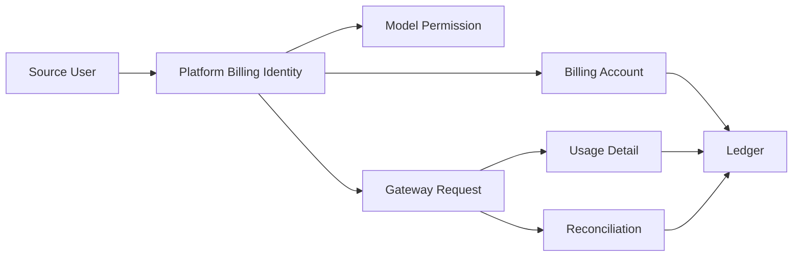
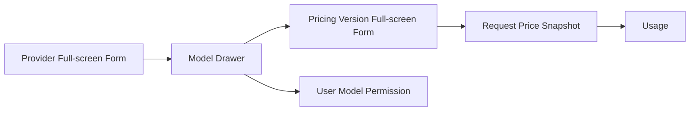
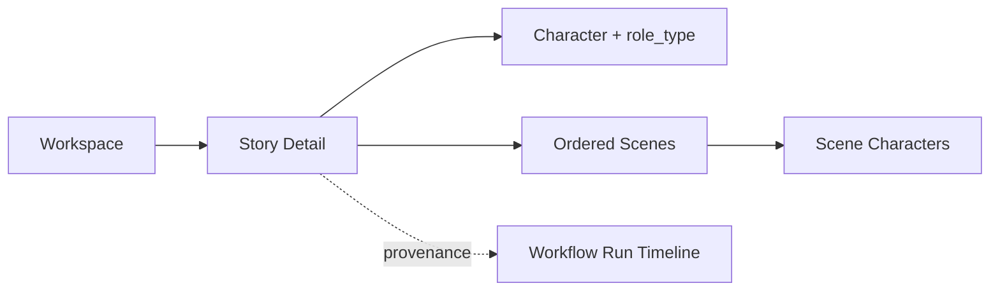

# Ink Memory Admin 字段级表单与资源详情 PRD 草案

> HTML Design Workflow：Stage 1 / PRD Architect  
> 日期：2026-08-08  
> 状态：供 Stage 2–4 与工程 PRD 合并使用  
> 设计决策：模型设置和模型计费采用 `cc-switch` 的交互骨架；视觉、数据、安全和权限语义采用 Ink Memory 规范。

## 1. 目标、证据与不可妥协边界

本轮不是给现有 `AdminCrudWorkbench` 换皮，而是把“从列表找到真实记录—查看上下文—基于服务器当前值编辑—确认影响—收到可追溯回执”建立为唯一写操作路径。

证据来源：

- 当前参考截图 `files/inputs/target_image.png`：1440×1000，左侧 248px 导航、暖纸主画布、页头与标签层级已形成，但正常页面仍把列表与页面内嵌编辑器割裂。
- 产品与数据边界：`docs/prd/ink-memory-admin-prd-v2.md`。
- 视觉与交互基线：`docs/design/refine-admin-ui-v2-interaction-design.md`。
- 模型与计费适配基线：`docs/design/cc-switch-model-billing-adaptation.md`。
- 当前 PostgreSQL Schema 与写契约：`app/lib/db/schema.ts`、`app/lib/admin/resources.ts`、`app/lib/admin/mutations.ts`。
- Story 真实表契约：`app/lib/story-source/repository.ts`、`app/lib/story-source/mutations.ts`。
- `cc-switch`：Provider 全屏新增/编辑、Usage 顶部全局筛选与统计页签、Request Detail、Pricing 全屏编辑。

硬边界：

1. 页面不出现“记录 ID”编辑入口、模板占位 ID、默认 JSON CRUD 或“永久删除”通用操作。
2. 所有关系字段通过真实、可搜索、受权限约束的选择器获取；ID 仅作为选择结果的辅助信息和复制对象。
3. 详情先从服务器读取最新记录；编辑器打开时装载一次初值，后台刷新不得覆盖已经修改的草稿。
4. Secret 不回填；Gateway Key 明文只在创建成功回执中显示一次；金额通过整数 micro-USD 提交。
5. Pricing、Usage、Ledger、Gateway Request、Audit 的历史事实不得破坏性修改。
6. Story 只操作真实源表；源 PostgreSQL 不可用时显示 503，不退回旧平行表、SQLite、JSON 或假数据。

## 2. 页面模块结构（自上而下、自左至右）

| 编号 | 模块 | 1440×1000 结构 | 390×844 结构 | 功能定位 |
|---|---|---|---|---|
| A1 | Admin Sidebar | 左侧固定 248px；分组、当前项短线、小面积黄色标记 | 收入 `min(320px,88vw)` 导航 Drawer | 全局路由和权限裁剪 |
| A2 | Topbar | 面包屑、数据源健康、管理员菜单在主纸面顶部 | 52px；菜单、页名、高优先动作 | 上下文和系统状态 |
| B1 | Page Heading | Serif 32px 标题、说明、状态来源、主动作右对齐 | Serif 28px；主动作可进入底部固定区 | 回答当前任务与风险边界 |
| B2 | Module Tabs | 紧凑文本标签、细规则线选中 | 横向局部滚动，不带动页面 | 模块内平级切换 |
| C1 | Global Query Bar | 搜索、关系筛选、状态、日期、刷新并排/换行 | 搜索常显，其余进入 Filter Sheet | URL 同步的白名单查询 |
| C2 | Result Context | 结果范围、筛选摘要、数据时间、数据源 | 两行紧凑摘要 | 避免把无数据误认为数据源健康 |
| D1 | Data Table | 原生 table，主识别列常显，行操作在末列 | 关键列优先；表格壳局部横滚 | 查询、比较、选择真实记录 |
| D2 | Detail | 右侧 Drawer 或独立详情，按身份/资料/关系/历史/风险区组织 | Drawer 变全屏 | 查看真实字段和跨资源链路 |
| E1 | Simple Form | Modal 或 620–720px Drawer；从当前记录预填 | 全屏；底部操作固定在 safe area 上方 | 单实体、有限字段的创建/编辑 |
| E2 | Complex Form | 全屏面板/独立页；固定 Header、独立滚动、固定 Footer | 全屏；逐节单列 | Provider、Pricing、Role、Reconciliation |
| F1 | Confirmation | 实底 Modal；展示当前状态、影响、理由、before/after | 全屏或底部 Sheet；不裁剪说明 | 停用、撤销、审核、调账等高风险动作 |
| G1 | Feedback | 字段错误、冲突摘要、一次性回执、审计 Request ID | Toast 位于固定操作区上方 | 400/403/404/409/503 与成功恢复 |

参考截图中的暖白画布、棕色文字、细规则线、平直数据行继续保留。当前大圆角列表壳只能作为唯一外层容器，不能让筛选器、每一行和表单分区再次形成卡片海。

## 3. 表单容器决策

| 资源/动作 | 容器 | 关闭与提交行为 |
|---|---|---|
| Workspace 编辑 | 560px Modal；移动全屏 | Escape/关闭检测脏状态；成功回到原行 |
| Story/Character/Scene 编辑 | 720px 右 Drawer；移动全屏 | 与详情共享上下文，正文/关系只读；成功刷新详情与列表 |
| Story confirm/reject/archive | 确认 Modal | 重新取服务器状态和影响；reject 必填说明 |
| Workflow Run 详情 | 760px 只读 Drawer；移动全屏 | 保持列表筛选；无直接状态编辑 |
| Provider 新增/编辑/凭据轮换 | **直接采用 cc-switch 的全屏面板骨架** | 固定返回、Header/Footer、分区滚动；Secret 空值不轮换；脏状态确认 |
| Model 新增/编辑 | 680px Drawer；移动全屏 | 从 Provider 发起时预选并锁定 Provider |
| Pricing 新版本 | **直接采用 cc-switch 的全屏 Pricing 编辑骨架** | 展示旧/新版本、金额转换、重叠和影响；提交只创建版本 |
| Model Permission 新增/编辑 | 640px Drawer；移动全屏 | User/Model 均用真实搜索选择；删除 override 使用 Modal |
| Billing Account 调账 | 600px 高风险 Modal | 先取余额与版本，展示 before/after、reason、幂等键 |
| Usage / Gateway Request 详情 | **直接采用 cc-switch Request Detail 的宽 Drawer 骨架** | 只读分区；保持 Usage 全局筛选与页签 |
| Reconciliation | 独立页面 `/admin/gateway/reconciliation/[requestId]` | 三步：冻结上下文→处置与影响→不可变回执 |
| Gateway Key 创建 | 640px Modal；成功后切换一次性回执 | 关闭回执后不可再次显示明文；revoke 另用确认 Modal |
| Platform Billing Identity | 680px Drawer | 从 Source User 详情发起时自动带入且锁定 source/external user |
| Admin User 创建/编辑 | 640px Drawer | 角色为多选；停用/重置密码为独立确认流程 |
| Role 创建/编辑 | 独立页面 | 权限矩阵和影响摘要复杂；内置角色保护 |
| System Setting 创建/编辑 | 640px Drawer；Secret 覆盖再弹确认 | key 创建后只读；value 使用 JSON Editor |
| Storage 上传/已知 key 检查 | 560px Drawer | 无 list/delete；上传成功只返回真实 metadata |

## 4. 全局字段展示与控件规则

| 数据类型 | 列表 | 详情 | 表单控件 | 规则 |
|---|---|---|---|---|
| 人类名称/标题 | 主文本，可换行两行 | 正文文本 | `text` | 禁止用 ID 代替名称 |
| ID/code/key | Mono，必要时截断 | Mono + 复制 | code 创建用 `text`；系统生成 ID 只读 | 关系 ID 不可手填 |
| 枚举 | 文字 + 非颜色状态标记 | 文字、解释和时间 | `select`/segmented radio | 选项必须来自固定契约或真实 options API |
| 布尔 | “是/否”“启用/停用” | 状态文字 | `switch`/checkbox | 不显示 `true/false` 原值 |
| 日期时间 | 本地时区、短格式 | 完整 ISO + 本地时间 | `datetime-local`/DateTime Picker | 服务端按 UTC；清楚标注时区 |
| 整数/Token | 右对齐、千分位、Mono | 原值 + 单位 | `number` step=1 | nullable 为空，不转成 0 |
| micro-USD | `$` 格式主值 + micro-USD 辅助 | before/after 精确值 | USD decimal 输入 + 精确整数预览 | API 只收安全整数，禁用 JS 浮点账务计算 |
| 数组 | 最多三枚 chip + `+n` | 全量 chip/列表 | 多选、标签输入 | 不用 JSON textarea |
| 已知键对象 | 摘要 | 定义列表 | 结构化控件 | 如 capabilities、Provider 受管 config |
| 真 JSON | 不展开或摘要 | 只读 JSON Viewer | JSON Editor | 仅 Workspace settings、未知 Provider config、System value 等真实 JSON |
| URL | 截断文本 + 安全外链 | 完整可复制 URL | `url` | 禁止 `javascript:`；服务端再次校验 |
| Secret | “已配置/未配置”+指纹尾部 | 从不显示原值 | `password` + 本次输入显隐 | 不持久到 URL/localStorage/日志/审计 metadata |
| 关系 | 名称 + code，ID 辅助 | 可跳转链接 | 可搜索 Combobox | options 由受权 API 分页；显示 loading/empty/403 |

所有表单字段有可见 label、必填/可选、说明、错误和稳定 `aria-describedby`。400 保留草稿并聚焦首错；409 显示冲突记录和服务器最新值；403 禁用提交且说明所需 permission；404 关闭已失效编辑器并返回列表；503 保留草稿、允许重试，绝不切换数据源。

## 5. Story 与真实业务用户字段规范

### 5.1 Source User（`source-users`，只读）

| 字段 | 列表展示 | 详情展示 | 表单/数据源 | 权限与错误 |
|---|---|---|---|---|
| `id` | Mono Source User ID | 复制 + 作为 Workspace/计费身份关联键 | 无编辑 | `users.read`；不显示 password hash |
| `email` | 主识别文本 | mailto 可选、完整文本 | 无编辑 | 源字段只读 |
| `display_name` | 次级文本 | 文本；空值显示“未设置” | 无编辑 | 空值不伪造名称 |
| `avatar_url` | 24px 头像或文字占位 | 受控图片预览 + URL | 无编辑 | 加载失败回退文字，不代理未知内容 |
| `role` | 状态文字 | 业务角色说明 | 筛选 `select`，选项来自源契约 | 不等同 Admin Role |
| `created_at`,`updated_at` | 本地日期时间 | 完整时间与时区 | 日期范围筛选 | 503 显示 Story source unavailable |

详情联动：Workspace、Story、Character、Scene 列表携带 `owner_id/author_id` 筛选；“初始化计费身份”在独立 Drawer 中使用当前用户 ID，不让操作者复制。

### 5.2 Workspace（`story-workspaces`）

| 字段 | 列表/详情展示 | 编辑控件 | 数据源与校验 | 权限/恢复 |
|---|---|---|---|---|
| `id` | Mono + 复制 | 只读 | 源表 UUID/文本 PK | 不手填 |
| `name` | 主文本 | 单行文本 | 1–180 | `story.write`；400 聚焦 |
| `owner_id`,`owner_email`,`owner_display_name` | 用户链接 + 辅助 ID | 只读 | 真实 `source-users` | 不允许转移 owner |
| `settings` | 列表显示“已配置” | JSON Editor | 必须 object；格式化、diff、恢复服务器值 | 未知字段由源 schema 拒绝；503 保留草稿 |
| `created_at`,`updated_at` | 本地时间 | 只读 | 服务器 | 并发变化显示 409/最新时间 |

详情需要真实聚合：Story/Character/Scene 数量及最近更新时间；任一聚合失败显示“不可用”而非 0。创建、删除、停用均无入口。

### 5.3 Story（`story-stories`）

| 字段 | 列表/详情展示 | 编辑/动作控件 | 数据源与校验 | 安全/恢复 |
|---|---|---|---|---|
| `id`,`identifier` | 标题下方 Mono | 只读、可复制 | 源表 | 不人工编辑 |
| `title` | 主文本 | `text` | 1–240 | 400 保留输入 |
| `description` | 列表不展开；详情段落 | `textarea` | 0–20,000，可空 | 空字符串与 null 语义明确 |
| `content` | 列表不显示；详情只读正文预览 | **无编辑控件** | 源正文 | 当前 API 的 content Patch 必须从 Admin 契约移除；未来需版本权限 |
| `type` | 枚举文字 | `select` | short/long/script/outline | 不允许自由输入 |
| `status` | draft/published/archived 文字标记 | 只读；archive 走确认 | 源状态机 | 状态不匹配 409 |
| `review_status`,`review_notes` | 审核标记；详情显示说明 | confirm/reject Modal；reject 必填说明，confirm 可选 | 仅 agent_generated 且 pending | 提交前重取状态；冲突显示最新状态 |
| `author_id`,`author_email` | 用户链接 | 只读 | `source-users` | 不转移 author |
| `workspace_id`,`workspace_name` | Workspace 链接 | 只读 | `story-workspaces` | 保持 workspace 上下文 |
| `character_count`,`scene_count` | 右对齐整数 | 只读；与真实关系列表并列 | M:N/Scene 查询 | 不可直接编辑计数 |
| `agent_generated`,`agent_session_id` | “Agent/人工”+ provenance | 只读链接 | 源数据 | 无 Agent 时显示“无” |
| `created_at`,`updated_at`,`confirmed_at`,`published_at` | 更新时间常显 | 完整时间线 | 源数据 | 缺失时间显示“尚未发生” |

Story 详情必须新增：`story_workspace_story_characters` 的角色与 `role_type`、按 `order_index` 的 Scene、相关 Workflow/Agent provenance。不得把关系数组降级成泛化 JSON。

### 5.4 Character（`story-characters`）

| 字段 | 列表/详情展示 | 编辑控件 | 数据源与校验 | 安全/恢复 |
|---|---|---|---|---|
| `id`,`identifier` | 名称下方 Mono | 只读 | 源表 | 可复制 |
| `name` | 主文本 | `text` | 1–180 | 必填 |
| `avatar_url` | 头像/URL | `url` + 本次预览 | URL≤2000 或空 | 图片错误可恢复 |
| `identity`,`personality`,`background` | 详情分节长文本 | `textarea` | 每项≤20,000，可空 | 不用 JSON |
| `catchphrase` | 详情引用式文本 | `textarea` | ≤4,000，可空 | 无值显示“未设置” |
| `tags` | chip + `+n` | 标签输入/可删除 chip | 最多 100，每项 1–120 | **不使用 JSON** |
| `notes` | 详情只读 | 当前 Admin 不编辑 | 源字段 | 若开放需补服务端白名单 |
| `author`,`workspace` | 关系链接 | 只读 | 真实用户/Workspace | 不允许跨 owner 迁移 |
| `story_count` | 整数 | 只读 | M:N 关系 | 与详情真实关系核对 |
| `status`,`review_status`,`review_notes` | 状态文字 | confirm/reject/archive Modal | 同 Story 审核前置条件 | 409 显示最新状态 |
| `agent_generated` 与时间字段 | provenance / 时间线 | 只读 | 源数据 | 不伪造缺失时间 |

详情必须展示关联 Story + `role_type`、关联 Scene；链接保持 Workspace 筛选。

### 5.5 Scene（`story-scenes`）

| 字段 | 列表/详情展示 | 编辑控件 | 数据源与校验 | 安全/恢复 |
|---|---|---|---|---|
| `id`,`identifier` | 名称下方 Mono | 只读 | 源表 | 可复制 |
| `name` | 主文本 | `text` | 1–240 | 必填 |
| `description` | 详情段落 | `textarea` | ≤20,000，可空 | 400 保留 |
| `story_id`,`story_title` | Story 链接或“未绑定” | **可搜索 Story Combobox**；允许清空 | 仅同 author + workspace 的真实 Story | FK/租户冲突 409，提供返回当前父 Story |
| `author`,`workspace` | 关系链接 | 只读 | 源关系 | 不跨租户 |
| `character_count` | 整数 | 只读 | Scene M:N | 详情列出真实角色 |
| `order_index` | 右对齐整数 | `number` step=1 min=0 | 非负整数 | 不接受字符串/小数 |
| `status`,`review_status`,`review_notes` | 状态文字 | confirm/reject/archive Modal | 审核状态机 | 冲突刷新 |
| `agent_generated` 与时间字段 | provenance / 时间线 | 只读 | 源数据 | — |

详情必须展示出场角色、同 Story 的上一/下一场景，并明确 `story_id` 可为空。

### 5.6 Workflow Run（`story-workflow-runs`，只读）

| 字段组 | 列表 | 详情展示 | 控件/数据源 | 边界 |
|---|---|---|---|---|
| 身份与父级 | `id`、Workspace、status | Mono ID、Workspace 链接 | 关键词/Workspace Combobox/状态 select | `story.read` |
| 插件定义 | `deck_plugin_id`,`version`,`workflow_definition_ref` | 定义列表 | Plugin/definition 精确筛选 | 不编辑 |
| 运行时 provenance | 列表省略 | snapshot、manifest hash、binding/revision、lock、receipt、preflight | 复制与关联链接 | 不用可编辑 JSON |
| 重试链 | `retry_of_run_id` | 前序/后续 Run 链接 | ID 搜索仅用于过滤，不用于写入 | 不改链 |
| Agent/message 来源 | `created_by` | agent session、voice thread、message/time | 只读 | 最小披露 |
| 幂等与一致性 | 列表省略 | idempotency key、input hash、semantic fingerprint、status_version | Mono + 复制 | 不直接修改 |
| 失败信息 | failed step、error code | 安全错误摘要 | 状态/错误筛选 | 不显示敏感 payload |
| 时间 | created | created/started/completed 时间线 | 日期范围 | — |
| transitions/consumptions | — | 时间线表 + 四类 Token/模型 | 源 `workflow_run_transitions`、`workflow_run_token_consumptions` | 当前 repository 必须补充详情投影 |

在源项目没有 PostgreSQL 命令适配器时不展示可点击的 retry/cancel 假按钮；未来只有显式命令 API、状态版本与幂等键齐备后开放。

## 6. AI 模型中心（cc-switch 骨架）

### 6.1 Provider（`providers`）

全屏面板顺序直接采用 cc-switch：Provider 预设/协议 → 基础信息 → 凭据 → Endpoint → 模型关联摘要 → 高级运行配置 → 保存前影响摘要。Ink Memory 不复制 Tauri 窗口行为、本地配置存储或硬编码颜色。

| 字段 | 列表/详情展示 | 新增/编辑控件 | 数据源与校验 | 安全/错误 |
|---|---|---|---|---|
| `id` | 详情 Mono + 复制 | 只读 | 服务端生成 | 不手填 |
| `code` | 主标识徽标 | 创建 `text`；编辑只读 | regex，2–80，全局唯一 | 409 展示占用记录 |
| `name` | 主标题 | `text` | 1–120 | 必填 |
| `protocol` | Anthropic/OpenAI 文字标记 | 创建 segmented radio/预设；编辑只读 | 固定枚举 | 更换协议需新建 Provider |
| `base_url` | 截断 URL + 复制/外链 | `url` | 合法 URL≤2000；预设只预填 | 显示标准化后的最终 Endpoint |
| credential | 已配置/未配置 + fingerprint | `password`、本次输入显隐、粘贴 | 8–8000；active 时必填/已有 | 历史 Secret 永不回填；空值=不轮换 |
| `status` | active/disabled | 开关；停用另走确认 Modal | 固定枚举 | 启用校验 credential；停用展示 enabled Model 与近期请求影响 |
| `timeout_ms` | 秒格式 | 数字 + 单位说明 | 1000–900000 整数 | 默认 120000 |
| `max_retries` | 整数 | Stepper | 0–5 | 默认 1 |
| `config.authMode` | 定义项 | `select` | x-api-key/bearer | 不进自由 JSON |
| `config.outputTokenParam` | 定义项 | `select` | max_tokens/max_completion_tokens | 按协议显隐 |
| `config` 扩展键 | JSON 摘要 | 折叠 JSON Editor | object；受管键剥离 | Secret 风险键拒绝提交 |
| 时间 | 详情时间线 | 只读 | 服务端 | — |

### 6.2 Model（`models`）

| 字段 | 列表/详情展示 | 创建/编辑控件 | 数据源与校验 | 权限/错误 |
|---|---|---|---|---|
| `provider_id`,`provider_code` | Provider 链接 + 协议 | 可搜索 Provider Combobox；编辑只读 | `/api/admin/providers`；只列有权可见项 | `models.write`；无选项解释 Provider 权限/空态 |
| `code` | 主标识 Mono | 创建 `text`；编辑只读 | code regex，2–80，全局唯一 | 409 冲突 |
| `upstream_model` | Mono | `text` + Provider 预设建议 | 1–200；同 Provider 唯一 | 建议不等于假 option |
| `display_name` | 主标题 | `text` | 1–160 | 必填 |
| `context_window` | 千分位 + tokens | nullable integer | 正整数或空 | 不把空转 0 |
| `max_output_tokens` | 千分位 + tokens | nullable integer | 正整数或空；大于 context 时提示并服务端校验 | — |
| `capabilities` | Chat/Streaming/Tools 等 chip | 复选组 | 已知白名单；未知键详情只读 | **不使用 JSON** |
| `enabled` | 启用/停用 | switch；启停确认 | Provider active 才能启用 | 409 提供 Provider 链接 |
| 时间 | 更新时间 | 详情完整时间 | 只读 | — |

### 6.3 Pricing Rule（`pricing-rules`）

全屏编辑顺序直接采用 cc-switch Pricing：选择模型 → 四类 Token 定价 → 加价/折扣 → 生效窗口 → 旧/新对比 → 冲突/影响 → 创建版本。按钮文案必须是“创建价格版本”，不得是“覆盖保存”。

| 字段 | 列表/详情展示 | 新版本控件 | 数据源与校验 | 财务边界 |
|---|---|---|---|---|
| `id` | Mono + 复制 | 只读 | 服务端生成 | — |
| `model_id`,`model_code` | 模型链接 | 可搜索 Model Combobox；从 Model 发起时锁定 | 真实 models API | 不手填 ID |
| `user_tier` | tier chip | 可搜索/可创建 code Combobox | 现存 tier options + code regex | 参与重叠维度 |
| 四类 `*_price_microusd_per_million` | `$ / 1M` 主值 + micro-USD 辅助 | USD decimal 输入 + 精确整数预览 | 非负、最多 6 位 USD 小数；API 安全整数 | 不使用浮点执行计费 |
| `markup_bps` | 百分比 + bps | 百分比输入 + bps 辅助 | 0–100000 bps | 显示计价公式 |
| `discount_bps` | 百分比 + bps | 百分比输入 + bps 辅助 | 0–10000 bps | 与 markup 同时存在时明确顺序 |
| `status` | active/disabled/expired 语义 | 新版本 radio；旧版本仅结束/停用 | 固定状态 | 已生效金额不可原地编辑 |
| `effective_from` | 本地日期时间 | DateTime Picker | ISO；默认下一合法边界 | 不使用硬编码假日期 |
| `effective_to` | 时间或“持续有效” | nullable DateTime Picker | 必须晚于 from | 与旧窗重叠返回 409 |
| 影响摘要 | 真实引用/差额/时间窗 | 只读确认区 | 聚合 API | 无法计算显示“暂不可计算” |

现有 PATCH 改价能力必须收紧：已开始生效或已被 `gateway_requests.pricing_rule_id` 引用的记录不允许修改金额/起始时间；新版本事务可结束旧 `effective_to` 并插入新行。删除无 UI/API 入口。

### 6.4 User Model Permission（`user-model-permissions`）

| 字段 | 列表/详情展示 | 创建/编辑控件 | 数据源/校验 | 删除语义 |
|---|---|---|---|---|
| `platform_user_id`,`email` | 用户链接 | 可搜索 Platform User Combobox；编辑只读 | 真实 platform-users API | 不手填 ID |
| `model_id`,`model_code` | 模型链接 | 可搜索 Model Combobox；编辑只读 | 真实 models API | 不手填 ID |
| `enabled` | 允许/禁止 | switch | boolean | — |
| `requests_per_minute` | 整数或“继承默认” | nullable integer | 正整数或空 | — |
| `daily_token_limit`,`monthly_token_limit` | 千分位或“继承默认” | nullable integer | 非负整数或空 | — |
| 时间 | 更新时间 | 只读 | 服务器 | — |

唯一冲突 `(platform_user_id,model_id)` 返回 409 并给出现有 override 链接。删除仅表示恢复默认策略，确认 Modal 明确不会删除用户、模型或历史限流窗口。

## 7. Token 计费（cc-switch Usage 骨架）

### 7.1 Usage Dashboard 与 Usage 记录（`usage`）

直接采用 cc-switch 的结构：全局筛选 → 事实摘要 → Token/成本趋势 → “请求日志 / Provider 统计 / 模型统计”页签 → Request Detail Drawer。

全局筛选必须同时驱动所有摘要、趋势和页签：日期范围 Date Range Picker、协议 segmented radio、Provider Combobox、Model Combobox、Platform User Combobox、outcome select、刷新频率 select。筛选项写 URL；自动刷新不覆盖当前选择或打开的详情。

| 字段 | 请求日志列表 | Request Detail Drawer | 权限/边界 |
|---|---|---|---|
| `id` | Mono Request ID | 复制；跳 Gateway Request | `billing.read` |
| `platform_user_id`,`email` | 用户名称/邮箱 | Platform User 链接 | 只读 |
| `requested_model`,`resolved_model` | 请求/实际双行 | 路由解析分区；链接 Model | 不合并两个语义 |
| `protocol`,`outcome` | 文字状态 | 协议、结果和解释 | 筛选固定枚举 |
| 四类 tokens | 关键两列/紧凑双行 | 四项独立整数与口径说明 | 未知须有显式 unknown，不能按 0 计费 |
| `provider_cost_microusd`,`charged_microusd` | `$` 精确值 | 成本/收费/差额和价格快照 | 只读事实 |
| `created_at`,`settled_at` | 创建时间 | 生命周期时间线 | 时区常显 |

摘要只使用真实聚合：请求数、成功率、四类 Token、Provider 成本、实际收费。没有聚合 API 时该模块显示“暂不可用”，不得在前端对当前页伪装全量统计。趋势点、Provider/模型统计必须返回统计时间窗和更新时间。

### 7.2 Billing Account（`billing-accounts`）

| 字段 | 列表/详情展示 | 调账控件 | 数据源/校验 | 财务边界 |
|---|---|---|---|---|
| `id` | 详情 Mono | 只读 | 服务端 | — |
| `platform_user_id`,`email`,`display_name`,`tier` | 用户主识别 | 只读链接 | 真实 Platform User | — |
| `currency` | USD | 只读 | 当前仅 USD | 不提供切换假控件 |
| `available_microusd` | `$` 主值 | before 值 | 服务端最新行锁 | 可为业务允许的负值但 UI 警示 |
| `reserved_microusd` | `$` 主值 | 只读影响 | 非负 | 不直接编辑 |
| `lifetime_debited_microusd` | `$` | 只读 | 非负 | 不直接编辑 |
| `version` | 详情一致性版本 | 只读 | 服务端 | 提交前变化返回 409 |
| 调账 `type` | — | credit/debit/reversal radio | 命令式 API | 当前仅 credit 实现时只展示 credit，不能伪装其他动作 |
| `amount` | — | USD decimal + micro-USD 预览 | 正整数 micro-USD | 必填 |
| `reason`,`idempotency_key`,`external_ticket` | — | textarea/text/text | reason 8–500；幂等 regex；ticket 可选 | 成功生成 Ledger/Audit 回执 |

### 7.3 Ledger（`ledger`，append-only）

| 字段组 | 列表 | 详情 | 交互 |
|---|---|---|---|
| 身份 | `id`,`entry_type` | Mono ID、类型解释 | type 筛选 |
| 账户/用户 | email | Account/User 链接 | 可搜索筛选 |
| 请求 | gateway request ID | Request 链接 | 精确筛选 |
| 金额 | amount | amount 与方向说明 | 精确 micro-USD + USD |
| 前后余额 | 可用前/后 | available/reserved before→after | 只读 diff |
| 幂等/描述 | 描述摘要 | idempotency key、description | 复制 |
| actor | actor type | actor ID/link | 筛选 |
| metadata/time | 时间 | 安全 JSON Viewer、创建时间 | Secret 脱敏 |

不存在 update/delete 按钮。纠错跳转新的 reversal/adjustment 命令，并把原 Ledger ID 作为只读引用。

### 7.4 Billing Report

| 数据项 | 展示 | 控件 | 规则 |
|---|---|---|---|
| 时间范围/时区 | 页头常显 | Date Range + timezone display | 服务端 UTC 边界 |
| 用户/Provider/Model/status | 筛选摘要 | 真实可搜索 Combobox/select | 与 Usage 筛选一致 |
| 请求、四类 Token、Provider cost、charged、差额 | 紧凑汇总行 + 表格 | 无编辑 | 仅真实聚合；失败显示 unavailable |
| 分日明细 | flat table | 排序 | 不用装饰性图表代替表 |
| CSV | 当前筛选导出 | “导出 CSV” | 不含 Secret、正文、Prompt/Response |

## 8. Gateway

### 8.1 Gateway Request（`gateway-requests`，只读）

| 字段组 | 列表 | cc-switch 风格详情 Drawer | 交互边界 |
|---|---|---|---|
| 身份 | request ID、upstream ID | 两项 Mono + 复制 | 精确筛选 |
| 用户/Key | email | Platform User、Key prefix/link | Key hash/明文不显示 |
| 路由 | protocol、requested model、Provider | provider/model/pricing 关系链 | 关系链接 |
| 状态 | status/outcome/http/error code | 生命周期与失败说明 | 状态/错误筛选 |
| Token | 列表精简总览 | estimated + 四类实际 Token + semantics | 未知不变 0 |
| 价格/金额 | charged | 四项快照、markup/discount、reserved/provider cost/charged | 只读 |
| 性能 | latency | streaming、first token、latency | tabular nums |
| 错误/摘要 | error code | 脱敏 error message、只读 response_summary JSON Viewer | 不展示完整正文 |
| 时间 | created | created/started/completed/settled 时间线 | — |
| Ledger | — | Ledger 时间线与链接 | append-only |

当前列表/getOne 投影必须补齐 Key、pricing snapshot、response summary、完整时间和 Ledger 关联，详情才能达到此规范。

### 8.2 Reconciliation（独立命令页）

| 步骤/字段 | 展示形式 | 控件/校验 | 错误恢复 |
|---|---|---|---|
| 选择请求 | 从 settlement_failed 列表行进入 | 不提供手填 Request ID | 404 返回队列 |
| 冻结上下文 | User/Provider/Model、status/version、reserved、已知 Token、快照、错误、最近更新时间 | 全部只读 | 503 重试，不进入填写态 |
| `disposition` | 二选一说明 | settle/release radio | 不允许自由字符串 |
| 四类实际 Token | 仅 settle 显示 | 4 个非负整数输入 | unknown 不默认 0；必填策略由命令决定 |
| release 证据 | 仅 release 显示 | textarea + external ticket | 必填且说明来源 |
| `reason` | 高风险理由 | textarea 8–500 | 必填 |
| `idempotency_key` | Mono | text，8–128 regex | 网络未知时按 key 查结果 |
| 影响 | 账户 before→after、release/capture、charged、Ledger 类型 | 只读服务端预览 | 数据更新时 409 并要求刷新 |
| 回执 | Request、Ledger、Audit、金额与时间 | 只读；复制/跳转 | 提交后不可编辑 |

### 8.3 Gateway Key（`gateway-api-keys`）

| 字段 | 列表/详情 | 创建控件 | 安全/动作 |
|---|---|---|---|
| `platform_user_id`,`email` | 用户链接 | 可搜索 Platform User Combobox | 不手填 ID |
| `name` | 主文本 | text 1–120 | 必填 |
| `scopes` | chip | checkbox group | messages:create/chat:create/models:list，至少 1 |
| `expires_at` | 日期或“永不过期” | nullable DateTime Picker | 必须晚于当前时间（服务端为准） |
| `key_prefix` | Mono | 系统生成 | 可复制但不可认证 |
| `status`,`last_used_at`,`revoked_at`,`created_at` | 状态/时间 | 只读 | active 才显示 revoke |
| plaintext | 不在列表/详情存在 | 成功回执 password-like code + Copy | 只显示一次，不写 URL/storage/analytics |

Revoke Modal 显示用户、prefix、最近使用、影响说明和 reason；动作实际是状态迁移，不是硬删除。

### 8.4 Rate Limit Window（`gateway-rate-limits`，只读）

| 字段 | 展示 | 筛选/操作 |
|---|---|---|
| User/Model | 具名链接 | 可搜索 Combobox |
| `window_type` | minute/day/month 文字 | select |
| `window_start` | 日期时间 + 时区 | 日期范围 |
| `request_count`,`token_count` | 右对齐整数 | 排序 |
| `updated_at` | 更新时间 | — |

不编辑运行计数。修改策略跳到对应 User Model Permission Drawer，并保留 User/Model 上下文。

## 9. 用户、资源与 Storage

### 9.1 Platform Billing Identity（`platform-users`）

| 字段 | 列表/详情 | 创建/编辑控件 | 数据源/校验 | 边界 |
|---|---|---|---|---|
| `source`,`external_user_id` | 来源 + 源用户链接 | 从 Source User 发起时锁定；否则 source 固定 ink-dream + Source User Combobox | 唯一组合 | 不手填 ID，不创建业务用户 |
| `email`,`display_name` | 主识别 | 默认来自 Source User；允许计费展示覆盖时 text/email | email≤320，name≤160 | 明示不回写源 users |
| `tier` | chip | 可搜索 tier Combobox | 现存 tier + code regex | 409 显示依赖 Pricing |
| `status` | active/suspended/closed | select；停用走确认 | 固定枚举 | 不等同删除源用户 |
| `daily_token_limit`,`monthly_token_limit` | 整数或“未设置” | nullable integer | 非负整数 | 空不转 0 |
| `metadata` | 详情 JSON Viewer | 折叠 JSON Editor | object | 不放 Secret |
| 时间 | 更新时间 | 只读 | 服务端 | — |

详情联动到 Model Permission、Billing Account、Usage、Gateway Request、Ledger、Gateway Key。

### 9.2 Storage（保留现有 API/lib）

| 数据项 | 展示 | 控件 | 边界/恢复 |
|---|---|---|---|
| driver/config health | 定义列表与健康文字 | 刷新 | 不展示凭据；失败含安全 request ID |
| direct upload capability | 支持/不支持 + 原因 | 无编辑 | 真实 capability API |
| prefix rule | Mono 规则 | 无编辑 | 不伪造目录树 |
| 上传文件 | 文件名、类型、大小、进度 | file input/拖放；label 可键盘触发 | 沿用 upload API；限制来自服务端 |
| 已知 key | 结果区 Mono | text + 检查 metadata/exists/download 动作 | 这是诊断，不是 list |
| metadata | 定义列表/JSON Viewer | 只读 | 无 list/count/delete 假能力 |

## 10. 权限治理

### 10.1 Admin User（`admin-users`）

| 字段 | 列表/详情 | 创建/编辑控件 | 数据源/校验 | 高风险规则 |
|---|---|---|---|---|
| `email` | 主识别 | 创建 email；编辑只读 | 合法 email≤320，唯一 | 409 冲突 |
| `display_name` | 次级文本 | text，1–120，可空 | — | — |
| password | 永不展示 | 创建 password；重置为独立 password + confirm | 14–256；显示强度说明 | 不回显/不审计值 |
| `roles` | chip | 可搜索多选 | 真实 Admin Roles API，1–10 | 提交前显示新增/移除角色 |
| `status` | active/disabled | switch；停用确认 | 固定枚举 | 禁止停用最后 active super_admin；409 |
| `last_login_at` 与时间 | 日期 | 详情时间线 | 只读 | — |

### 10.2 Admin Role（`admin-roles`）

| 字段 | 列表/详情 | 独立页控件 | 规则 |
|---|---|---|---|
| `code` | 主标识 Mono | 创建 text；编辑只读 | code regex、唯一 |
| `name` | 主文本 | text 1–120 | 必填 |
| `description` | 摘要/完整文本 | textarea≤1000 | 可空 |
| `permissions` | chip 摘要 | 按域分组 checkbox matrix + 全组选/清 | 真实 Permission API，1–100 |
| 影响管理员 | 数量/名单链接 | 保存前只读 diff | 必须由服务端真实聚合 |
| 内置状态 | “系统内置” | 权限矩阵只读或受限 | super_admin 权限由迁移维护 |

删除只允许自定义且无管理员关联的 Role；确认需输入 role code。409 显示关联管理员。内置 super_admin/operator/auditor 无删除入口。

### 10.3 Admin Permission（`admin-permissions`，只读）

| 字段 | 展示 | 筛选/详情 |
|---|---|---|
| `code` | Mono 主标识 | code 搜索；按 `.` 前缀分域 |
| `name`,`description` | 名称/说明 | 详情定义列表 |
| `created_at` | 日期 | 只读 |
| 使用角色 | 详情关系列表 | 当前 getOne 必须补真实 Role 投影 |

## 11. 系统与审计

### 11.1 System Setting（`system-settings`）

| 字段 | 列表/详情 | 创建/编辑控件 | 数据源/校验 | Secret/生命周期 |
|---|---|---|---|---|
| `category` | 分类文字 | 创建 select/可搜索 code Combobox；编辑只读 | 现存分类 + code regex | 与 key 唯一 |
| `key` | Mono | 创建 text；编辑只读 | code regex，2–80 | 409 冲突 |
| `value` | 非 Secret 显示 JSON 摘要；Secret 显示“已配置” | JSON Editor | object；格式化、diff、恢复服务器值 | Secret 历史值永不返回；编辑是覆盖 |
| `description` | 摘要 | textarea≤4000 | 可空 | 不放敏感值 |
| `is_secret` | 是/否 | 创建 switch；编辑只读 | boolean | 改类型需新建设置 |
| `status` | active/disabled | select/停用确认 | 固定枚举 | **不提供硬删除** |
| 时间 | 更新时间 | 只读 | 服务端 | — |

现有通用 DELETE 必须移除 `system-settings`；停用与覆盖写审计。Secret 覆盖 Modal 必须明确旧值不可取回，新值不进入 before/after。

### 11.2 Audit Log（`audit-logs`，append-only）

| 字段 | 列表 | 详情 | 边界 |
|---|---|---|---|
| `created_at` | 主时间 | 完整时间/时区 | 只读 |
| actor | email/type | actor ID/链接 | 最小披露 |
| `action` | 状态文字 | 动作解释 | 精确筛选 |
| resource | type + ID | 资源链接（可访问时） | 403 不泄露目标 |
| `request_id` | Mono | 复制、串联错误 | 唯一追踪键 |
| IP/User-Agent | IP | 完整安全文本 | 不进行外部探测 |
| `before`,`after` | 列表省略 | 脱敏 JSON Diff Viewer | Secret/password/Key/Token/正文剥离 |
| `metadata` | 列表省略 | 脱敏 JSON Viewer | append-only |

## 12. 权限、状态与跨模块动线

### 12.1 写权限

| 域 | 读 | 写/命令 | 无权时 |
|---|---|---|---|
| Story | `story.read` | `story.write` | 详情可读时隐藏写动作；API 403 |
| Provider/Model/Pricing | 各自 `.read` | 各自 `.write` | 全屏表单不挂载；深链进入 403 |
| Billing | `billing.read` | `billing.adjust` | 调账/结算不可见；事实仍只读 |
| Gateway | `gateway.read` | `gateway.keys.write`；结算使用 `billing.adjust` | 不通过按钮隐藏替代服务端授权 |
| Users | `users.read` | `users.write` | 业务源字段永远只读 |
| Access | `access.read` | `access.write` | auditor 只读 |
| System/Audit | `system.read`/`audit.read` | `system.write` | Audit 永远无写能力 |

### 12.2 关键动线

跨模块跳转只携带白名单 query 参数；返回时恢复原 URL、页码、排序、筛选和打开记录。不得复制一份关系数据到 Admin 表。

## 13. Loading、Empty、错误、成功与焦点恢复

| 状态 | 页面/表单表现 | 焦点与恢复 |
|---|---|---|
| Loading | 保留标题/筛选/表头，骨架与真实行等高；表单分区骨架 | 不跳焦；超时提示“仍在加载” |
| Empty/filter | 显示筛选条件和“无匹配结果” | 清除筛选后聚焦结果标题 |
| Empty/system | 解释系统尚无数据/无可选关系 | 仅可创建域显示创建；关系选择器提供返回父资源 |
| 400 | 顶部错误摘要 + 字段级错误，草稿不丢 | 聚焦首个错误；摘要链接到字段 |
| 401 | 清除保护内容并登录 | 登录后安全返回原 URL |
| 403 | 显示所需 permission，不显示资源值 | 聚焦错误标题，返回可访问页 |
| 404 | 记录不存在/已不可见 | 关闭 Drawer/面板，返回列表并播报 |
| 409 | 冲突类型、服务器最新值、相关记录、当前草稿 | “载入最新值”需二次确认；禁止盲写 |
| 500 | 安全文案 + Request ID | 重试/复制 ID，不显示 SQL/stack/Secret |
| 503 | Story/数据库不可用，明确数据源 | 保留筛选/草稿；重试；无回退 |
| Success | 实际动作、resource ID、Request ID、Audit/ledger receipt | 刷新 list/detail；归焦行/回执标题；polite live region |

Modal、Drawer、全屏面板均锁定 Tab 焦点；初始焦点为标题或首字段；内层 Select/Escape 优先关闭内层；关闭后焦点归还触发按钮。存在未保存草稿时 Escape、返回、刷新和路由跳转都先进入未保存确认。

## 14. 响应式、视觉与可访问性验收

- Desktop 1440×1000：Sidebar 248px；主内容左右至少 36px；Provider/Pricing 全屏内容最大宽 1120px；普通表单阅读宽 760px；表格只有自身横向滚动。
- Mobile 390×844：导航、详情、表单全部在 viewport 内；全屏面板固定操作区使用 safe-area；最后字段下留至少 96px；根节点 `scrollWidth <= clientWidth`。
- 使用暖纸 `#F6EFE5/#FFFAF2`、棕色正文、细实线和单一纸面虚线；暗色采用既定暖夜 Token。不得复制 cc-switch 的硬编码蓝灰，也不得呈现默认 Refine/Ant Design 外观。
- 控件最小高 44px；所有 label 可见；状态不只靠颜色；原生 table 有 caption/th/scope/aria-sort；局部横滚壳可聚焦并有说明。
- 无远程字体、渐变、glow、装饰性 KPI、hover-only 关键动作。支持 200% 文字缩放和 `prefers-reduced-motion`。

## 15. 技术建议与验收门槛

1. 建立资源字段定义层，分别声明 `listColumns`、`detailSections`、`createFields`、`editFields`、`relationOptions`、`actions`；组件不得依据 JavaScript 值类型猜控件。
2. `AdminResourceTable` 的“查看/编辑”动作必须传真实 record；编辑前 `getOne`；删除能力按资源配置缺省为 false。
3. 关系 Combobox 通过现有 Refine Data Provider 分页查询，并显示名称/code/辅助 ID；禁止接受不在 options 中的裸 ID。
4. Provider/Pricing 全屏面板、Usage Dashboard、Request Detail 按 cc-switch 结构实现，视觉类名全部映射 Ink Memory Token。
5. Route Handler 只解析/鉴权/编排；关系投影、价格版本、影响预览、最后 super_admin 保护、Setting 停用和结算仍在 `app/lib/**` 事务服务。
6. 当前实现必须修复的契约差异：Story content 不可编辑；Story/Character/Scene/Workflow 详情补真实关系；Pricing 禁止历史原地改价；最后 active super_admin 保护；System Setting 不硬删；Gateway Key 提供 revoke UI；Reconciliation 不手填 Request ID。
7. 自动化覆盖：无 Session、401/403、真实列表选中到预填表单、关系选择、400 首错、409 最新值、503 保留草稿、Secret 不回显、Key 一次性回执、Pricing 新版本、Ledger/Audit 无写入口、1440×1000 与 390×844、light/dark、键盘焦点锁定/归还和无页面级横溢出。

本 Stage 1 的通过标准是：每个资源的展示/控件/数据源/校验/安全边界可直接转译为 Stage 2 结构草图，不再需要工程师根据字段名猜测 `text`、`select`、`JSON` 或关系 ID 输入方式。
