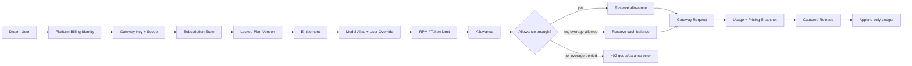

# Ink Memory Admin v3：真实剧本运营与 Gateway 订阅计费 PRD 结构草稿

> 阶段：HTML Design Workflow / Stage 1 — PRD Architect  
> 输入主题：`Ink Memory Admin v3：基于真实 Dream 业务数据的剧本运营控制台与 Gateway 订阅计费系统`  
> 图像输入：`files/inputs/target_image.png`，1489×2105；该图是《Ink & Memory UI Design v2.1》封面，不是 Admin 页面截图  
> 数据证据：`docs/verification/ink-dream-memory-data-integration-audit.md`  
> 产品基线：`docs/prd/ink-memory-admin-prd-v2.md`  
> 视觉基线：`docs/prd/Ink & Memory UI Design v2.pdf`、`docs/prd/color_system/**`  
> 用途：作为后续结构草图、层级逻辑、UI 设计与正式 PRD v3 的可执行输入；不表示对应功能已经上线

## 0. 产品结论

Ink Memory Admin v3 是一套面向内容运营、模型运营、订阅运营、财务支持、安全审计和系统管理员的控制台。它必须同时完成两件彼此关联但数据边界清晰的工作：

1. 直接运营迁入同一 PostgreSQL `ink-memory` 的 Dream 真实业务表，不再把 Admin 自建的 `story_*` 平行表包装成业务事实。
2. 维护 Admin 控制面的套餐、不可变套餐版本、权益、订阅、周期额度、余额、Gateway Key、用量和只追加账本，并以这套数据实时决定用户能否调用模型网关。

核心资格链固定为：

```text
Dream User
  → Platform Billing Identity
  → Subscription
  → Published Plan Version
  → Entitlement
  → Model Permission Override
  → Period Allowance / Overage Balance
  → Gateway Request
  → Token Usage + Price Snapshot
  → Append-only Ledger
```

本产品不是 Landing Page、剧本创作前台、支付收银台或通用数据库工作台。所有统计必须来自真实查询；不可用时明确显示“暂不可用”，不得以 0、模拟数据或随机趋势代替。

---

## 1. 输入图像的具象解析与 Admin 转译

### 1.1 图像中可验证的视觉信息

目标图是纵向封面页：主体位于页面中部，四周保留大面积空白；主标题使用深炭棕粗体，副标题和版本说明使用较浅暖棕；背景接近纸张白而非冷灰；页面没有渐变卡片、玻璃拟态、霓虹色或密集装饰。封面文字还直接给出了 v2.1 的分区规则：**减少面板、增加留白、视觉收敛、轻纸面分区、单一虚线边界、无卡片设计**。

这张图没有侧栏、表格、表单、数据卡或移动界面，因此不能据此虚构 Admin 的具体控件位置。Admin 的结构应由真实任务链和 v2 PRD 决定，只继承图像可证明的品牌气质与空间关系。

### 1.2 Admin v3 视觉转译规则

| 图像/规范证据 | Admin 设计决策 | 禁止做法 |
|---|---|---|
| 大面积留白、居中标题、弱装饰 | 页面标题区保持 24–32px 垂直呼吸，主要信息块按任务顺序展开 | KPI 卡片墙、每个字段套卡片 |
| 深炭棕标题、暖棕正文 | 标题、正文、辅助文本分别映射语义 Token | 纯黑正文、冷灰大底、蓝紫主视觉 |
| 暖纸背景 | App 使用 Warm Canvas，主内容使用 Paper Cream/透明纸面 | 纯白全屏、冷色渐变 |
| 单一虚线边界 | 每个页面最多一个 page-level paper boundary；内部靠留白和行分隔 | 多层圆角面板、普通行阴影 |
| 小面积黄/绿强调 | Memory Yellow 用于当前项、告警重点；Spark Green 用于成功/启用辅助 | 彩色整行、整卡铺色、只用颜色表达状态 |
| 安静、手写、工具台 | 展示标题可有温暖书写感；业务控件保持清晰无衬线 | 把手写字体用于密集表格和金额 |

### 1.3 颜色与字体优先级

PDF v2.1 明确晚于 `color_system` 旧亮色值，Admin v3 采用 PDF/最新 Token 的亮色值；暗色、状态色和浮层语义沿用 `color_system` 的体系。实现只引用集中 Token，不在组件内新增孤立 hex。

| Token | Light | 主要用途 |
|---|---:|---|
| `--color-bg-app` | `#F6EFE5` | 页面暖纸画布 |
| `--color-bg-paper` | `#FFFAF2` | 主内容纸面 |
| `--color-bg-surface-solid` | `#FFFDF8` | Dropdown、Popover、Tooltip |
| `--color-text-primary` | `#3F3429` | 标题、图标、焦点主信息 |
| `--color-text-body` | `#4B3F33` | 正文、表格主值 |
| `--color-text-secondary` | `#7A6A59` | 描述、元信息 |
| `--color-text-muted` | `#9A8A78` | 时间、占位、次级 ID |
| `--color-action-primary` | `#5F4A36` | 主按钮、当前导航 |
| `--color-border-paper` | `#D8C7B3` | 页面纸边、行分隔 |
| `--color-action-link` | `#4A90E2` | 文本链接 |
| `--color-voice-yellow` | `#F39C12` | 小面积重点、提醒 |
| `--color-voice-green` | `#27AE60` | 小面积成功/启用辅助 |

字体必须使用项目本地资产：展示标题优先本地 Noto Serif SC；正文和控件优先本地 Noto Sans SC；ID、Token、金额和请求编号使用本地等宽字体。图标使用项目本地图标方案，不增加远程字体、远程图标或 CDN 依赖。

---

## 2. 产品角色、目标与风险边界

| 操作者 | 主要任务 | 明确风险边界 |
|---|---|---|
| 内容运营 | 查用户、Workspace、Story、Character、Scene；执行源契约允许的修订与审阅 | 不创建 Agent 产物，不硬删除，不扩充 Dream 不存在的状态 |
| 订阅运营 | 建套餐、发布不可变版本、配置权益、开通/变更/暂停/取消订阅 | 已发布版本不可覆盖；所有生命周期命令必须幂等、事务化、可审计 |
| 模型运营 | 管 Provider、Model Alias、Pricing、模型发现与验证 | Provider Secret 只写不读；历史价格只保留新版本 |
| 财务支持 | 查周期额度、余额、用量、账本、账单预览；有授权时执行调账/reversal | 金额只用整数 micro-USD；账本只追加；禁止直接改余额列 |
| 客服支持 | 从用户订阅详情定位资格、额度、请求和错误 | 默认只读；不看 Secret、完整 Prompt、完整响应 |
| 安全审计 | 查 Session、RBAC、Key、系统设置和审计证据 | 审计只读；敏感值始终脱敏 |
| Super Admin | 管角色、系统配置及高风险处置 | 仍受双重确认、并发冲突、审计和不可变规则约束 |

P0 成功定义：

- 运营人员可以沿 `User → Workspace → Story → Character/Scene` 真实关系双向查看数据，不落入旧平行表。
- 订阅运营可以从 Plan 到 Published Version，再到 Entitlement 和 Subscription 完成完整配置；任何已发布快照不被覆盖。
- 用户详情能解释“为什么可调用/不可调用某模型”，并展示当前周期额度、已用、预留、剩余和预计超额。
- Gateway 每次请求都冻结订阅版本、权益、模型、价格和额度来源，历史请求不因后续改价/换套餐而重算。
- 所有写操作均通过服务端 Session、permission、严格 Zod、transaction 和 audit；Route Handler 不承载 SQL 与状态机。

---

## 3. 数据事实、边界与迁移前提

### 3.1 单一数据源

目标运行态只有一个 `DATABASE_URL`、一个 PostgreSQL Pool 和一个数据库 `ink-memory`。Dream 当前真实数据位于 SQLite 是迁移前事实，不是 Admin 的运行时兼容目标。Admin 不连接 SQLite，不增加 `STORY_DATABASE_URL`，不提供 JSON/内存/旧表回退。

第一批已审计的 canonical 表为：

| 表 | 已审计结构与事实 | Admin v3 边界 |
|---|---|---|
| `users` | integer PK；email unique；含 password_hash；没有 status | API 永不选择 password_hash；业务字段默认只读；通过 `(source, external_user_id)` 绑定计费身份 |
| `story_workspace_workspaces` | text PK；owner_id → users；settings 是 JSON 文本；没有 status | 允许白名单 PATCH name/settings；不创建、不删除 |
| `story_workspace_stories` | text PK；author/workspace FK；真实 status/review/type 枚举 | 允许白名单更新和源契约动作；不通用创建、不硬删除 |

源报告确认的当前真实计数仅用于迁移验收证据，不作为 UI 固定文案或产品 KPI。Character、Scene、Workflow 等尚未迁入时必须分别返回 503 和缺表清单，不得读取 Admin 旧表。

### 3.2 Dream 业务事实与 Admin 控制面映射

| 业务实体 | Dream 真实表 | 当前 Admin 表/Resource | 是否重复 | 最终数据源 | 读写策略 | v3 修改位置 |
|---|---|---|:---:|---|---|---|
| 业务用户 | `users` | `platform_users` / `platform-users` | 部分 | Dream `users` + 控制面 crosswalk | 源字段只读；计费身份单独绑定/停用 | source-user repository、组合用户页 |
| 工作区 | `story_workspace_workspaces` | `story_workspaces` | 是 | Dream 原名表 | list/get；仅 name/settings PATCH；不创建/删除 | story-source repository/service/API |
| 剧本 | `story_workspace_stories` | `story_projects` | 是 | Dream 原名表 | list/get；白名单更新与命令式审阅；不创建/硬删除 | `story-stories` Resource |
| 角色 | `story_workspace_characters` | `story_characters` | 是 | Dream 原名表 | 白名单维护；关系来自中间表 | Character repository/detail |
| 场景 | `story_workspace_scenes` | `story_scenes` | 是 | Dream 原名表 | 白名单维护；story_id 可空且需同 workspace 校验 | Scene repository/detail |
| Story-角色 | `story_workspace_story_characters` | 无 | 缺失 | Dream 原名表 | 关系事实；事务校验后受控调整 | Story/Character relation service |
| Scene-角色 | `story_workspace_scene_characters` | 无 | 缺失 | Dream 原名表 | 关系事实；事务校验后受控调整 | Scene relation service |
| 工作流 | `workflow_runs` + transition/consumption | `story_workflow_runs` | 是 | Dream 原名表 | 默认只读；retry/cancel 只能是显式命令 | 后续迁移闭包与只读详情 |
| 套餐/版本/权益 | 无 | 无 | 否 | Admin 控制面 PostgreSQL | 版本发布后不可变 | subscription schema/service/UI |
| 订阅/周期额度 | 无 | 无 | 否 | Admin 控制面 PostgreSQL | 状态机 + 周期额度事务 | subscription/billing service |
| Provider/Model/Pricing | 无 | 现有控制面表 | 否 | Admin 控制面 PostgreSQL | 保留并版本化价格 | model center |
| Usage/Balance/Ledger | 无同义业务事实 | 现有计费表 | 否 | Admin 控制面 PostgreSQL | Usage/Ledger 只读；账本 append-only | billing/gateway integration |
| Gateway Key/Request | 无 | 现有网关表 | 否 | Admin 控制面 PostgreSQL | Key 一次明文；请求只读追踪 | gateway service/UI |
| Storage/RBAC/Session/Audit | 无同义控制面实体 | 现有实现 | 否 | Admin 控制面 PostgreSQL/Storage | 保留并防回归 | 既有 service/API/UI |

旧 `story_workspaces`、`story_projects`、`story_characters`、`story_scenes`、`story_workflow_runs` 只做 deprecated 保留：v3 UI/API 不再绑定，不删除、不清空、不自动合并。最终删除必须是独立、可回滚且经备份核验的未来变更。

---

## 4. 订阅领域模型

### 4.1 核心表与不变量

| 表/聚合 | 必需字段 | 不变量与写规则 |
|---|---|---|
| `subscription_plans` | id、code、name、status、currency、created_at、updated_at | code 永不复用；currency 首版固定 USD；有历史版本时不可硬删除 |
| `subscription_plan_versions` | id、plan_id、version_no、status、billing_interval、base_price_micro_usd、trial_days、grace_period_seconds、effective_from、published_at | `(plan_id, version_no)` unique；published 后禁止 update/delete；价格是整数 micro-USD |
| `subscription_plan_entitlements` | id、plan_version_id、model_id/alias、gateway_scopes、rpm_limit、period_token_limit、period_micro_usd_limit、storage_bytes_limit、overage_policy | 归属于版本快照；发布后随版本冻结；模型与 scope 均使用白名单 |
| `subscriptions` | id、platform_user_id、plan_version_id、status、current_period_start/end、trial_end、grace_end、cancel_at_period_end、scheduled_version_id、renewal_anchor、version | 同一用户同时最多一个可执行主订阅；乐观版本/行锁防并发；始终锁定具体 plan_version |
| `subscription_usage_allowances` | id、subscription_id、period_start/end、granted、reserved、consumed、unit、version | 周期唯一；预留和结算用事务锁；不与 cash available 混写 |
| `billing_accounts` | available_micro_usd、reserved_micro_usd、lifetime_debited | 继续表示现金/充值余额，不混入赠送额度 |
| `billing_ledger_entries` | account、type、amount、before/after、request/subscription refs、idempotency_key、reason、created_at | 只追加；退款/纠错新增 reversal，不修改原记录 |
| `gateway_requests` 扩展快照 | subscription_id、plan_version_id、entitlement snapshot/ref、allowance_id、pricing snapshot、reservation refs | 请求创建时冻结；结算后禁止重算历史 |
| 支付边界 | adapter、external_reference、webhook_event_id、idempotency_key、status | 只定义接口与幂等存根；未确认前不接 Stripe/支付宝/微信，不生成虚假支付成功 |

### 4.2 套餐版本发布规则

1. Plan 保存稳定 code/name/status，不直接保存会变化的价格和权益。
2. Draft Version 可编辑；发布时在单事务中验证价格、周期、至少一个可调用模型、Scope、RPM、额度和 overage 组合。
3. Published Version 只读；改价、改权益、改限额必须创建 `version_no + 1`。
4. 现有 Subscription 继续锁定原版本，除非执行明确升级/降级/续费命令；不可静默漂移。
5. 版本被订阅、Request 或 Ledger 引用后永久保留。

### 4.3 生命周期与命令语义

| 当前状态 | 命令/条件 | 目标状态 | 账务与权益行为 |
|---|---|---|---|
| 无订阅 | start trial | `trial` | 创建周期与 trial allowance；不伪造支付 |
| 无订阅 | activate | `active` | 通过已充值 Billing Account 或未来 adapter 完成幂等订阅扣费后授予额度 |
| `trial` | trial 到期且续费成功 | `active` | 新周期、新 allowance、renewal ledger |
| `trial/active` | renewal 成功 | `active` | 原周期关闭，新周期授予额度；同一周期幂等键不可重复扣费 |
| `trial/active` | renewal 失败 | `past_due` | 设置 grace_end；宽限期内是否允许调用由版本策略决定 |
| `past_due` | 补款/恢复成功 | `active` | 追加补款/恢复账本；不改写失败记录 |
| `past_due` | grace 到期 | `paused` 或 `expired` | 停止新 Gateway 预留；历史 Usage/Ledger 保留 |
| `trial/active` | pause now | `paused` | 立即阻止新请求；未用 allowance 默认不退款、不转现金 |
| `paused` | resume | `active` | 校验版本有效、计费与周期；恢复动作幂等并审计 |
| `trial/active` | cancel at period end | 保持原状态 + `cancel_at_period_end=true` | 周期内继续按原权益调用；到期转 `cancelled` |
| 可执行状态 | cancel now（高权限） | `cancelled` | 立即停止资格；退款只能新增明确 refund/reversal ledger |
| `cancelled` | 重新订阅 | 新 Subscription | 不复活旧周期或覆盖历史 |
| 任意终止周期 | 自然失效 | `expired` | 只读保留，不能继续调用 |

升级默认立即生效：锁定当前订阅，按剩余周期用整数 micro-USD 计算旧版本未使用价值和新版本差额，分别写 credit/charge ledger；周期不重置，Allowance 只补发新旧权益的正差，禁止重复赠送已消费部分。降级默认排到下一续费锚点，通过 `scheduled_version_id` 表达，当前周期权益不缩水。任何 proration、续费、Webhook 或状态命令都必须有幂等键；重复提交返回同一结果而不重复扣费。

### 4.4 Gateway 资格判断



错误语义：无/失效 Key 为 401；缺 Scope、套餐无模型权益或用户 override 禁止为 403；余额/Allowance 不足为 402；生命周期/并发版本冲突为 409；RPM 或 Token 窗口超限为 429；控制面或资格数据不可用为 503，禁止降级放行。

---

## 5. 全局信息架构与路由

```text
总览

剧本运营
├── 业务用户
├── 工作区
├── 剧本
├── 角色
└── 场景

订阅中心
├── 套餐
├── 套餐版本
├── 权益
└── 用户订阅

模型中心
├── Provider
├── Models
├── Pricing
└── 用户模型限制

网关与计费
├── Gateway Keys
├── 请求日志
├── Token Usage
├── Billing Accounts
├── Ledger
└── 账单预览 / CSV

资源与治理
├── Storage
├── 管理员
├── 角色与权限
├── Session
├── 审计日志
└── 系统设置
```

| 页面 | 建议路由 | Refine Resource / 数据来源 |
|---|---|---|
| 业务用户 | `/admin/story/users` | `source-users` / Dream `users` + platform crosswalk |
| 工作区 | `/admin/story/workspaces` | `story-workspaces` / canonical workspace |
| 剧本/角色/场景 | `/admin/story/stories`、`characters`、`scenes` | 对应 canonical Dream tables |
| 套餐 | `/admin/subscriptions/plans` | `subscription-plans` |
| 套餐版本 | `/admin/subscriptions/plan-versions` | `subscription-plan-versions` |
| 权益 | `/admin/subscriptions/entitlements` | `subscription-entitlements` |
| 用户订阅 | `/admin/subscriptions/users`、`/[id]` | `subscriptions` + allowance + usage projection |
| Provider/Model/Pricing | `/admin/models/providers`、`models`、`pricing` | 现有控制面 Resources |
| Gateway | `/admin/gateway/keys`、`requests` | 现有 gateway resources + subscription snapshot |
| Usage/Account/Ledger | `/admin/billing/usage`、`accounts`、`ledger` | 现有计费事实表 |
| 账单预览 | `/admin/billing/invoices/preview` | Usage/Ledger 只读聚合；CSV 仅当前筛选 |
| Storage/RBAC/Session/Audit/Settings | `/admin/resources/storage`、`/admin/access/**`、`/admin/system/**` | 保留现有能力 |

---

## 6. Admin Shell 页面模块结构（自上而下、自左至右）

| 区块 | 桌面 1440×1000 | 移动 390×844 | 功能要求 |
|---|---|---|---|
| A1 左侧品牌与主导航 | 248px 固定侧栏；品牌区、分组导航、底部账户 | 收入左侧 Drawer；默认关闭 | 当前项用细线、字重和小面积黄标识；不使用整行深色 |
| A2 顶部上下文栏 | 64px；面包屑、页面名、数据源健康、主题、账户 | 56px；菜单、短标题、一个最高优先动作 | Drawer 打开锁焦点；Escape 关闭并归还焦点 |
| B1 页面标题区 | 标题、目的说明、刷新时间、1–2 个主动作 | 标题与说明折行；次动作进 overflow | 不放装饰性 KPI；数据不可用不显示 0 |
| B2 查询工具条 | 搜索、关系筛选、状态、日期、排序、清除 | 搜索常显，其余进 Filter Sheet | 条件同步 URL；服务端白名单筛选；显示已启用条件数 |
| B3 主数据区 | 页面级单一虚线边界；内部平面表格/分区 | 关键字段列表；详情全屏 | 真实分页、总数、page size；根节点不横向滚动 |
| B4 行级动作 | 行尾常显主动作 + overflow | 44×44 行尾菜单 | 高风险动作不能只在 hover 出现 |
| B5 详情容器 | 只读核对用右 Drawer；复杂编辑用独立路由 | 全屏页面 | 关闭后恢复列表筛选、滚动和触发行焦点 |
| B6 反馈层 | Toast、字段错误、409 冲突面板、503 状态 | 同语义，宽度适配 | Success 用 polite live region；Error 用 role=alert |

---

## 7. 核心页面功能需求

### 7.1 运营总览

- 页面目的：发现真实待处理事项和系统异常，不承担创建。
- 内容顺序：数据源健康 → pending review 内容 → 即将续费/past_due/paused 订阅 → Allowance/余额不足 → settlement_failed → Provider/Model/Pricing 异常 → 最近高风险审计。
- 每个数字必须标注时间窗、更新时间和来源；聚合 API 失败显示“暂不可用 + request ID”。
- 数字和队列均可跳转到对应已筛选列表，不复制记录。

### 7.2 Dream 业务用户

- 列表主字段：display_name/email；次行显示 source user ID；列包含 role、Workspace 数、Story 数、计费身份绑定、订阅状态、当前周期剩余额度、更新时间。
- 筛选：name/email、source ID、是否绑定、订阅状态；排序：created_at、updated_at、display_name。
- 详情分区：源用户只读资料、Workspace/Story、Billing Identity、Subscription、Usage、Gateway Keys、Audit。
- 操作：绑定/初始化计费身份；不得编辑 password_hash、创建/删除源用户或伪造 Dream status。

### 7.3 Workspace → Story → Character/Scene

- Workspace 列表：name、owner、Story/Character/Scene 数、更新时间；Owner 使用可搜索关系选择器，不手填 ID。
- Workspace 编辑：右 Drawer；name 为文本，settings 为 JSON Editor；提交前严格 object schema；不提供 create/delete/status。
- Story 列表：title/identifier、workspace、author、type、status、review_status、关联数量、updated_at。
- Story 详情：基本信息、正文只读预览、角色关系、按 order_index 的 Scene、审阅信息、Agent provenance；允许字段依 Dream API 白名单。
- Character 详情：基础设定、所属 Workspace、关联 Story + role_type、关联 Scene。
- Scene 详情：name/description、可空 story_id、Workspace、order_index、出场角色；更换 Story 前校验同 owner/workspace。
- 创建和硬删除均禁止；审阅/归档只暴露 Dream 真实命令，并在不支持时不显示按钮。

### 7.4 Subscription Plan

- 列表字段：name/code、status、currency、已发布最新版本、订阅数量、updated_at；不显示虚构收入。
- 筛选：name/code、status；排序：updated_at、name。
- 创建/编辑：右 Drawer；name 文本、code 规范化文本（创建后只读）、status 下拉、currency 只读 USD。
- 停用确认必须说明：不影响已锁定版本和现有订阅，只阻止新订阅选择。

### 7.5 Plan Version 与 Entitlement

- Version 列表字段：Plan、version_no、draft/published、周期、基础价格、trial、grace、有效时间、订阅引用数。
- 创建使用独立页面，分为“价格与周期 → 权益 → 超额策略 → 发布核对”四段；底部固定保存草稿/发布按钮。
- 控件：价格用 USD/周期输入并只读显示 micro-USD；周期用单选；trial/grace 用带单位整数；模型用可搜索多选；Gateway Scope 用复选；RPM/Token/金额/Storage quota 用可空整数；overage 用 `deny / cash_balance` 单选。
- 发布前展示不可变快照 Diff；确认后 Version 和 Entitlement 控件全部只读。
- 发布冲突、版本号冲突或引用过期返回 409，保留草稿并提供刷新比较。

### 7.6 用户订阅详情（v3 核心页）

- 顶部身份带：Dream 用户、Billing Identity、Subscription 状态、Plan + Version、周期起止、续费/取消标签。
- 资格解释区：允许的 Model Alias、Gateway Scope、RPM、周期 Token/金额额度、Storage quota、overage policy；显示用户 override 后的最终交集。
- 额度区：granted、reserved、consumed、remaining；金额同时显示格式化 USD 和精确 micro-USD；不得用浮点计算。
- 使用区：当前周期 Token 趋势、费用、请求数、预计超额。预计值只能基于明示方法和当前周期真实 Usage；数据不足显示“暂不预测”。
- 时间线：开通、续费、升级、降级排期、past_due、暂停、恢复、取消与对应 Ledger/Audit。
- 操作：开通、升级、安排降级、续费、暂停、恢复、周期末取消、立即取消。每个动作使用影响摘要 Modal；升级/续费展示账务预览和幂等键。
- 用户、Subscription、Usage、Ledger、Request 均支持上下文链接，返回保持原筛选。

### 7.7 Provider → Model → Pricing

- Provider 列表沿用紧凑单列运营卡/条目：name/code/protocol/base_url、Credential 配置状态、健康、discover、模型数、定价覆盖、近期真实请求；Secret 永不返回。
- Provider 创建/编辑使用覆盖侧栏的全屏面板；Secret 为 Password 控件，空值表示不轮换；保存后 discover 失败不回滚 Provider。
- Model 使用稳定 `code` 对外，`upstream_model` 只在控制面；Provider 为可搜索关系选择器；模型能力用复选，不用默认 JSON。
- Pricing 只能创建新版本；四类 Token 单价输入明确 USD/1M Token，并同步显示整数 micro-USD；历史价格不可覆盖。
- 页面联动：Provider → Models → Pricing → Gateway Request，所有跳转携带白名单筛选参数。

### 7.8 Gateway Key 创建与配置回执

- 创建 Modal 字段：Billing Identity、name、scopes 多选、expires_at 日期时间。
- 成功回执只显示一次明文 Token；固定展示 Gateway Base URL、Anthropic `/v1/messages`、OpenAI `/v1/chat/completions`、`ANTHROPIC_BASE_URL`、`ANTHROPIC_AUTH_TOKEN` 和完整 env 片段。
- 提供“复制地址 / 复制 Token / 复制完整配置”；复制结果通过 polite live region 播报。
- 离开回执后不可恢复；列表仅显示 prefix、status、scopes、last_used、expires_at；可 revoke，不可取回/更新明文。

### 7.9 Gateway Request、Usage、Billing Account、Ledger

- Request/Usage 共用 URL 驱动筛选：日期/时区、protocol、Provider、Model、User、Subscription、outcome、error code。
- 请求详情使用桌面宽 Drawer、移动全屏，依次展示 Key/User、订阅资格快照、路由解析、四类 Token、价格快照、Allowance/现金预留、结算、Ledger、性能、脱敏错误。
- Billing Account 只显示 available/reserved/lifetime debited；周期 Allowance 是独立区块，禁止混成一个“总余额”。
- 调账只能是 credit/debit/reversal 命令，必须 reason、idempotency key 和可选工单号；提交前显示 before/after。
- Ledger 只读、append-only；支持 account/user/subscription/request/type/time/idempotency 筛选。
- 月度账单预览按筛选聚合订阅基础费、Allowance 消耗、Overage、退款/reversal；CSV 仅导出当前筛选及安全字段。

### 7.10 Storage、RBAC、Session、Audit、System Settings

- Storage 复用现有 driver/API，只展示真实支持的配置健康、direct upload、prefix、metadata/exists/download；没有 list 能力时不虚构文件总量。
- Admin User 可创建、启停、分配角色；禁止停用最后一个 active super_admin。
- Role 权限矩阵按域/读写/高风险分组；内置角色不可删除，自定义角色有关联时删除返回 409。
- Session 列表只显示安全元信息，可执行 revoke；不得显示 Session Token。
- Audit append-only；before/after/metadata 必须递归脱敏 Secret、password、Key、Token、Prompt/response。
- System Secret 只写不读；详情仅返回 masked 状态；普通设置使用真实控件，未知结构才使用 JSON Editor。

---

## 8. 控件、容器与高风险交互规则

| 数据类型/任务 | 控件或容器 | 关键规则 |
|---|---|---|
| 文本/Code | Text Input | code 创建后只读；显示格式和长度错误 |
| 整数/RPM/Token/Storage | Number Input + 单位 | 不接受小数；空值与 0 语义必须区分 |
| 金额 | Decimal USD 输入 + micro-USD 只读镜像 | 提交前转换并校验整数；禁止 JS 浮点进入 service |
| 枚举 | Select / Segmented Radio | 选项来自 Zod 白名单，不自由输入 |
| 多模型/Scope | Searchable Multi-select / Checkbox Group | 只提交真实 ID/code；显示选中数量 |
| 关系 | Searchable Relation Combobox | 服务端分页；支持名称搜索和精确 ID 粘贴 |
| 日期时间 | DateTime Picker | 明示时区；API 使用 ISO 时间 |
| 布尔 | Switch | label 说明“开启后影响”，不只显示开关 |
| JSON | JSON Editor | 仅真实 JSON 字段；schema、行列错误、恢复服务器值 |
| Secret | Password Input | 默认隐藏、仅本次草稿可显隐；已保存值绝不预填 |
| 状态/ID/快照 | Tag + Read-only Code | 状态配文字和图标；ID 可复制 |
| 简单编辑 | Modal 或右 Drawer | 移动端全屏；离开未保存提醒 |
| 多分区/财务/版本发布 | 独立路由 + 固定 Footer | 中段局部滚动；提交前 review |
| 只读链路核对 | 右 Drawer | 保持列表查询上下文 |
| 停用/撤销/取消/调账 | 影响摘要确认 Modal | 二次确认、理由、幂等键、冲突恢复 |

---

## 9. RBAC 需求

| 权限域 | 读 | 写/高风险动作 |
|---|---|---|
| Story | `story.read` | `story.write`：白名单更新和真实命令 |
| Source User | `users.read` | `users.write`：仅计费身份绑定/停用 |
| Subscription | `subscriptions.read` | `subscriptions.write`：Plan/Version/Entitlement/Lifecycle |
| Provider/Model/Pricing | 各域 `.read` | 各域 `.write`；Secret 轮换与版本发布 |
| Billing | `billing.read` | `billing.adjust`：credit/debit/reversal |
| Gateway | `gateway.read` | `gateway.keys.write`：create/revoke Key |
| Storage | `storage.read` | `storage.write`；删除若未来开放需独立权限 |
| Access | `access.read` | `access.write`：Admin/Role/Session revoke |
| System | `system.read` | `system.write`：设置/Secret 覆盖 |
| Audit | `audit.read` | 无 update/delete |

客户端仅负责隐藏或禁用控件；每个 API 必须再次验证 Session 与 permission。403 页面说明所需权限但不泄露记录内容。

---

## 10. 状态、错误与恢复

| 状态 | 页面表现 | 恢复动作 |
|---|---|---|
| Loading | 保留表头/筛选和最终行高的 skeleton | 超时后显示仍在加载；不清空现有数据 |
| Empty | 区分“无数据”和“筛选无结果” | 清除筛选；只读域不诱导创建 |
| 400 | 字段级错误，保留草稿 | 聚焦首个错误并允许修正 |
| 401 | Session 已过期 | 登录后返回原 URL |
| 402 | Allowance/Overage 余额不足 | 跳转订阅/余额详情；不建议重试消耗请求 |
| 403 | 权益、Scope、模型或 Admin permission 不足 | 显示安全原因和申请路径 |
| 404 | 记录不存在/不可见 | 返回对应列表 |
| 409 | 状态机、唯一键、版本、FK 或并发冲突 | 展示服务器最新状态、Diff；禁止盲目覆盖 |
| 429 | RPM/Token 窗口超限 | 显示重置时间和生效限制来源 |
| 500 | 安全错误摘要 + request ID | 重试/复制 request ID；不泄露 SQL/Secret |
| 503 | Dream 表、数据库或依赖不可用 | 显示缺失依赖和运维提示；绝不旧表/假数据回退 |
| Success | Toast/行内确认真实动作和资源 ID | 失效对应 list/detail cache，焦点回归合理位置 |

---

## 11. 响应式与可访问性

- 桌面 1440×1000：固定侧栏 + 顶栏 + 单一主滚动；列表占满可用宽度，只有数据表内部允许横向滚动。
- 移动 390×844：侧栏 Drawer；筛选收进 Sheet；列表仅保留主字段、状态、时间和动作；详情/编辑全屏；根节点宽度不得超过 viewport。
- 触控目标至少 44×44；正文不小于 14px；可见 label 与 required/optional 标识齐全。
- focus ring 使用语义 Token；不得全局移除 outline；Modal/Drawer 锁焦点并在关闭后还原。
- 状态不只用颜色，必须有文字或图标；图标按钮有 accessible name。
- 表格提供 caption/column header；异步成功使用 polite live region，错误使用 `role=alert`。
- 所有动效 0.2–0.3s，并尊重 `prefers-reduced-motion`；两主题均达到 WCAG AA。

---

## 12. 技术落地建议

1. 保持 Next.js Route Handler 轻量：解析请求、Session/RBAC、Zod、调用 service、映射错误；SQL、行锁、状态机、Ledger 和 Audit 放在 `app/lib/**`。
2. Dream 资源使用 `app/lib/story-source/**` repository/service 并复用 `app/lib/db.ts` 的唯一 PostgreSQL Pool；旧 `story_*` 不再出现在新查询。
3. Subscription 建独立 domain repository/service/state machine；所有生命周期命令使用 transaction、row lock/乐观 version 与 idempotency key。
4. Plan Version/Entitlement published 后由 service 和数据库约束双重禁止更新/删除；Ledger、Token Usage、Audit 继续用 trigger/API 双重保护。
5. Gateway 在上游调用前完成资格与预留，在响应后 capture/release；流式中断、未知 usage 和结算失败保留安全状态，不按 0 结算。
6. Refine Data Provider 统一实现服务端 page/pageSize、单字段 sorter、白名单 filter 和 meta.total；关系选择器复用受权分页端点。
7. 使用项目现有 Tailwind 4、本地字体和本地图标；把颜色、间距、圆角、阴影、z-index、表格密度集中为 Admin Design Tokens。
8. 支付仅保留 Adapter/Webhook 幂等接口和审计边界；没有渠道配置时 UI 明确显示“未接入支付渠道”，不得生成支付成功数据。

---

## 13. 可自动验证的验收标准

### 数据与安全

- Story/source-user repository 只查询 Dream canonical 原名表；旧平行表仍保留但无 Resource/API 绑定。
- 全仓运行态仅 `DATABASE_URL`，仅 PostgreSQL `ink-memory`；无 SQLite、JSON DB、内存或旧表回退。
- Source User API 不选择/返回 password_hash；Provider Secret、Gateway Key、System Secret 永不回显或进入日志/截图。
- 未迁入 Character/Scene/Workflow 表时返回 503，控制面模块继续可用。
- 无 Session API 返回 401；无权限返回 403；FK/unique/state/version 冲突返回 409。

### 订阅与计费

- Plan code 唯一且不可复用；Published Version/Entitlement 不可 update/delete。
- 覆盖 trial、activate、renew、past_due、pause、resume、cancel_at_period_end、cancel now、expired。
- 覆盖立即升级、下周期降级、重复续费、并发升级和重复 Webhook；重复幂等键不重复扣费/赠额。
- Gateway 验证 Subscription → Entitlement → Model override → Allowance/Overage → Request → Usage → Ledger 全链路。
- Allowance 预留/消费/释放守恒；cash available/reserved 与赠送额度分离；所有金额是整数 micro-USD。
- Ledger/Usage/Audit 的 update/delete 被 API 与数据库拒绝；退款/纠错使用新 reversal 记录。

### 页面与交互

- Plan、Version、Entitlement、Subscription 和用户订阅详情均使用真实 API，不是静态外壳。
- 用户订阅详情能解释最终模型权限、额度来源、当前用量和不可调用原因。
- Gateway Key 明文只在创建回执出现一次，刷新/详情不可取回；Anthropic/OpenAI 配置均可复制。
- loading、empty、400、401、402、403、404、409、429、500、503 和 success 有明确恢复路径。
- 1440×1000 与 390×844 无根节点横向溢出；键盘、焦点、label、live region 和触控目标通过。
- 页面遵循暖纸 Token、少面板、单一虚线边界、普通行无静态阴影；不出现默认 Refine/Ant Design CRUD 外观。

### 回归与发布

- `pnpm env:check`、`pnpm exec tsc --noEmit`、`pnpm lint`、`pnpm test:run`、`pnpm build` 通过。
- 聚焦 Playwright 覆盖 Dream 查询/受控写、订阅生命周期、Gateway 资格、账本、Secret 脱敏、Storage、RBAC、移动布局和 PWA 404。
- PostgreSQL 集成只连接明确临时数据库或 `TEST_DATABASE_URL`；不迁移、清空或删除共享 `ink-memory` 数据。
- 明确证明没有修改 `ink-dream-memory` 代码/Schema/迁移/运行逻辑，没有恢复 PWA，没有删除 Storage。

---

## 14. 本阶段交付给后续设计 Agent 的硬约束

1. 结构草图必须以 Admin Shell 和真实运营任务为中心，不画品牌 Landing Page、Hero 或毛绒角色展示区。
2. 用户订阅详情是首要核心屏；其次是 Plan Version 发布、Dream 业务层级详情和 Gateway Request 资格链。
3. 所有页面最多一个 page-level 虚线纸边界；普通内容靠留白、字体层级和细分隔线组织。
4. 桌面和移动必须同时画出筛选、列表、详情、编辑和错误恢复结构，不能只给桌面静态图。
5. 所有金额、用量、状态和总数均使用“真实 API 占位语义”，不得填入虚构数字或增长率。
6. 所有 Secret 仅使用“已配置 / 未配置 / 一次性回执”状态，不在任何设计稿中放真实或示例明文 Key。
